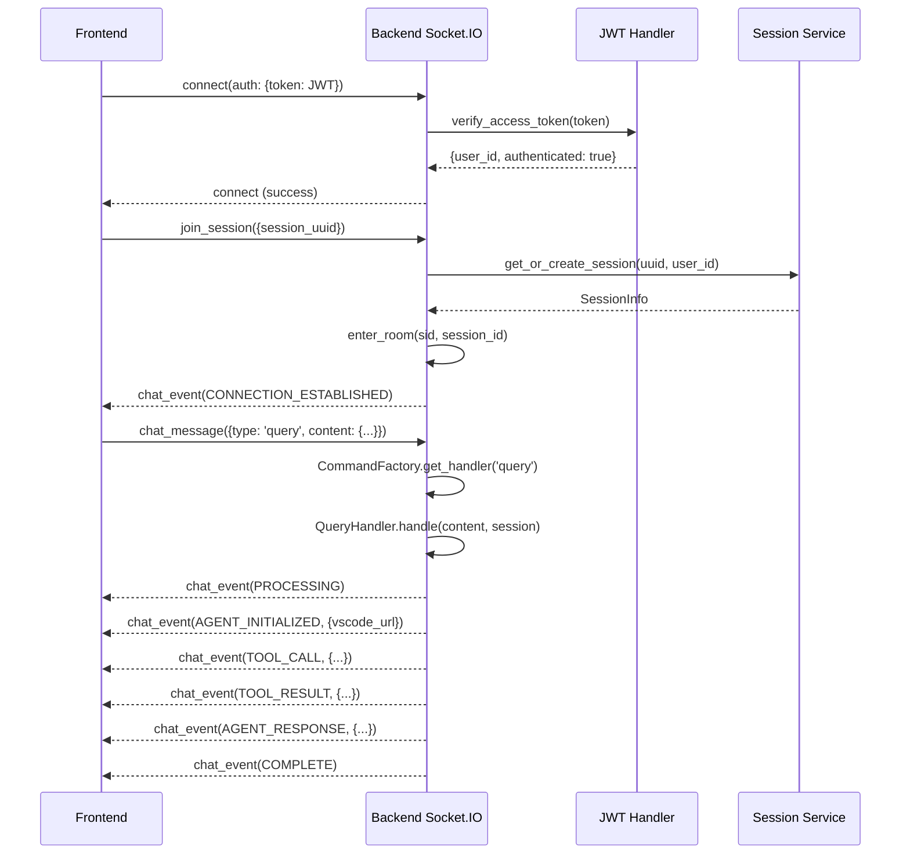
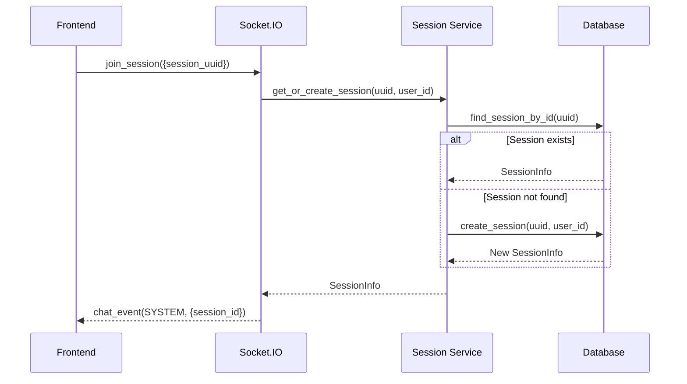

# Plan: Integrate II-Agent Frontend with Another Backend

This plan outlines all integration points between the frontend and backend, organized from **critical** (must fix first) to **optional** (can defer). Each section details the exact files, endpoints, and implementation requirements with **complete backend and frontend file references**.

---

## Table of Contents

- [Plan: Integrate II-Agent Frontend with Another Backend](#plan-integrate-ii-agent-frontend-with-another-backend)
  - [Table of Contents](#table-of-contents)
  - [Step 1: Configure Environment Variables (Foundation)](#step-1-configure-environment-variables-foundation)
    - [1.1 Frontend Environment Variables](#11-frontend-environment-variables)
    - [1.2 Backend Environment Variables](#12-backend-environment-variables)
  - [Step 2: Implement Authentication System (Critical)](#step-2-implement-authentication-system-critical)
    - [2.1 Token Storage](#21-token-storage)
    - [2.2 Required Backend Endpoints](#22-required-backend-endpoints)
    - [2.3 Auth Response Format](#23-auth-response-format)
    - [2.4 Files to review](#24-files-to-review)
  - [Step 3: Implement WebSocket Connection (Critical)](#step-3-implement-websocket-connection-critical)
    - [3.1 Connection Details](#31-connection-details)
    - [3.2 Socket Events (Client → Server)](#32-socket-events-client--server)
    - [3.3 Socket Events (Server → Client)](#33-socket-events-server--client)
    - [3.4 AgentEvent Types](#34-agentevent-types)
  - [Step 4: Implement Session Management API (Critical)](#step-4-implement-session-management-api-critical)
    - [4.1 Required Endpoints](#41-required-endpoints)
    - [4.2 Session Data Structure](#42-session-data-structure)
  - [Step 5: Implement Chat/Conversation API (Critical)](#step-5-implement-chatconversation-api-critical)
    - [5.1 Required Endpoints](#51-required-endpoints)
    - [5.2 Chat Request Payload](#52-chat-request-payload)
    - [5.3 SSE Event Format](#53-sse-event-format)
  - [Step 6: Implement User Settings API (Important)](#step-6-implement-user-settings-api-important)
    - [6.1 Required Endpoints](#61-required-endpoints)
  - [Step 7: Implement File System API (Important for Code Editor)](#step-7-implement-file-system-api-important-for-code-editor)
  - [Step 8: Implement Upload API (Important)](#step-8-implement-upload-api-important)
  - [Step 9: Implement Slides API (Optional - Presentation Feature)](#step-9-implement-slides-api-optional---presentation-feature)
  - [Step 10: Implement Billing API (Optional - Payments)](#step-10-implement-billing-api-optional---payments)
  - [Step 11: Implement Connectors API (Optional - Integrations)](#step-11-implement-connectors-api-optional---integrations)
  - [Step 12: Implement Wishlist API (Optional)](#step-12-implement-wishlist-api-optional)
  - [Further Considerations](#further-considerations)
    - [1. Database Schema Compatibility](#1-database-schema-compatibility)
    - [2. Sandbox Integration (E2B)](#2-sandbox-integration-e2b)
    - [3. CORS Configuration](#3-cors-configuration)
  - [Complete File Reference Index](#complete-file-reference-index)
    - [Services (API Calls)](#services-api-calls)
    - [Contexts (State Management)](#contexts-state-management)
    - [State (Redux)](#state-redux)
    - [Configuration](#configuration)
    - [Types](#types)
    - [Entry Points](#entry-points)

---

## Step 1: Configure Environment Variables (Foundation)

### 1.1 Frontend Environment Variables

Create a `.env` file in the frontend root with these required variables:

| Variable | Purpose | Required |
|----------|---------|----------|
| `VITE_API_URL` | Base URL for all backend API calls | ✅ **Critical** |
| `VITE_GOOGLE_CLIENT_ID` | Google OAuth client ID | ⚠️ If using Google auth |
| `VITE_STRIPE_PUBLISHABLE_KEY` | Stripe payments integration | ❌ Optional |
| `VITE_SENTRY_DSN` | Error tracking | ❌ Optional |
| `VITE_DISABLE_CHAT_MODE` | Feature flag | ❌ Optional |

**Frontend Files affected:**
- `frontend/src/vite-env.d.ts` - TypeScript definitions
- `frontend/src/lib/axios.ts` (line 5) - Axios base URL configuration
- `frontend/src/main.tsx` (line 11) - Sentry init

### 1.2 Backend Environment Variables

The backend requires these environment variables (see `src/ii_agent/core/config/ii_agent_config.py`):

| Variable | Purpose | Default |
|----------|---------|---------|
| `JWT_SECRET_KEY` | Secret for signing JWT tokens | `your-secret-key-change-in-production` |
| `ACCESS_TOKEN_EXPIRE_MINUTES` | JWT access token expiry | `15` |
| `REFRESH_TOKEN_EXPIRE_DAYS` | JWT refresh token expiry | `7` |
| `SESSION_SECRET_KEY` | Secret for session middleware (OAuth state) | Required |
| `DATABASE_URL` | PostgreSQL connection string | Required |
| `REDIS_URL` | Redis connection for Socket.IO pub/sub | Optional |
| `GOOGLE_CLIENT_ID` | Google OAuth client ID | Required for Google auth |
| `GOOGLE_CLIENT_SECRET` | Google OAuth client secret | Required for Google auth |
| `GOOGLE_REDIRECT_URI` | Google OAuth redirect URL | Required for Google auth |
| `II_CLIENT_ID` | II OAuth client ID | Optional for II auth |
| `II_REDIRECT_URI` | II OAuth redirect URL | Optional for II auth |
| `II_AUTH_URL` | II OAuth authorization URL | Optional |
| `II_TOKEN_URL` | II OAuth token URL | Optional |
| `II_ISSUER` | II OAuth issuer | Optional |
| `STORAGE_PROVIDER` | Storage provider (`gcs`, etc.) | Required |
| `FILE_UPLOAD_PROJECT_ID` | GCS project ID for file uploads | Required for GCS |
| `FILE_UPLOAD_BUCKET_NAME` | GCS bucket for file uploads | Required for GCS |
| `STRIPE_SECRET_KEY` | Stripe API key | Optional for billing |
| `STRIPE_WEBHOOK_SECRET` | Stripe webhook signing secret | Optional |
| `LLM_CONFIGS` | JSON string of LLM configurations | Required |
| `WORKSPACE_PATH` | Path to workspace directory | Required |
| `DEFAULT_USER_CREDITS` | Initial credits for new users | `100.0` |
| `DEFAULT_SUBSCRIPTION_PLAN` | Default subscription plan | `free` |

**Backend Files affected:**
- `src/ii_agent/core/config/ii_agent_config.py` - Main config loader
- `src/ii_agent/server/auth/jwt_handler.py` (lines 10-21) - JWT settings
- `src/ii_agent/server/shared.py` - Service initialization

---

## Step 2: Implement Authentication System (Critical)

The frontend uses **JWT Bearer tokens** stored in localStorage.

### 2.1 Token Storage
- **Key:** `II_AGENT_ACCESS_TOKEN` (defined in `frontend/src/constants/auth.tsx`)
- **Usage:** All API requests include `Authorization: Bearer <token>`

### 2.2 Required Backend Endpoints

| Endpoint | Method | Purpose | File Reference |
|----------|--------|---------|----------------|
| `/auth/oauth/google/callback` | GET | Google OAuth callback | `frontend/src/services/auth.service.ts` (lines 10-17) |
| `/auth/me` | GET | Get current user | `frontend/src/services/auth.service.ts` (lines 24-27) |
| `/auth/refresh` | POST | Refresh JWT token | `frontend/src/services/auth.service.ts` (lines 29-32) |
| `/api/auth/logout` | POST | Logout user | `frontend/src/services/auth.service.ts` (lines 19-21) |

### 2.3 Auth Response Format
```typescript
interface GoogleAuthResponse {
    access_token: string
    refresh_token?: string
    token_type?: string
    expires_in?: number
}

interface User {
    id: string
    email: string
    name?: string
    avatar?: string
    // ... other user fields
}
```

### 2.4 Files to review
- `frontend/src/contexts/auth-context.tsx` - Auth state management
- `frontend/src/app/routes/login.tsx` - Login flow with Google OAuth
- `frontend/src/lib/axios.ts` - Request interceptor adds auth header

---

## Step 3: Implement WebSocket Connection (Critical)

The frontend uses **Socket.IO** for real-time agent communication.

### 3.1 Connection Details
- **URL:** `VITE_API_URL` (same as REST API)
- **Transport:** `['websocket', 'polling']`
- **Auth:** `{ token: <JWT> }` in socket options
- **Ping Timeout:** 300 seconds
- **Ping Interval:** 30 seconds
- **Max HTTP Buffer Size:** 10MB

**Frontend Reference:** `frontend/src/contexts/websocket-context.tsx` (lines 133-145)
**Backend Reference:** `src/ii_agent/server/app.py` (lines 118-126) - Socket.IO server config

### 3.2 Backend WebSocket Architecture

| File | Path | Purpose |
|------|------|---------|
| SocketIO Manager | `src/ii_agent/server/socket/socketio.py` | Main Socket.IO event handler class |
| Session Store | `src/ii_agent/server/socket/session_store.py` | Manages session-to-socket mappings |
| Chat Session | `src/ii_agent/server/socket/chat_session.py` | ChatSessionContext for agent runs |
| Command Factory | `src/ii_agent/server/socket/command/handler_factory.py` | Routes message types to handlers |

**Command Handlers (in `src/ii_agent/server/socket/command/`):**

| Handler | File | Message Type | Purpose |
|---------|------|--------------|---------|
| Query Handler | `query_handler.py` | `query` | Process user queries, run agents |
| Cancel Handler | `cancel_handler.py` | `cancel` | Cancel ongoing agent tasks |
| Sandbox Status | `sandbox_status_handler.py` | `sandbox_status` | Get sandbox status |
| Awake Sandbox | `awake_sandbox_handler.py` | `awake_sandbox` | Wake sleeping sandbox |
| Publish Handler | `publish_handler.py` | `publish` | Publish project to Vercel |
| Ping Handler | `ping_handler.py` | `ping` | Keep-alive ping |
| Workspace Info | `workspace_info_handler.py` | `workspace_info` | Get workspace info |

### 3.3 Socket Events (Client → Server)

| Event | Payload | Purpose |
|-------|---------|---------|
| `join_session` | `{ session_uuid: string }` | Join a session room |
| `leave_session` | `{ session_uuid: string }` | Leave a session room |
| `chat_message` | `{ type: string, content: object, session_uuid?: string }` | Send message to agent |

**Backend Handler:** `src/ii_agent/server/socket/socketio.py`
```python
class SocketIOManager:
    def init(self):
        self.sio.event(self.connect)         # line 33
        self.sio.event(self.disconnect)      # line 34
        self.sio.on("join_session")(self.join_session)   # line 35
        self.sio.on("chat_message")(self.chat_message)   # line 36
        self.sio.on("leave_session")(self.leave_session) # line 37
```

**Frontend References:**
- `frontend/src/contexts/websocket-context.tsx` (lines 225-245)
- `frontend/src/app/routes/agent.tsx` (lines 90-101)
- `frontend/src/components/agent/agent-result.tsx` (lines 62-108)

### 3.4 Socket Connection Flow



### 3.5 Socket Events (Server → Client)

| Event | Payload | Purpose |
|-------|---------|---------|
| `connect` | - | Connection established |
| `disconnect` | reason: string | Connection closed |
| `connect_error` | error | Connection failed |
| `chat_event` | `{ type: AgentEvent, content: object }` | Agent event stream |

**Backend Emit Helper (in `socketio.py`):**
```python
async def _emit_chat_event(self, room: str, event_type: str, content: Dict) -> None:
    await self.sio.emit("chat_event", {"type": event_type, "content": content}, room=room)
```

### 3.6 AgentEvent Types

**Frontend Reference:** `frontend/src/typings/agent.ts` (lines 37-61)
**Backend Reference:** `src/ii_agent/core/event.py` (EventType enum)

```typescript
enum AgentEvent {
    AGENT_INITIALIZED = 'agent_initialized',
    USER_MESSAGE = 'user_message',
    CONNECTION_ESTABLISHED = 'connection_established',
    WORKSPACE_INFO = 'workspace_info',
    PROCESSING = 'processing',
    AGENT_THINKING = 'agent_thinking',
    TOOL_CALL = 'tool_call',
    TOOL_RESULT = 'tool_result',
    AGENT_RESPONSE = 'agent_response',
    COMPLETE = 'complete',
    ERROR = 'error',
    SYSTEM = 'system',
    PONG = 'pong',
    UPLOAD_SUCCESS = 'upload_success',
    BROWSER_USE = 'browser_use',
    FILE_EDIT = 'file_edit',
    PROMPT_GENERATED = 'prompt_generated',
    AGENT_RESPONSE_INTERRUPTED = 'agent_response_interrupted',
    STATUS_UPDATE = 'status_update',
    SANDBOX_STATUS = 'sandbox_status',
    SUB_AGENT_COMPLETE = 'sub_agent_complete',
    TOOL_PROGRESS = 'tool_progress',
    MODEL_COMPACT = 'model_compact'
}
```

### 3.7 Query Message Payload (for `chat_message` type: `query`)

**Frontend sends:**
```typescript
{
    type: 'query',
    content: {
        text: string,           // User's message
        model_id: string,       // e.g., 'claude-sonnet-4@20250514'
        source?: 'user' | 'system',
        files?: string[],       // Array of file upload IDs
        agent_type?: string,    // e.g., 'general', 'media', 'slide'
        tool_args?: object,     // Tool configuration
        thinking_tokens?: number,
        metadata?: object
    },
    session_uuid: string
}
```

**Backend Handler:** `src/ii_agent/server/socket/command/query_handler.py`

### 3.8 Backend Dependencies for WebSocket

| Service | Import Path | Purpose |
|---------|-------------|---------|
| sandbox_service | `ii_agent.server.shared` | Sandbox lifecycle management |
| session_service | `ii_agent.server.shared` | Session CRUD operations |
| agent_service | `ii_agent.server.shared` | Agent creation and execution |
| file_service | `ii_agent.server.shared` | File upload handling |
| jwt_handler | `ii_agent.server.auth.jwt_handler` | Token verification |
| EventStream | `ii_agent.core.event_stream` | Event publishing |
| RedisPubSub | `ii_agent.core.pubsub` | Cross-instance messaging |

---

## Step 4: Implement Session Management API (Critical)

Sessions are the core data model for agent conversations.

### 4.1 Backend Session Architecture

| File | Path | Purpose |
|------|------|---------|
| Sessions Router | `src/ii_agent/server/api/sessions.py` | FastAPI endpoints for session CRUD |
| Session Models | `src/ii_agent/server/models/sessions.py` | Pydantic models (SessionInfo, SessionList) |
| Sessions Manager | `src/ii_agent/db/manager.py` (Sessions class) | Database operations |
| Session Service | `src/ii_agent/server/services/session_service.py` | Business logic |

### 4.2 Required Endpoints (Frontend → Backend)

| Endpoint | Method | Frontend Reference | Backend Handler |
|----------|--------|-------------------|-----------------|
| `/sessions` | GET | `session.service.ts:17-27` | `sessions.py:list_sessions()` (line 59) |
| `/sessions` | POST | `session.service.ts:64-68` | via Socket.IO `join_session` event |
| `/sessions/:id` | GET | `session.service.ts:30-34` | `sessions.py:get_session()` (line 20) |
| `/sessions/:id` | DELETE | `session.service.ts:72-74` | `sessions.py:delete_session()` (line 311) |
| `/sessions/:id/events` | GET | `session.service.ts:44-48` | `sessions.py:get_session_events()` (line 101) |
| `/sessions/:id/files` | GET | `session.service.ts:60-64` | `sessions.py:get_session_files()` (line 134) |
| `/sessions/:id/public` | GET | `session.service.ts:37-41` | `sessions.py:get_public_session()` (line 245) |
| `/sessions/:id/public/events` | GET | `session.service.ts:51-57` | `sessions.py:get_public_session_events()` (line 280) |
| `/sessions/:id/publish` | POST | `session.service.ts:116-118` | `sessions.py:publish_session()` (line 167) |
| `/sessions/:id/unpublish` | POST | `session.service.ts:120-122` | `sessions.py:unpublish_session()` (line 206) |

### 4.3 Backend Database Layer

**Database Operations (`src/ii_agent/db/manager.py` - Sessions class):**
```python
class Sessions:
    @staticmethod
    async def get_session_details(session_id: str, user_id: str) -> dict | None
    
    @staticmethod
    async def get_user_sessions(user_id: str, search_term: str, page: int, per_page: int) -> tuple[list, int]
    
    @staticmethod
    async def get_public_session_details(session_id: str) -> dict | None
    
    @staticmethod
    async def set_session_public(session_id: str, user_id: str, is_public: bool) -> bool
    
    @staticmethod
    async def soft_delete_session(session_id: str, user_id: str) -> bool
```

### 4.4 Session Data Structure

**Frontend Types (`frontend/src/typings/agent.ts` lines 320-327):**
```typescript
interface ISession {
    id: string
    workspace_dir: string
    created_at: string
    name: string
    agent_type: string
    is_public?: boolean
}
```

**Backend Model (`src/ii_agent/server/models/sessions.py`):**
```python
class SessionInfo(BaseModel):
    id: str
    user_id: uuid.UUID
    name: Optional[str]
    status: Optional[str]
    sandbox_id: Optional[str]
    agent_type: Optional[str]
    created_at: str
    updated_at: str
    workspace_dir: Optional[str]
    is_public: bool
    token_usage: Optional[TokenUsage]
```

### 4.5 Session Creation Flow (via WebSocket)

Sessions are created through the WebSocket `join_session` event, not a REST POST:



**Backend Handler:** `src/ii_agent/server/socket/socketio.py:join_session()` (line 145)

---

## Step 5: Implement Chat/Conversation API (Critical)

The chat service handles SSE streaming for agent responses. This is used for the **Simple Chat mode** (no sandbox).

### 5.1 Backend Chat Architecture

| File | Path | Purpose |
|------|------|---------|
| Chat Router | `src/ii_agent/server/chat/router.py` | FastAPI endpoints with SSE streaming |
| Chat Service | `src/ii_agent/server/chat/service.py` | Business logic, LLM integration |
| Chat Models | `src/ii_agent/server/chat/models.py` | Request/Response Pydantic models |
| LLM Providers | `src/ii_agent/server/chat/llm/` | OpenAI, Anthropic, Gemini adapters |

### 5.2 Required Endpoints (Frontend → Backend)

| Endpoint | Method | Frontend Reference | Backend Handler |
|----------|--------|-------------------|-----------------|
| `/v1/chat/conversations` | POST | `chat.service.ts:60-107` | `router.py:send_chat_message()` (line 161) |
| `/v1/chat/conversations/:id` | GET | `chat.service.ts:40-44` | `router.py:get_message_history()` (line 480) |
| `/v1/chat/conversations/:id/stop` | POST | `chat.service.ts:56-58` | `router.py:stop_conversation()` (line 431) |
| `/v1/chat/conversations/:id/public` | GET | `chat.service.ts:47-53` | `router.py:get_public_message_history()` (line 508) |
| `/chat/:sessionId/files/:fileId` | GET | `chat.service.ts:26-37` | `files.py:download_file()` (line 146) |

### 5.3 Chat Request Payload

**Frontend sends (via `chat.service.ts:streamQuery`):**
```typescript
{
    content: string,           // User's message text
    model_id: string,         // LLM model identifier
    session_id?: string,      // Existing session UUID (null for new)
    file_ids?: string[],      // Uploaded file IDs
    tools?: {
        web_search: boolean,
        image_search: boolean,
        web_visit: boolean,
        code_interpreter: boolean
    }
}
```

**Backend Model (`src/ii_agent/server/chat/models.py`):**
```python
class ChatMessageRequest(BaseModel):
    content: str
    model_id: str
    session_id: Optional[uuid.UUID] = None
    file_ids: Optional[List[uuid.UUID]] = None
    tools: Optional[ToolsConfig] = None
```

### 5.4 SSE Event Types (Backend → Frontend)

| SSE Event | Status | Content | Purpose |
|-----------|--------|---------|---------|
| `session` | `created` | `session_id, name, agent_type, model_id` | New session created |
| `content` | `start` | - | Content streaming begins |
| `content` | `delta` | `delta: string` | Streaming text chunk |
| `content` | `stop` | - | Content streaming ends |
| `thinking` | `delta` | `delta: string, signature?` | Reasoning/thinking text |
| `tool_call` | `start` | `id, name, type` | Tool call initiated |
| `tool_call` | `delta` | `id, delta` | Tool input streaming |
| `tool_call` | `stop` | `id, name, input` | Tool call complete |
| `tool_result` | `info` | `tool_call_id, name, output, is_error` | Tool execution result |
| `usage` | `info` | `input_tokens, output_tokens, total_tokens` | Token usage stats |
| `complete` | `done` | `message_id, finish_reason, elapsed_ms` | Stream finished |
| `error` | `error` | `error, code` | Error occurred |

**Backend SSE Generator (`src/ii_agent/server/chat/router.py` lines 271-419)**

### 5.5 Chat Service Methods

**`src/ii_agent/server/chat/service.py`:**
```python
class ChatService:
    @staticmethod
    async def validate_model_for_chat(db_session, model_id, user_id) -> None
    
    @staticmethod
    async def check_sufficient_credits(db_session, user_id) -> bool
    
    @staticmethod
    async def create_chat_session(db_session, user_id, user_message, model_id) -> SessionMetadata
    
    @staticmethod
    async def stream_chat_response(db_session, chat_request, user_id) -> AsyncGenerator
    
    @staticmethod
    async def get_message_history(db_session, session_id, limit, before) -> tuple[list, bool]
    
    @staticmethod
    async def stop_conversation(db_session, session_id) -> str | None
```

### 5.6 Frontend SSE Handling

**`frontend/src/services/chat.service.ts`** parses SSE events:
```typescript
const normalizeStreamEvent = (eventName: string | undefined, raw: unknown): ChatStreamEvent[] => {
    // Maps SSE events to frontend types:
    // 'session' -> { type: 'session', session_id, is_new_session, ... }
    // 'content' delta -> { type: 'token', content }
    // 'thinking' delta -> { type: 'thinking', status, delta, signature }
    // 'tool_call' -> { type: 'tool_call_start|delta|stop', ... }
    // 'complete' -> { type: 'complete', message_id, finish_reason }
    // 'error' -> { type: 'error', message }
}
```

---

## Step 6: Implement User Settings API (Important)

### 6.1 Required Endpoints

| Endpoint | Method | Purpose | File Reference |
|----------|--------|---------|----------------|
| `/user-settings/models` | GET | Get available LLM models | `frontend/src/services/settings.service.ts` (lines 30-35) |
| `/user-settings/models` | POST | Create custom model | `frontend/src/services/settings.service.ts` (lines 11-17) |
| `/user-settings/models/:id` | PUT | Update model | `frontend/src/services/settings.service.ts` (lines 19-25) |
| `/user-settings/models/:id` | DELETE | Delete model | `frontend/src/services/settings.service.ts` (lines 27-29) |
| `/user-settings/mcp` | GET | Get MCP settings | `frontend/src/services/settings.service.ts` (lines 43-48) |
| `/user-settings/mcp` | POST | Create MCP config | `frontend/src/services/settings.service.ts` (lines 50-57) |

---

## Step 7: Implement File System API (Important for Code Editor)

Required for sandbox file management.

| Endpoint | Method | Purpose | File Reference |
|----------|--------|---------|----------------|
| `/api/files` | POST | List files | `frontend/src/services/file.service.ts` (lines 13-16) |
| `/api/files/content` | POST | Get file content | `frontend/src/services/file.service.ts` (lines 18-24) |
| `/api/files/save` | POST | Save file | `frontend/src/services/file.service.ts` (lines 26-28) |
| `/api/files/create` | POST | Create file | `frontend/src/services/file.service.ts` (lines 30-32) |
| `/api/files/create-folder` | POST | Create folder | `frontend/src/services/file.service.ts` (lines 34-36) |
| `/api/files` | DELETE | Delete file | `frontend/src/services/file.service.ts` (lines 38-40) |
| `/api/files/rename` | POST | Rename file | `frontend/src/services/file.service.ts` (lines 42-44) |
| `/api/files/move` | POST | Move file | `frontend/src/services/file.service.ts` (lines 46-48) |

---

## Step 8: Implement Upload API (Important)

| Endpoint | Method | Purpose | File Reference |
|----------|--------|---------|----------------|
| `/api/upload` | POST | Upload file | `frontend/src/services/upload.service.ts` (lines 21-25) |
| `/api/upload/multiple` | POST | Upload multiple files | `frontend/src/services/upload.service.ts` (lines 27-31) |
| `/api/upload/form-data` | POST | Upload with FormData | `frontend/src/services/upload.service.ts` (lines 62-76) |
| `/api/remove-file` | POST | Remove file | `frontend/src/services/upload.service.ts` (lines 33-35) |
| `/api/upload/files/:sessionId` | GET | Get uploaded files | `frontend/src/services/upload.service.ts` (lines 41-44) |

---

## Step 9: Implement Slides API (Optional - Presentation Feature)

| Endpoint | Method | Purpose | File Reference |
|----------|--------|---------|----------------|
| `/slides` | GET | Get session slides | `frontend/src/services/session.service.ts` (lines 84-89) |
| `/slides` | POST | Update slide | `frontend/src/services/session.service.ts` (lines 99-105) |
| `/slides/download/stream` | GET | Download as PDF (SSE) | `frontend/src/services/slide.service.ts` (lines 61-78) |
| `/slide-templates` | GET | Get templates | `frontend/src/services/slide.service.ts` (lines 36-52) |

---

## Step 10: Implement Billing API (Optional - Payments)

| Endpoint | Method | Purpose | File Reference |
|----------|--------|---------|----------------|
| `/credits/balance` | GET | Get credit balance | `frontend/src/services/user.service.ts` (lines 5-9) |
| `/credits/usage` | GET | Get usage history | `frontend/src/services/user.service.ts` (lines 10-22) |
| `/billing/checkout-session` | POST | Create Stripe checkout | `frontend/src/services/billing.service.ts` (lines 11-28) |
| `/billing/portal-session` | POST | Create billing portal | `frontend/src/services/billing.service.ts` (lines 30-41) |

---

## Step 11: Implement Connectors API (Optional - Integrations)

| Endpoint | Method | Purpose | File Reference |
|----------|--------|---------|----------------|
| `/connectors/google-drive/auth-url` | GET | Get OAuth URL | `frontend/src/services/connector.service.ts` (lines 49-57) |
| `/connectors/google-drive/callback` | POST | Handle OAuth callback | `frontend/src/services/connector.service.ts` (lines 59-69) |
| `/connectors/google-drive/status` | GET | Get connection status | `frontend/src/services/connector.service.ts` (lines 71-75) |
| `/connectors/google-drive/picker-config` | GET | Get picker config | `frontend/src/services/connector.service.ts` (lines 77-82) |
| `/connectors/google-drive/files` | POST | Download files | `frontend/src/services/connector.service.ts` (lines 84-90) |

---

## Step 12: Implement Wishlist API (Optional)

| Endpoint | Method | Purpose | File Reference |
|----------|--------|---------|----------------|
| `/wishlist/sessions` | GET | Get favorited sessions | `frontend/src/services/wishlist.service.ts` (lines 8-13) |
| `/wishlist/sessions/:id` | POST | Add to favorites | `frontend/src/services/wishlist.service.ts` (lines 15-20) |
| `/wishlist/sessions/:id` | DELETE | Remove from favorites | `frontend/src/services/wishlist.service.ts` (lines 22-27) |

---

## Further Considerations

### 1. Database Schema Compatibility
Your backend needs tables for:
- `users`
- `sessions`
- `events`
- `files`
- `slides`
- `credits`
- `wishlist`
- `connectors`
- `mcp_settings`
- `user_models`

Consider mapping your existing schema or creating these tables.

### 2. Sandbox Integration (E2B)
- The frontend expects sandbox URLs in specific format (e.g., `*.e2b.dev`)
- Check `frontend/src/components/agent/agent-result.tsx` for URL handling
- Backend must manage sandbox lifecycle and return `vscode_url`, `result_url`

### 3. CORS Configuration
- Backend must allow `Origin: http://localhost:1420` (or your frontend URL)
- Required headers: `Authorization`, `Content-Type`
- Allow methods: `GET`, `POST`, `PUT`, `PATCH`, `DELETE`, `OPTIONS`

---

## Complete File Reference Index

### Services (API Calls)
| File | Path |
|------|------|
| Auth Service | `frontend/src/services/auth.service.ts` |
| Billing Service | `frontend/src/services/billing.service.ts` |
| Chat Service | `frontend/src/services/chat.service.ts` |
| Connector Service | `frontend/src/services/connector.service.ts` |
| File Service | `frontend/src/services/file.service.ts` |
| Fullstack Service | `frontend/src/services/fullstack.service.ts` |
| Prompt Service | `frontend/src/services/prompt.service.ts` |
| Session Service | `frontend/src/services/session.service.ts` |
| Settings Service | `frontend/src/services/settings.service.ts` |
| Slide Service | `frontend/src/services/slide.service.ts` |
| Upload Service | `frontend/src/services/upload.service.ts` |
| User Service | `frontend/src/services/user.service.ts` |
| Wishlist Service | `frontend/src/services/wishlist.service.ts` |

### Contexts (State Management)
| File | Path |
|------|------|
| Auth Context | `frontend/src/contexts/auth-context.tsx` |
| WebSocket Context | `frontend/src/contexts/websocket-context.tsx` |
| Terminal Context | `frontend/src/contexts/terminal-context.tsx` |

### State (Redux)
| File | Path |
|------|------|
| User API | `frontend/src/state/api/user.api.ts` |
| Session API | `frontend/src/state/api/session.api.ts` |

### Configuration
| File | Path |
|------|------|
| Axios Instance | `frontend/src/lib/axios.ts` |
| Vite Environment Types | `frontend/src/vite-env.d.ts` |
| Auth Constants | `frontend/src/constants/auth.tsx` |
| Vite Config | `frontend/vite.config.ts` |

### Types
| File | Path |
|------|------|
| Agent Types | `frontend/src/typings/agent.ts` |
| Auth Types | `frontend/src/typings/auth.ts` |

### Entry Points
| File | Path |
|------|------|
| Main Entry | `frontend/src/main.tsx` |
| App Component | `frontend/src/app/index.tsx` |
| App Provider | `frontend/src/app/provider.tsx` |
| Login Page | `frontend/src/app/routes/login.tsx` |
| Agent Page | `frontend/src/app/routes/agent.tsx` |
