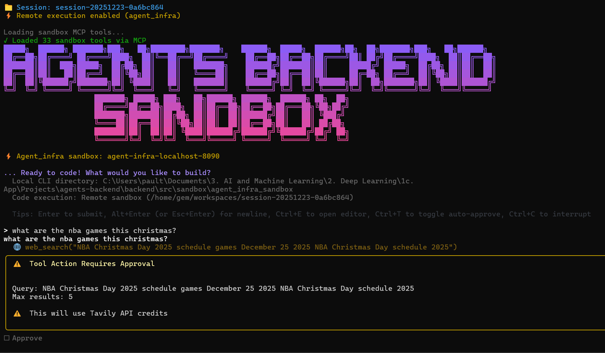

<div align="center">


# Agents Backend

**Enterprise-Grade AI Agent & Backend Platform**

[](https://www.python.org/downloads/)
[](https://fastapi.tiangolo.com)
[](https://langchain.com)
[](https://langchain-ai.github.io/langgraph/)
[](https://www.postgresql.org)
[](https://www.docker.com)
[](https://opensource.org/licenses/MIT)

> ⚠️ **BETA** - This project is under active development. Features may change, and some components are still being refined. Contributions and feedback are welcome!

*The unified, production-ready platform combining high-performance FastAPI with advanced Agentic AI capabilities*

**[🚀 Get Started](#-get-started-in-60-seconds) • [🔌 FastAPI](#-fastapi-backend---full-stack-architecture) • [🤖 Agents](#-agentic-ai-system---production-grade-orchestration) • [📦 Sandbox](#-sandbox-execution-environment---dual-architecture) • [🛠 Tools](#-tool-server---comprehensive-integrations)**

</div>

---

## 📋 Table of Contents

- [Agents Backend](#agents-backend)
  - [📋 Table of Contents](#-table-of-contents)
  - [🚀 Get Started in 60 Seconds](#-get-started-in-60-seconds)
    - [Option 1: Docker (Recommended)](#option-1-docker-recommended)
    - [Option 2: Local Development](#option-2-local-development)
    - [Option 3: Agents Backend CLI (Prototyping \& Testing)](#option-3-agents-backend-cli-prototyping--testing)
    - [Option 4: FastAPI Server (Production)](#option-4-fastapi-server-production)
    - [📚 Documentation Reference](#-documentation-reference)
  - [🎬 Demo](#-demo)
  - [🔄 System Lifecycle Architecture](#-system-lifecycle-architecture)
    - [Application Startup](#application-startup)
    - [Authentication Flow](#authentication-flow)
    - [Agent Chat Flow](#agent-chat-flow)
    - [Sandbox Lifecycle](#sandbox-lifecycle)
    - [Tool Server Flow](#tool-server-flow)
    - [Complete Request Lifecycle](#complete-request-lifecycle)
  - [🌟 FastAPI Backend - Production-Ready Backend Architecture](#-fastapi-backend---production-ready-backend-architecture)
    - [AI \& LLM Features](#ai--llm-features)
    - [Sandbox Environments](#sandbox-environments)
    - [Developer Experience](#developer-experience)
  - [🔧 PTC Module - Programmatic Tool Calling](#-ptc-module---programmatic-tool-calling)
    - [Why PTC?](#why-ptc)
    - [Architecture](#architecture)
    - [Module Structure](#module-structure)
    - [Interactive CLI Agent](#interactive-cli-agent)
    - [CLI Commands](#cli-commands)
    - [Available Tools](#available-tools)
  - [📦 Sandbox Execution Environment - Dual Architecture](#-sandbox-execution-environment---dual-architecture)
    - [1. Agent Infra Sandbox (Local Development)](#1-agent-infra-sandbox-local-development)
      - [Quick Start](#quick-start)
      - [Integration Options](#integration-options)
      - [DeepAgents CLI Commands](#deepagents-cli-commands)
      - [LangChain Tools Usage](#langchain-tools-usage)
      - [Architecture](#architecture-1)
    - [2. Sandbox Server (Production-Grade)](#2-sandbox-server-production-grade)
      - [Sandbox Providers](#sandbox-providers)
      - [Lifecycle Management](#lifecycle-management)
      - [Sandbox Templates](#sandbox-templates)
  - [🛠 Tool Server - Comprehensive Integrations](#-tool-server---comprehensive-integrations)
    - [Tool Server Architecture](#tool-server-architecture)
    - [Browser Automation Tools](#browser-automation-tools)
    - [Slide System (PowerPoint)](#slide-system-powerpoint)
    - [Web \& Search Integrations](#web--search-integrations)
      - [Web Visit Providers](#web-visit-providers)
      - [Web Search Providers](#web-search-providers)
      - [Image Search Providers](#image-search-providers)
      - [Image Generation](#image-generation)
    - [Core Tools (Standalone)](#core-tools-standalone)
    - [MCP (Model Context Protocol)](#mcp-model-context-protocol)
  - [⚙️ Configuration](#️-configuration)
    - [Required Environment Variables](#required-environment-variables)
  - [📚 Documentation](#-documentation)
  - [📝 Recent Changes (December 2024)](#-recent-changes-december-2024)
    - [LLM Metrics \& Credit System](#llm-metrics--credit-system)
    - [Database Setup](#database-setup)
    - [API Fixes](#api-fixes)
    - [Testing](#testing)
  - [🤝 Contributing](#-contributing)
  - [📄 License](#-license)

---

<!-- 
**Video demonstration** (click the picture):

[](https://www.youtube.com/watch?v=-O_abcdef) -->


## 🚀 Get Started in 60 Seconds

### Option 1: Docker (Recommended)

```bash
# 1️⃣ Clone the repository
git clone https://github.com/obinopaul/agents-backend.git && cd agents-backend

# 2️⃣ Set up environment variables
cp backend/.env.example backend/.env
cp deploy/backend/docker-compose/.env.server.example deploy/backend/docker-compose/.env.server
# Edit backend/.env and deploy/backend/docker-compose/.env.server with your API keys (OpenAI, E2B, Tavily, etc.)

# 3️⃣ Build the E2B Sandbox Template
# First-time setup: Create your own E2B sandbox template
# Get your E2B API key from https://e2b.dev/dashboard and add it to backend/.env and/or deploy\backend\docker-compose\.env.server

# Option A — CLI (legacy V1):
# If you DON'T have an existing template, create one:
e2b template build -d backend/e2b.Dockerfile -c "bash /app/start-services.sh" -n agents-sandbox --cpu-count 4 --memory-mb 2048

# Option B — Python build script (V2, recommended):
# Uses backend/template.py config (4 vCPUs, 2048 MB RAM by default).
# Edit SANDBOX_CPU_COUNT / SANDBOX_MEMORY_MB in backend/template.py to change resources.
python backend/build_prod.py        # Production: tags as 'agents-sandbox'
# python backend/build_dev.py       # Development: tags as 'agents-sandbox-dev'

# If you already have a template_id in e2b.toml, just rebuild:
# e2b template build -c backend

# ⚠️ Recreating a template? If e2b.toml exists with old config, rename it first:
# Windows: Rename-Item e2b.toml e2b.toml.bak -Force
# Linux/Mac: mv e2b.toml e2b.toml.bak
# Then run the build command above

# The command will output your new template_id - update backend/.env:
# E2B_TEMPLATE_ID=<your-new-template-id>

# 4️⃣ Start everything with one command
docker-compose up -d --build

# 5️⃣ Verify the database is created (runs Alembic migrations)
docker-compose exec agents_backend_server bash -c "cd /agents_backend/backend && alembic upgrade head"

# 6️⃣ Create a test user for login (required for authentication)
python backend/tests/create_test_user.py
# Default credentials: sandbox_test / TestPass123!

# 7️⃣ Test the setup (optional but recommended)
python backend/tests/live/interactive_agent_test.py
```

> **Note:** The `agents_backend` PostgreSQL database is automatically created by Docker. All tables (users, agents, sandboxes, etc.) are created on first startup via SQLAlchemy.

| Service | URL |
|---------|-----|
| Backend API | http://localhost:8001 |
| Swagger UI | http://localhost:8001/docs |
| Celery Flower | http://localhost:8555 |

---

### Option 2: Local Development

```bash
# 1️⃣ Install dependencies
pip install -r requirements.txt

# 2️⃣ Start PostgreSQL & Redis
docker-compose up -d agents_backend_postgres agents_backend_redis

# 3️⃣ Run database migrations
cd backend && alembic upgrade head

# 4️⃣ Start the server
python -m uvicorn backend.main:app --reload --host 0.0.0.0 --port 8000

# 5️⃣ Test the setup (in a new terminal)
python backend/tests/live/interactive_agent_test.py

# 6️⃣ Start the Frontend (in a new terminal)
cd frontend
pnpm install   # or npm install
pnpm dev       # or npm run dev
# Frontend will be available at http://localhost:1420
```

---

### Option 3: Agents Backend CLI (Prototyping & Testing)

Test all backend functionalities **without starting the server** using the Agents Backend (`agents-backend`) CLI.

```bash
# Install & view commands
pip install -r requirements.txt
agents-backend --help

# Quick test: Run the Deep Research Agent interactively
agents-backend agent
```

This launches an interactive session where you select a language, ask a question, and watch the agent research and generate a report.

📖 **Full CLI Reference:** See [`docs/guides/cli-reference.md`](docs/guides/cli-reference.md) for all commands and options.

---

### Option 4: FastAPI Server (Production)

Start the full FastAPI server for production deployment:

```bash
agents-backend run --host 0.0.0.0 --port 8000

# Start the Frontend (in a new terminal)
cd frontend
pnpm install   # or npm install
pnpm dev       # or npm run dev
```

| Service | URL |
|---------|-----|
| Backend API | http://localhost:8000 |
| Swagger UI | http://localhost:8000/docs |
| ReDoc | http://localhost:8000/redoc |
| Frontend | http://localhost:1420 |
| Agent API | `POST /api/v1/agent/chat/stream` |

📖 **Full API Reference:** See [`docs/guides/fastapi-backend.md`](docs/guides/fastapi-backend.md) for detailed endpoint documentation.

---

### 📚 Documentation Reference

| Guide | Description |
|-------|-------------|
| [`docs/guides/admin-api.md`](docs/guides/admin-api.md) | Admin API endpoints and middleware |
| [`docs/guides/api-endpoints.md`](docs/guides/api-endpoints.md) | API endpoints and middleware |
| [`docs/guides/cli-reference.md`](docs/guides/cli-reference.md) | CLI commands and options |
| [`docs/guides/fastapi-backend.md`](docs/guides/fastapi-backend.md) | FastAPI endpoints & middleware |
| [`docs/guides/agentic-ai.md`](docs/guides/agentic-ai.md) | LangGraph agent architecture |
| [`docs/guides/sandbox-guide.md`](docs/guides/sandbox-guide.md) | Sandbox execution environments |
| [`docs/api-contracts/sandbox-server.md`](docs/api-contracts/sandbox-server.md) | Sandbox execution API Guide |
| [`docs/guides/environment-variables.md`](docs/guides/environment-variables.md) | All environment variables |
| [`docs/guides/plugins.md`](docs/guides/plugins.md) | Plugin system (OAuth2, Email, etc.) |
| [`docs/guides/ptc-module.md`](docs/guides/ptc-module.md) | Programmatic Tool Calling |
| [`docs/api-contracts/database.md`](docs/api-contracts/database.md) | Database schema & tables |
| [`docs/api-contracts/tool-server.md`](docs/api-contracts/tool-server.md) | Tool Server API |
| [`docs/api-contracts/e2b-sandbox.md`](docs/api-contracts/e2b-sandbox.md) | E2B Sandbox API |
| [`docs/guides/standalone-scripts.md`](docs/guides/standalone-scripts.md) | Writing standalone Python scripts |

## 🎬 Demo

<div align="center">


*Watch the agent autonomously research, code, and execute tasks in the secure sandbox*

</div>

---

## 🔄 System Lifecycle Architecture

A visual overview of how all components work together.

### Application Startup

```
┌─────────────────────────────────────────────────────────────────────┐
│                        APPLICATION STARTUP                           │
└─────────────────────────────────────────────────────────────────────┘
                                  │
        ┌─────────────────────────┼─────────────────────────┐
        ▼                         ▼                         ▼
┌───────────────┐        ┌───────────────┐        ┌───────────────┐
│ Plugin        │        │ FastAPI       │        │ Middleware    │
│ Discovery     │        │ Creation      │        │ Registration  │
│ (OAuth, Email)│        │ (App Factory) │        │ (JWT, CORS)   │
└───────────────┘        └───────────────┘        └───────────────┘
                                  │
                                  ▼
                    ┌─────────────────────────┐
                    │     LIFESPAN: STARTUP    │
                    ├─────────────────────────┤
                    │ 1. Create database tables│
                    │ 2. Open Redis connection │
                    │ 3. Initialize rate limiter│
                    │ 4. Initialize Snowflake  │
                    │ 5. Start audit log task  │
                    └─────────────────────────┘
                                  │
                                  ▼
                    ┌─────────────────────────┐
                    │    SERVER RUNNING        │
                    │    localhost:8000        │
                    └─────────────────────────┘
```

---

### Authentication Flow

```
┌─────────────────────────────────────────────────────────────────────┐
│                      AUTHENTICATION LIFECYCLE                        │
└─────────────────────────────────────────────────────────────────────┘

   ┌─────────┐                                        ┌─────────────┐
   │  User   │                                        │   Database  │
   └────┬────┘                                        └──────┬──────┘
        │                                                    │
        │  1. Login Request                                  │
        │  POST /api/v1/admin/auth/login                     │
        ▼                                                    │
   ┌─────────────┐     2. Validate      ┌─────────────┐     │
   │   FastAPI   │ ───────────────────► │   Service   │     │
   │  Endpoint   │                      │   Layer     │     │
   └─────────────┘                      └──────┬──────┘     │
                                               │            │
                                               ▼            │
                                        ┌─────────────┐     │
                                        │  Query      │◄────┘
                                        │  sys_user   │
                                        └──────┬──────┘
                                               │
        ┌──────────────────────────────────────┘
        │  3. Generate JWT
        ▼
   ┌─────────────┐     4. Store Session   ┌─────────────┐
   │  JWT Token  │ ─────────────────────► │   Redis     │
   │  (HS256)    │                        │  Sessions   │
   └──────┬──────┘                        └─────────────┘
          │
          │  5. Return Token
          ▼
   ┌─────────────────────────────────────────────────────────────┐
   │ {                                                            │
   │   "access_token": "eyJhbGciOiJIUzI1NiIs...",                │
   │   "token_type": "Bearer",                                    │
   │   "user": {"id": 1, "username": "admin", ...}               │
   │ }                                                            │
   └─────────────────────────────────────────────────────────────┘
```

---

### Agent Chat Flow

```
┌─────────────────────────────────────────────────────────────────────┐
│                      AGENT CHAT LIFECYCLE                            │
└─────────────────────────────────────────────────────────────────────┘

   Frontend                     Backend                      Sandbox
   ────────                     ───────                      ───────
       │                           │                            │
       │ POST /agent/chat/stream   │                            │
       │ ─────────────────────────►│                            │
       │                           │                            │
       │                           ▼                            │
       │                    ┌─────────────┐                     │
       │                    │ LangGraph   │                     │
       │                    │  Workflow   │                     │
       │                    └──────┬──────┘                     │
       │                           │                            │
       │           ┌───────────────┼───────────────┐            │
       │           ▼               ▼               ▼            │
       │    ┌───────────┐   ┌───────────┐   ┌───────────┐       │
       │    │Investigator│   │   Base    │   │ Reporter  │       │
       │    │   Node    │   │   Node    │   │   Node    │       │
       │    └───────────┘   └─────┬─────┘   └───────────┘       │
       │                          │                             │
       │                          │ Tool Call?                  │
       │                          ▼                             │
       │                   ┌─────────────┐                      │
       │                   │ MCP Client  │──────────────────────►
       │                   └──────┬──────┘     POST /mcp        │
       │                          │                             │
       │                          │◄────────────────────────────│
       │                          │        Tool Result          │
       │                          │                             │
       │◄─────────────────────────┤                             │
       │     SSE: Stream Events   │                             │
       │     • type: "text"       │                             │
       │     • type: "tool_call"  │                             │
       │     • type: "done"       │                             │
       │                           │                            │
```

---

### Sandbox Lifecycle

```
┌─────────────────────────────────────────────────────────────────────┐
│                       SANDBOX LIFECYCLE                              │
└─────────────────────────────────────────────────────────────────────┘

   API Request               Sandbox Service                E2B/Daytona
   ───────────               ───────────────                ───────────
       │                           │                            │
       │ POST /sandboxes           │                            │
       │ ─────────────────────────►│                            │
       │                           │                            │
       │                           │  1. Get User MCP Settings  │
       │                           │  ─────────────────────────►│
       │                           │◄─────────────────────────── │
       │                           │                            │
       │                           │  2. Create Container       │
       │                           │  ─────────────────────────►│
       │                           │                            │
       │                           │                   ┌────────┴────────┐
       │                           │                   │ start-services.sh│
       │                           │                   │                  │
       │                           │                   │ • MCP Server    │
       │                           │                   │   :6060         │
       │                           │                   │                  │
       │                           │                   │ • Code Server   │
       │                           │                   │   :9000         │
       │                           │                   └────────┬────────┘
       │                           │                            │
       │                           │  3. Write Credentials      │
       │                           │  • ~/.codex/auth.json      │
       │                           │  • ~/.claude/.credentials  │
       │                           │  ─────────────────────────►│
       │                           │                            │
       │◄──────────────────────────┤                            │
       │  { sandbox_id,            │                            │
       │    mcp_url,               │                            │
       │    vscode_url }           │                            │
       │                           │                            │
```

---

### Tool Server Flow

```
┌─────────────────────────────────────────────────────────────────────┐
│                      TOOL SERVER (MCP) LIFECYCLE                     │
└─────────────────────────────────────────────────────────────────────┘

                         Sandbox Container
   ┌─────────────────────────────────────────────────────────────────┐
   │                                                                  │
   │   ┌─────────────────────────────────────────────────────────┐   │
   │   │                    MCP Server (:6060)                    │   │
   │   │   Built with FastMCP - Exposes 44+ tools via SSE        │   │
   │   └─────────────────────────────────────────────────────────┘   │
   │                              │                                   │
   │         ┌────────────────────┼────────────────────┐              │
   │         ▼                    ▼                    ▼              │
   │   ┌───────────┐       ┌───────────┐        ┌───────────┐        │
   │   │  Shell    │       │   File    │        │  Browser  │        │
   │   │  Tools    │       │  Tools    │        │  Tools    │        │
   │   │  (6)      │       │  (7)      │        │  (15)     │        │
   │   ├───────────┤       ├───────────┤        ├───────────┤        │
   │   │ shell_init│       │ file_read │        │ navigate  │        │
   │   │ shell_run │       │ file_write│        │ click     │        │
   │   │ shell_view│       │ file_edit │        │ type      │        │
   │   │ ...       │       │ grep      │        │ scroll    │        │
   │   └───────────┘       └───────────┘        └───────────┘        │
   │                                                                  │
   │         ┌────────────────────┼────────────────────┐              │
   │         ▼                    ▼                    ▼              │
   │   ┌───────────┐       ┌───────────┐        ┌───────────┐        │
   │   │   Web     │       │   Media   │        │   Dev     │        │
   │   │  Tools    │       │  Tools    │        │  Tools    │        │
   │   │  (6)      │       │  (2)      │        │  (4)      │        │
   │   ├───────────┤       ├───────────┤        ├───────────┤        │
   │   │ web_search│       │ image_gen │        │ fullstack │        │
   │   │ web_visit │       │ video_gen │        │ checkpoint│        │
   │   │ img_search│       │           │        │ register  │        │
   │   └───────────┘       └───────────┘        └───────────┘        │
   │                                                                  │
   │   ┌─────────────────────────────────────────────────────────┐   │
   │   │                  Custom MCP Servers                      │   │
   │   │    Codex CLI  │  Claude Code  │  User Custom MCPs       │   │
   │   └─────────────────────────────────────────────────────────┘   │
   │                                                                  │
   └─────────────────────────────────────────────────────────────────┘
                              ▲
                              │ SSE/HTTP
                              │
   ┌─────────────────────────────────────────────────────────────────┐
   │                        MCPClient                                 │
   │         from backend.src.tool_server.mcp.client import MCPClient │
   │                                                                  │
   │         async with MCPClient(mcp_url) as client:                │
   │             tools = await client.get_langchain_tools()          │
   │             agent = create_react_agent(llm, tools)              │
   └─────────────────────────────────────────────────────────────────┘
```

---

### Complete Request Lifecycle

```
┌─────────────────────────────────────────────────────────────────────┐
│                    COMPLETE REQUEST LIFECYCLE                        │
└─────────────────────────────────────────────────────────────────────┘

  Frontend          API Gateway          Services              External
  ────────          ───────────          ────────              ────────
      │                  │                   │                     │
      │  1. Login        │                   │                     │
      │ ────────────────►│                   │                     │
      │◄──── JWT Token ──┤                   │                     │
      │                  │                   │                     │
      │  2. Create Sandbox                   │                     │
      │ ────────────────►│──────────────────►│                     │
      │                  │                   │─────────────────────►
      │◄─── Sandbox URLs ┤◄──────────────────┤     E2B/Daytona    │
      │                  │                   │                     │
      │  3. Configure MCP                    │                     │
      │ ────────────────►│──────────────────►│                     │
      │◄──── Success ────┤◄──────────────────┤  Store in DB       │
      │                  │                   │                     │
      │  4. Chat Stream  │                   │                     │
      │ ────────────────►│──────────────────►│                     │
      │                  │                   │────► LangGraph      │
      │                  │                   │      │               │
      │                  │                   │◄─────┘               │
      │◄─── SSE Events ──┤◄──────────────────┤                     │
      │    text, tools   │                   │                     │
      │                  │                   │                     │
      │  5. Cleanup      │                   │                     │
      │ ────────────────►│──────────────────►│─────────────────────►
      │                  │                   │     Delete Sandbox  │
      │                  │                   │                     │
```

---

📖 **Detailed Lifecycle Documentation:** See [`docs/lifecycle/README.md`](docs/lifecycle/README.md) for step-by-step guides with code examples.

---

<!-- ## 🌟 Features -->

An interactive AI coding assistant that connects to a secure sandbox for writing, executing, and debugging code.

<div align="center">
  
</div>

```bash
# Quick Start
cd backend/src/sandbox/agent_infra_sandbox && docker-compose up -d
python -m deepagents_cli
```

**Sandbox URL:** http://localhost:8090

📖 **Full Guide:** See [`docs/guides/deepagents-cli.md`](docs/guides/deepagents-cli.md) for all commands, skill modes, and configuration.

</div>

---

<!-- ## 🌟 Features -->
## 🌟 FastAPI Backend - Production-Ready Backend Architecture

<!-- ### Production-Ready Backend Architecture -->

- **FastAPI with Async Performance**
  - High-performance async API endpoints with uvloop optimization
  - SQLAlchemy 2.0 async with PostgreSQL connection pooling
  - Redis caching with configurable TTL
  - Celery workers for background task processing
  - Docker and Docker Compose support with health checks

- **Enterprise Security**
  - JWT authentication with access/refresh tokens and auto-renewal
  - Role-Based Access Control (RBAC) with granular permissions
  - Row-level security with custom data access policies
  - Password policy enforcement with history tracking
  - OAuth2 social login (GitHub, Google, Linux.do)
  - Input sanitization and CORS configuration

- **Complete Audit Trail**
  - Login history with IP tracking and user agent detection
  - Operation audit logs for all user actions
  - Request/response logging with timing metrics
  - Structured logging with request context binding

- **Internationalization & Localization**
  - Multi-language support with locale detection
  - I18n middleware for automatic language switching
  - Translatable content and error messages

- **Plugin System**
  - OAuth2 social login providers
  - Email notifications with SMTP and templates
  - Auto-generate CRUD code from database models
  - Dynamic configuration and feature flags
  - System notifications and announcements

---

### AI & LLM Features

- **Multi-Agent Orchestration with LangGraph**
  - Directed Acyclic Graph (DAG) state machine for agent workflows
  - State persistence and checkpointing for long-running tasks
  - Automatic plan generation, revision, and execution
  - Human-in-the-loop interrupt/resume capabilities

- **Specialized Agent Nodes**
  - Research Node: Web search, RAG retrieval, information synthesis
  - Code Node: Python/Bash execution in sandboxes
  - Content Node: Podcast, PPT, and prose generation
  - Tool Caller: MCP integration with 50+ tools

- **LLM Provider Support**
  - OpenAI (GPT-4o, GPT-4o-mini, o1, o3-mini)
  - Anthropic (Claude 3.5 Sonnet, Claude 3 Opus)
  - Google (Gemini 2.0, Gemini 1.5 Pro)
  - Ollama for local/self-hosted models
  - LangChain adapters for custom providers

- **RAG Pipeline with 6 Vector Databases**
  - Milvus / Zilliz Cloud for high-performance storage
  - Qdrant for efficient similarity search
  - Dify, RagFlow for managed document processing
  - VikingDB (ByteDance) for enterprise scale
  - Custom vector store implementations

- **Content Generation**
  - Multi-voice podcast generation with audio effects
  - AI-generated PowerPoint presentations
  - Long-form prose with chapters and coherent narrative
  - Prompt enhancement and optimization

---

### Sandbox Environments

- **Dual Sandbox Architecture**
  - Agent Infra Sandbox: Local Docker-based for development
  - E2B / Daytona: Cloud-based for production workloads
  - Web preview URLs for running applications
  - VS Code integration for interactive debugging

- **Programmatic Tool Calling (PTC)**
  - Agents write Python code instead of JSON tool calls
  - Data stays in sandbox, only summaries returned
  - Full programming power with loops and conditionals
  - MCP tool discovery and Python function generation

---

### Developer Experience

- **CLI Tools**
  - `fba` CLI for all backend operations (run, init, agent, celery)
  - DeepAgents CLI for interactive AI coding
  - Code generation from database schemas
  - SQL script execution

- **API Documentation**
  - Swagger UI and ReDoc auto-generation
  - Type hints throughout for IDE support
  - Comprehensive endpoint documentation
  - Request/response schema validation

📖 **Full Technical Reference:** See [`docs/guides/fastapi-backend.md`](docs/guides/fastapi-backend.md) for complete API endpoints, service layers, and code paths.

📖 **Agentic AI Details:** See [`docs/guides/agentic-ai.md`](docs/guides/agentic-ai.md) for graph components, RAG pipeline, and LLM configuration.

---

## 🔧 PTC Module - Programmatic Tool Calling

The **PTC (Programmatic Tool Calling)** module provides a production-ready implementation where agents write Python code to interact with tools instead of using JSON-based tool calls.

### Why PTC?

| Traditional Approach | PTC Approach |
|---------------------|---------------|
| LLM → JSON tool call → Result → LLM | LLM → Write Python → Execute in sandbox → Summary |
| Intermediate data fills context | Data stays in sandbox |
| Limited to single operations | Full programming power (loops, conditionals) |

### Architecture

```
┌─────────────────────────────────────────────────────────────────────────────┐
│                          PTC Module (backend/src/ptc/)                       │
├─────────────────────────────────────────────────────────────────────────────┤
│                                                                              │
│   ┌─────────────────┐   ┌─────────────────┐   ┌─────────────────┐          │
│   │   PTCSandbox    │   │   MCPRegistry   │   │  ToolGenerator  │          │
│   │    (76KB)       │   │    (25KB)       │   │    (30KB)       │          │
│   │  Daytona SDK    │   │ Tool Discovery  │   │ Python codegen  │          │
│   └─────────────────┘   └─────────────────┘   └─────────────────┘          │
│            │                    │                    │                      │
│            └────────────────────┼────────────────────┘                      │
│                                 ▼                                            │
│                    ┌─────────────────────────┐                              │
│                    │   Session Manager       │                              │
│                    │   (Persistent State)    │                              │
│                    └─────────────────────────┘                              │
│                                 │                                            │
│                    ┌────────────┴────────────┐                              │
│                    ▼                         ▼                              │
│          ┌─────────────────┐       ┌─────────────────┐                     │
│          │   Interactive   │       │   Web Preview   │                     │
│          │      CLI        │       │     Links       │                     │
│          └─────────────────┘       └─────────────────┘                     │
│                                                                              │
└─────────────────────────────────────────────────────────────────────────────┘
```

### Module Structure

| Component | Description | Size | Code Path |
|-----------|-------------|------|-----------|
| **PTCSandbox** | Daytona cloud sandbox management | **76KB** | [`ptc/sandbox.py`](backend/src/ptc/sandbox.py) |
| **MCPRegistry** | MCP server connections, tool discovery | **25KB** | [`ptc/mcp_registry.py`](backend/src/ptc/mcp_registry.py) |
| **ToolGenerator** | Generate Python functions from MCP tools | **30KB** | [`ptc/tool_generator.py`](backend/src/ptc/tool_generator.py) |
| **SessionManager** | Session lifecycle, persistence | 6.7KB | [`ptc/session.py`](backend/src/ptc/session.py) |
| **Security** | Code validation, sandboxing | 10KB | [`ptc/security.py`](backend/src/ptc/security.py) |

### Interactive CLI Agent

The PTC module includes a production-ready interactive CLI:

```bash
# Start the interactive agent
cd backend
python -m src.ptc.examples.langgraph_robust_agent
```

```
🔧 Initializing...
   ✓ Sandbox ID: sandbox-abc123
   ✓ Web Preview (port 8000): https://sandbox-abc123.daytona.io
   ✓ Tools: Bash, read_file, write_file, edit_file, glob, grep

You > Create a Flask API with /hello endpoint
🤖 Agent (5 tool calls):
   Created app.py with Flask server
   Server running on port 5000

You > status
📊 Sandbox Status
   Preview (port 5000): https://sandbox-abc123.daytona.io:5000

You > exit
👋 Goodbye! Your sandbox is preserved.
```

### CLI Commands

| Command | Description |
|---------|-------------|
| `help` | Show available commands |
| `status` | Show sandbox ID and preview URLs |
| `files` | List files in sandbox |
| `clear` | Clear screen |
| `exit` | Quit (sandbox persists) |

### Available Tools

| Tool | Description |
|------|-------------|
| `execute_code` | Run Python code with MCP tools |
| `Bash` | Shell commands (git, npm, docker) |
| `read_file` | Read file with line numbers |
| `write_file` | Create/overwrite files |
| `edit_file` | Edit existing files |
| `glob` | Find files by pattern |
| `grep` | Search file contents |

📖 **Full Documentation:** [`backend/src/ptc/README.md`](backend/src/ptc/README.md)

---

## 📦 Sandbox Execution Environment - Dual Architecture

The platform includes **two sandbox systems** for different use cases.

### 1. Agent Infra Sandbox (Local Development)

A containerized local sandbox for development and testing, with **two integration options**:

#### Quick Start

```bash
# 1. Start the sandbox
cd backend/src/sandbox/agent_infra_sandbox
docker-compose up -d

# 2. Verify sandbox is running
python check_sandbox.py

# 3. Run DeepAgents CLI (interactive AI coding assistant)
export OPENAI_API_KEY=your_key_here
python -m deepagents_cli
```

#### Integration Options

| Approach | Description | Best For |
|----------|-------------|----------|
| **DeepAgents CLI** | Interactive terminal AI coding assistant | Developers, interactive sessions |
| **LangChain Tools** | 23+ tools for LangChain/LangGraph agents | Production agents, automation |

#### DeepAgents CLI Commands

```bash
# Interactive mode (default sandbox: agent_infra)
python -m deepagents_cli

# With auto-approve (no confirmation prompts)
python -m deepagents_cli --auto-approve

# List available agents
python -m deepagents_cli list

# Reset an agent's memory
python -m deepagents_cli reset --agent my_agent

# Run without sandbox (local filesystem only)
python -m deepagents_cli --sandbox none
```

#### LangChain Tools Usage

```python
from agent_infra_sandbox import SandboxSession

async with await SandboxSession.create(session_id="chat_123") as session:
    tools = session.get_tools()
    tool_map = {t.name: t for t in tools}
    
    await tool_map["file_write"].ainvoke({
        "file": "app.py",
        "content": "print('Hello!')"
    })
    
    result = await tool_map["shell_exec"].ainvoke({
        "command": "python app.py"
    })
```

#### Architecture

```
┌─────────────────────────────────────────────────────────────────────┐
│                    Agent Infra Sandbox (Docker)                      │
├─────────────────────────────────────────────────────────────────────┤
│                                                                      │
│   ┌─────────────────────┐    ┌─────────────────────┐                │
│   │   DeepAgents CLI    │    │   LangChain Tools   │                │
│   │  (Interactive AI    │    │  (23+ sandbox tools │                │
│   │   coding assistant) │    │   for agents)       │                │
│   └─────────────────────┘    └─────────────────────┘                │
│              │                        │                              │
│              └────────────┬───────────┘                              │
│                           ▼                                          │
│   ┌────────────────────────────────────────────────────────────┐   │
│   │              Shared Infrastructure                          │   │
│   │  • client.py - Unified sandbox client                      │   │
│   │  • session.py - Workspace isolation                        │   │
│   │  • exceptions.py - Common error handling                   │   │
│   └────────────────────────────────────────────────────────────┘   │
│                                                                      │
└─────────────────────────────────────────────────────────────────────┘
```

| Component | Description | Code Path |
|-----------|-------------|-----------|
| **DeepAgents CLI** | Interactive AI coding assistant | [`deepagents_cli/`](backend/src/sandbox/agent_infra_sandbox/deepagents_cli/) |
| **LangChain Tools** | 23+ sandbox tools for agents | [`langchain_tools/`](backend/src/sandbox/agent_infra_sandbox/langchain_tools/) |
| **Shared Client** | Unified sandbox connection | [`client.py`](backend/src/sandbox/agent_infra_sandbox/client.py) |
| **Docker Compose** | Container orchestration | [`docker-compose.yaml`](backend/src/sandbox/agent_infra_sandbox/docker-compose.yaml) |

📖 **Full Documentation:** [`backend/src/sandbox/agent_infra_sandbox/README.md`](backend/src/sandbox/agent_infra_sandbox/README.md)

---

### 2. Sandbox Server (Production-Grade)

Enterprise sandbox with session management, lifecycle control, and cloud providers.

```
┌─────────────────────────────────────────────────────────────────────────────┐
│                        Sandbox Server Architecture                           │
├─────────────────────────────────────────────────────────────────────────────┤
│                                                                              │
│                          ┌─────────────────────┐                            │
│                          │  Sandbox Controller │                            │
│                          │   (12.5KB lifecycle)│                            │
│                          └─────────────────────┘                            │
│                                    │                                         │
│              ┌─────────────────────┼─────────────────────┐                  │
│              ▼                     ▼                     ▼                  │
│     ┌─────────────────┐   ┌─────────────────┐   ┌─────────────────┐        │
│     │   E2B Cloud     │   │    Daytona      │   │  Local Docker   │        │
│     │   (13.5KB)      │   │    (42.7KB)     │   │                 │        │
│     └─────────────────┘   └─────────────────┘   └─────────────────┘        │
│                                                                              │
└─────────────────────────────────────────────────────────────────────────────┘
```

> **Note:** For advanced Programmatic Tool Calling with Daytona, see the [PTC Module](#-ptc-module---programmatic-tool-calling) section.

#### Sandbox Providers

| Provider | Description | Features | Code Path |
|----------|-------------|----------|-----------|
| **E2B** | Cloud-based isolation | Persistent, secure, VS Code | [`e2b.py`](backend/src/sandbox/sandbox_server/sandboxes/e2b.py) |
| **Daytona** | Managed dev environments | Git integration, custom images | [`daytona.py`](backend/src/sandbox/sandbox_server/sandboxes/daytona.py) |
| **Sandbox Factory** | Provider abstraction | Switch via `SANDBOX_PROVIDER` env | [`sandbox_factory.py`](backend/src/sandbox/sandbox_server/sandboxes/sandbox_factory.py) |

#### Lifecycle Management

| Component | Description | Code Path |
|-----------|-------------|-----------|
| **Queue Scheduler** | Message queue for sandbox operations | [`lifecycle/queue.py`](backend/src/sandbox/sandbox_server/lifecycle/queue.py) |
| **Sandbox Controller** | Create, stop, delete, timeout handling | [`lifecycle/sandbox_controller.py`](backend/src/sandbox/sandbox_server/lifecycle/sandbox_controller.py) |

#### Sandbox Templates

| Template | Purpose | Code Path |
|----------|---------|-----------|
| **Code Server** | VS Code in browser | [`docker/sandbox/start-services.sh`](backend/docker/sandbox/start-services.sh) |
| **Cloud Code** | Google Cloud Shell compatible | [`docker/sandbox/`](backend/docker/sandbox/) |
| **Claude Template** | Claude-optimized environment | [`docker/sandbox/claude_template.json`](backend/docker/sandbox/claude_template.json) |
| **Codex Config** | OpenAI Codex integration | [`docker/sandbox/codex_config.toml`](backend/docker/sandbox/codex_config.toml) |

---

## 🛠 Tool Server - Comprehensive Integrations

The Tool Server is a **standalone server** that provides tools to agents via MCP (Model Context Protocol).

### Tool Server Architecture

```
┌─────────────────────────────────────────────────────────────────────────────┐
│                            Tool Server                                       │
├─────────────────────────────────────────────────────────────────────────────┤
│                                                                              │
│  ┌─────────────────────────────────────────────────────────────────────┐   │
│  │                         Tool Categories                              │   │
│  ├──────────┬──────────┬──────────┬──────────┬──────────┬──────────────┤   │
│  │ Browser  │   Web    │  Slides  │   Shell  │   File   │    Media     │   │
│  │  (12)    │   (7)    │   (5)    │   (9)    │   (9)    │    (3)       │   │
│  └──────────┴──────────┴──────────┴──────────┴──────────┴──────────────┘   │
│                                                                              │
│  ┌─────────────────────────────────────────────────────────────────────┐   │
│  │                        Integrations                                  │   │
│  ├──────────┬──────────┬──────────┬──────────┬──────────┬──────────────┤   │
│  │ Web Visit│Image Gen │Image Srch│Video Gen │Web Search│   Storage    │   │
│  └──────────┴──────────┴──────────┴──────────┴──────────┴──────────────┘   │
│                                                                              │
│  ┌─────────────────────────────────────────────────────────────────────┐   │
│  │                     MCP Server (SSE)                                 │   │
│  │  • client.py - MCP client connection                                │   │
│  │  • server.py - MCP server implementation                            │   │
│  └─────────────────────────────────────────────────────────────────────┘   │
│                                                                              │
└─────────────────────────────────────────────────────────────────────────────┘
```

---

### Browser Automation Tools

Full Playwright-based browser control for BrowserUse-style automation.

| Tool | Description | Code Path |
|------|-------------|-----------|
| `click` | Click elements by selector | [`browser/click.py`](backend/src/tool_server/tools/browser/click.py) |
| `navigate` | Navigate to URLs | [`browser/navigate.py`](backend/src/tool_server/tools/browser/navigate.py) |
| `enter_text` | Type text into inputs | [`browser/enter_text.py`](backend/src/tool_server/tools/browser/enter_text.py) |
| `enter_text_multiple` | Fill multiple form fields | [`browser/enter_text_multiple_fields.py`](backend/src/tool_server/tools/browser/enter_text_multiple_fields.py) |
| `scroll` | Scroll pages | [`browser/scroll.py`](backend/src/tool_server/tools/browser/scroll.py) |
| `drag` | Drag and drop elements | [`browser/drag.py`](backend/src/tool_server/tools/browser/drag.py) |
| `dropdown` | Select from dropdowns | [`browser/dropdown.py`](backend/src/tool_server/tools/browser/dropdown.py) |
| `press_key` | Keyboard input | [`browser/press_key.py`](backend/src/tool_server/tools/browser/press_key.py) |
| `tab` | Tab management | [`browser/tab.py`](backend/src/tool_server/tools/browser/tab.py) |
| `view` | Screenshot/view page | [`browser/view.py`](backend/src/tool_server/tools/browser/view.py) |
| `wait` | Wait for elements/time | [`browser/wait.py`](backend/src/tool_server/tools/browser/wait.py) |

---

### Slide System (PowerPoint)

Complete PowerPoint manipulation toolkit.

| Tool | Description | Size | Code Path |
|------|-------------|------|-----------|
| `slide_write` | Create new slides from scratch | **31KB** | [`slide_system/slide_write_tool.py`](backend/src/tool_server/tools/slide_system/slide_write_tool.py) |
| `slide_patch` | Modify existing slides | **27KB** | [`slide_system/slide_patch.py`](backend/src/tool_server/tools/slide_system/slide_patch.py) |
| `slide_edit` | Edit slide content | 8.7KB | [`slide_system/slide_edit_tool.py`](backend/src/tool_server/tools/slide_system/slide_edit_tool.py) |

---

### Web & Search Integrations

#### Web Visit Providers

| Provider | Description | Code Path |
|----------|-------------|-----------|
| **BeautifulSoup** | HTML parsing | [`web_visit/beautifulsoup.py`](backend/src/tool_server/integrations/web_visit/beautifulsoup.py) |
| **Firecrawl** | Advanced web scraping | [`web_visit/firecrawl.py`](backend/src/tool_server/integrations/web_visit/firecrawl.py) |
| **Jina** | AI-powered extraction | [`web_visit/jina.py`](backend/src/tool_server/integrations/web_visit/jina.py) |
| **Gemini** | Google Gemini vision | [`web_visit/gemini.py`](backend/src/tool_server/integrations/web_visit/gemini.py) |
| **Tavily** | AI search + extraction | [`web_visit/tavily.py`](backend/src/tool_server/integrations/web_visit/tavily.py) |

#### Web Search Providers

| Provider | Description | Code Path |
|----------|-------------|-----------|
| **DuckDuckGo** | Privacy-focused search | [`web_search/duckduckgo.py`](backend/src/tool_server/integrations/web_search/duckduckgo.py) |
| **SerpAPI** | Google/Bing via API | [`web_search/serpapi.py`](backend/src/tool_server/integrations/web_search/serpapi.py) |

#### Image Search Providers

| Provider | Description | Code Path |
|----------|-------------|-----------|
| **DuckDuckGo** | Image search | [`image_search/duckduckgo.py`](backend/src/tool_server/integrations/image_search/duckduckgo.py) |
| **SerpAPI** | Google Images via API | [`image_search/serpapi.py`](backend/src/tool_server/integrations/image_search/serpapi.py) |

#### Image Generation

| Provider | Description | Code Path |
|----------|-------------|-----------|
| **DuckDuckGo** | Free image generation | [`image_generation/duckduckgo.py`](backend/src/tool_server/integrations/image_generation/duckduckgo.py) |
| **Vertex AI** | Google Imagen | [`image_generation/vertex.py`](backend/src/tool_server/integrations/image_generation/vertex.py) |

---

### Core Tools (Standalone)

| Tool | Description | Code Path |
|------|-------------|-----------|
| **Bash** | Execute shell commands | [`tools/bash.py`](backend/src/tools/bash.py) |
| **Code Execution** | Python with artifacts | [`tools/code_execution.py`](backend/src/tools/code_execution.py) |
| **File Operations** | Read/write/search files | [`tools/file_ops.py`](backend/src/tools/file_ops.py) |
| **Grep** | Pattern matching | [`tools/grep.py`](backend/src/tools/grep.py) |
| **Glob** | File pattern matching | [`tools/glob.py`](backend/src/tools/glob.py) |
| **Tavily Search** | AI web search | [`tools/tavily.py`](backend/src/tools/tavily.py) |
| **InfoQuest Search** | Custom search tool | [`tools/infoquest_search/`](backend/src/tools/infoquest_search/) |
| **TTS** | Text-to-speech | [`tools/tts.py`](backend/src/tools/tts.py) |
| **Think** | Internal reasoning | [`tools/think.py`](backend/src/tools/think.py) |
| **Crawl** | Web page crawling | [`tools/crawl.py`](backend/src/tools/crawl.py) |
| **Retriever** | RAG document retrieval | [`tools/retriever.py`](backend/src/tools/retriever.py) |

---

### MCP (Model Context Protocol)

Connect multiple MCP servers to enable agents to use external tools.

| Component | Description | Code Path |
|-----------|-------------|-----------|
| **MCP Client** | Connect to MCP servers via SSE | [`mcp/client.py`](backend/src/tool_server/mcp/client.py) |
| **MCP Server** | Expose tools via MCP protocol | [`mcp/server.py`](backend/src/tool_server/mcp/server.py) |
| **MCP Tool** | Base MCP tool implementation | [`tools/mcp_tool.py`](backend/src/tool_server/tools/mcp_tool.py) |

**MCP Architecture:**
```
┌─────────────────┐     SSE      ┌─────────────────┐
│  Agent Graph    │ ────────────►│   MCP Server    │
│  (LangGraph)    │◄──────────── │  (Tool Server)  │
└─────────────────┘              └─────────────────┘
         │                                │
         │                                │
         ▼                                ▼
┌─────────────────┐              ┌─────────────────┐
│    Sandbox      │              │ External MCP    │
│  (E2B/Daytona)  │              │   Servers       │
└─────────────────┘              └─────────────────┘
```

---

## ⚙️ Configuration

### Required Environment Variables

```bash
# ═══════════════════════════════════════════════════════════════
#                         CORE SETTINGS
# ═══════════════════════════════════════════════════════════════
ENVIRONMENT=dev                    # 'dev' or 'prod'

# ═══════════════════════════════════════════════════════════════
#                          DATABASE
# ═══════════════════════════════════════════════════════════════
DATABASE_TYPE=postgresql
DATABASE_HOST=127.0.0.1
DATABASE_PORT=5432
DATABASE_USER=postgres
DATABASE_PASSWORD=your-password

# ═══════════════════════════════════════════════════════════════
#                            REDIS
# ═══════════════════════════════════════════════════════════════
REDIS_HOST=127.0.0.1
REDIS_PORT=6379
REDIS_PASSWORD=
REDIS_USERNAME=default            # For Redis 6+ ACL

# ═══════════════════════════════════════════════════════════════
#                          SECURITY
# ═══════════════════════════════════════════════════════════════
TOKEN_SECRET_KEY=your-secret-key

# ═══════════════════════════════════════════════════════════════
#                        AI PROVIDERS
# ═══════════════════════════════════════════════════════════════
OPENAI_API_KEY=sk-...
ANTHROPIC_API_KEY=sk-ant-...
GOOGLE_API_KEY=...
TAVILY_API_KEY=tvly-...

# ═══════════════════════════════════════════════════════════════
#                          SANDBOX
# ═══════════════════════════════════════════════════════════════
SANDBOX_PROVIDER=e2b              # 'e2b' or 'daytona'
E2B_API_KEY=e2b_...
DAYTONA_API_KEY=...
DAYTONA_API_URL=https://app.daytona.io/api

# ═══════════════════════════════════════════════════════════════
#                        INTEGRATIONS
# ═══════════════════════════════════════════════════════════════
SERPAPI_API_KEY=...               # For web/image search
FIRECRAWL_API_KEY=...             # For web scraping
```

See [`.env.example`](backend/.env.example) for complete reference.

---

## 📚 Documentation

- [API Contracts](API_CONTRACTS.md) - Complete API reference for frontend developers
- [API Documentation](http://localhost:8000/docs) - Interactive Swagger UI
- [Agent System Guide](docs/agent-system.md) - Deep dive into agent architecture
- [Sandbox Guide](backend/src/sandbox/sandbox_server/README.md) - Sandbox server documentation
- [Agent Infra Sandbox](backend/src/sandbox/agent_infra_sandbox/langchain_tools/README.md) - Local sandbox guide

---

## 📝 Recent Changes (December 2024)

### LLM Metrics & Credit System
- **SessionMetrics model** enhanced with `user_id` and `model_name` fields
- **Token-based pricing** for LLM usage tracking
- **Credit deduction** integrated with metrics service
- See: [`backend/app/agent/service/metrics_service.py`](backend/app/agent/service/metrics_service.py)

### Database Setup
- **Supabase compatible** - Set `DATABASE_SCHEMA=postgres` in `.env`
- **Auto-table creation** on startup via `create_tables()`
- **LangGraph checkpoints** auto-created via `checkpointer.setup()`
- Migration fix: Corrected `down_revision` chain in Alembic

### API Fixes
- Fixed `ResponseModel` → `ResponseSchemaModel` for generic type hints
- Fixed `DependsJwtAuth` dependency injection in sandbox/slides APIs
- Fixed duplicate route name `get_config` → `get_agent_config`

### Testing
- **43+ unit tests** for metrics, credits, PTC tools, and slides API
- Test documentation: [`backend/tests/README.md`](backend/tests/README.md)

```bash
# Run all tests
cd backend && pytest tests/ -v
```

---

## 🤝 Contributing


Contributions are welcome! Please read our [Contributing Guide](CONTRIBUTING.md) first.

---

## 📄 License

This project is licensed under the [MIT License](LICENSE).

---

<div align="center">

**⭐ Star this repo if you find it useful!**

[](https://starchart.cc/obinopaul/agents-backend)

</div>
