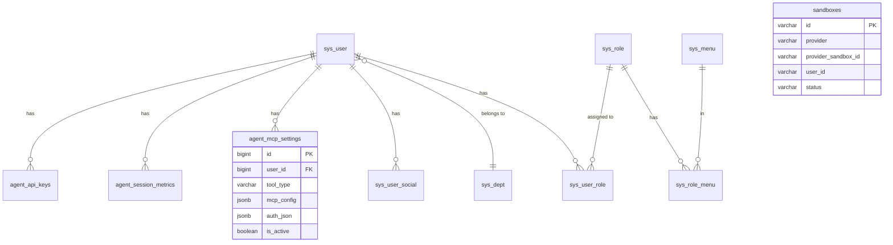

# Database Architecture Documentation

> Complete reference for all database tables, columns, and relationships.

---

## Overview

| Component | Description |
|-----------|-------------|
| **Database** | PostgreSQL (async via SQLAlchemy) |
| **Base Class** | `backend/common/model.py` - `Base(DataClassBase, DateTimeMixin)` |
| **Session** | `backend/database/db.py` - `CurrentSession` dependency |
| **CRUD Pattern** | `CRUDPlus` from sqlalchemy_crud_plus |
| **Migrations** | Alembic (`backend/alembic/`) |

---

## Admin Tables (`backend/app/admin/model/`)

### `sys_user` - User Table

| Column | Type | Description |
|--------|------|-------------|
| `id` | BIGINT | Primary key |
| `uuid` | VARCHAR(64) | Unique identifier |
| `username` | VARCHAR(64) | Login username (unique) |
| `nickname` | VARCHAR(64) | Display name |
| `password` | VARCHAR(256) | Hashed password |
| `salt` | BLOB | Password salt |
| `email` | VARCHAR(256) | Email (unique) |
| `phone` | VARCHAR(11) | Phone number |
| `avatar` | VARCHAR(256) | Avatar URL |
| `status` | INT | 0=disabled, 1=active |
| `is_superuser` | BOOLEAN | Super admin flag |
| `is_staff` | BOOLEAN | Staff flag |
| `is_multi_login` | BOOLEAN | Allow multiple sessions |
| `credits` | FLOAT | AI tool credit balance |
| `bonus_credits` | FLOAT | Bonus credits (used first) |
| `dept_id` | BIGINT | FK to department |
| `join_time` | TIMESTAMP | Registration time |
| `last_login_time` | TIMESTAMP | Last login |
| `last_password_changed_time` | TIMESTAMP | Password change time |

**Relationships:**
- `api_keys` → `agent_api_keys` (one-to-many)

---

### `sys_role` - Role Table

| Column | Type | Description |
|--------|------|-------------|
| `id` | BIGINT | Primary key |
| `name` | VARCHAR(32) | Role name (unique) |
| `status` | INT | 0=disabled, 1=active |
| `is_filter_scopes` | BOOLEAN | Apply data scope filters |
| `remark` | TEXT | Notes |

---

### `sys_menu` - Menu Table

| Column | Type | Description |
|--------|------|-------------|
| `id` | BIGINT | Primary key |
| `title` | VARCHAR(32) | Menu title |
| `name` | VARCHAR(32) | Route name |
| `path` | VARCHAR(256) | Route path |
| `component` | VARCHAR(256) | Vue component |
| `perms` | VARCHAR(256) | Permission string |
| `type` | INT | 0=dir, 1=menu, 2=button |
| `icon` | VARCHAR(64) | Icon name |
| `sort` | INT | Display order |
| `status` | INT | 0=hidden, 1=visible |
| `parent_id` | BIGINT | Parent menu ID |

---

### `sys_dept` - Department Table

| Column | Type | Description |
|--------|------|-------------|
| `id` | BIGINT | Primary key |
| `name` | VARCHAR(64) | Department name |
| `leader` | VARCHAR(32) | Leader name |
| `phone` | VARCHAR(11) | Contact phone |
| `email` | VARCHAR(64) | Contact email |
| `sort` | INT | Display order |
| `status` | INT | 0=disabled, 1=active |
| `parent_id` | BIGINT | Parent dept ID |

---

### `sys_login_log` - Login Log Table

| Column | Type | Description |
|--------|------|-------------|
| `id` | BIGINT | Primary key |
| `user_uuid` | VARCHAR(64) | User UUID |
| `username` | VARCHAR(64) | Username |
| `ip` | VARCHAR(128) | IP address |
| `city` | VARCHAR(256) | Location |
| `user_agent` | TEXT | Browser info |
| `os` | VARCHAR(64) | Operating system |
| `browser` | VARCHAR(64) | Browser name |
| `device` | VARCHAR(64) | Device type |
| `msg` | TEXT | Status message |
| `status` | INT | 0=fail, 1=success |
| `login_time` | TIMESTAMP | Login time |

---

### `sys_opera_log` - Operation Log Table

| Column | Type | Description |
|--------|------|-------------|
| `id` | BIGINT | Primary key |
| `trace_id` | VARCHAR(64) | Request trace ID |
| `username` | VARCHAR(32) | Username |
| `method` | VARCHAR(8) | HTTP method |
| `title` | VARCHAR(256) | Operation title |
| `path` | VARCHAR(512) | Request path |
| `ip` | VARCHAR(128) | IP address |
| `args` | JSON | Request params |
| `status` | INT | Response status code |
| `code` | VARCHAR(32) | Business code |
| `msg` | TEXT | Response message |
| `cost_time` | FLOAT | Request duration (ms) |
| `opera_time` | TIMESTAMP | Operation time |

---

## Agent Tables (`backend/app/agent/model/`)

### `agent_api_keys` - API Keys

| Column | Type | Description |
|--------|------|-------------|
| `id` | BIGINT | Primary key |
| `user_id` | BIGINT | FK to sys_user |
| `api_key` | VARCHAR(256) | Token (prefix: `sk_`) |
| `name` | VARCHAR(128) | Key label |
| `is_active` | BOOLEAN | Active status |
| `created_at` | TIMESTAMP | Creation time |
| `expires_at` | TIMESTAMP | Expiration (null=never) |
| `last_used_at` | TIMESTAMP | Last usage |

---

### `agent_session_metrics` - Session Credits

| Column | Type | Description |
|--------|------|-------------|
| `id` | BIGINT | Primary key |
| `user_id` | BIGINT | FK to sys_user |
| `session_id` | VARCHAR(64) | Agent session ID |
| `model_name` | VARCHAR(64) | LLM model used |
| `credits` | FLOAT | Credits consumed |
| `total_prompt_tokens` | INT | Prompt tokens |
| `total_completion_tokens` | INT | Completion tokens |
| `created_at` | TIMESTAMP | Start time |
| `updated_at` | TIMESTAMP | Last update |

---

### `agent_mcp_settings` - MCP Tool Configuration

| Column | Type | Description |
|--------|------|-------------|
| `id` | BIGINT | Primary key |
| `user_id` | BIGINT | FK to sys_user |
| `tool_type` | VARCHAR(64) | Tool type (codex, claude_code, custom:*) |
| `mcp_config` | JSONB | MCP server config |
| `auth_json` | JSONB | Authentication credentials |
| `metadata_json` | JSONB | Additional settings |
| `is_active` | BOOLEAN | Active status |
| `store_path` | VARCHAR(256) | Sandbox credential path |
| `created_time` | TIMESTAMP | Creation time |
| `updated_time` | TIMESTAMP | Last update |

**Unique Constraint:** `(user_id, tool_type)`

**Example `mcp_config`:**
```json
{
  "mcpServers": {
    "codex-as-mcp": {
      "command": "uvx",
      "args": ["--from", "git+https://...", "codex-as-mcp", "--yolo"]
    }
  }
}
```

---

## Sandbox Tables (`backend/src/sandbox/sandbox_server/db/`)

### `sandboxes` - Sandbox Records

| Column | Type | Description |
|--------|------|-------------|
| `id` | VARCHAR | UUID primary key |
| `provider` | VARCHAR | Provider (e2b, daytona) |
| `provider_sandbox_id` | VARCHAR | Provider's sandbox ID |
| `user_id` | VARCHAR | User ID |
| `status` | VARCHAR | initializing, running, stopped |
| `created_at` | TIMESTAMP | Creation time |
| `started_at` | TIMESTAMP | Start time |
| `stopped_at` | TIMESTAMP | Stop time |
| `deleted_at` | TIMESTAMP | Deletion time |
| `last_activity_at` | TIMESTAMP | Last activity |

---

## Plugin Tables

### OAuth2 (`backend/plugin/oauth2/model/`)

| Table | Description |
|-------|-------------|
| `sys_user_social` | Social login connections |

### Config (`backend/plugin/config/model/`)

| Table | Description |
|-------|-------------|
| `sys_config` | System configuration key-value pairs |

### Dict (`backend/plugin/dict/model/`)

| Table | Description |
|-------|-------------|
| `sys_dict_type` | Dictionary types |
| `sys_dict_data` | Dictionary values |

### Notice (`backend/plugin/notice/model/`)

| Table | Description |
|-------|-------------|
| `sys_notice` | System announcements |

### Code Generator (`backend/plugin/code_generator/model/`)

| Table | Description |
|-------|-------------|
| `gen_business` | Code generation templates |
| `gen_column` | Template columns |

---

## Task Scheduler (`backend/app/task/model/`)

| Table | Description |
|-------|-------------|
| `task_scheduler` | Celery scheduled tasks |
| `task_result` | Task execution results |
| `task_set_result` | Task set results |

---

## Entity Relationship Diagram



---

## LangGraph Checkpointer (Separate Database)

| Config Key | Description |
|------------|-------------|
| `LANGGRAPH_CHECKPOINT_ENABLED` | Enable checkpointing |
| `LANGGRAPH_CHECKPOINT_DB_URL` | PostgreSQL/MongoDB URL |

Tables are auto-created by `AsyncPostgresSaver.setup()`. Uses a **separate connection pool**.

---

## Redis Usage

| Purpose | Key Pattern |
|---------|-------------|
| Session tokens | User session data |
| OAuth2 state | `OAUTH2_STATE_REDIS_PREFIX:*` |
| Cache | Various caching needs |
