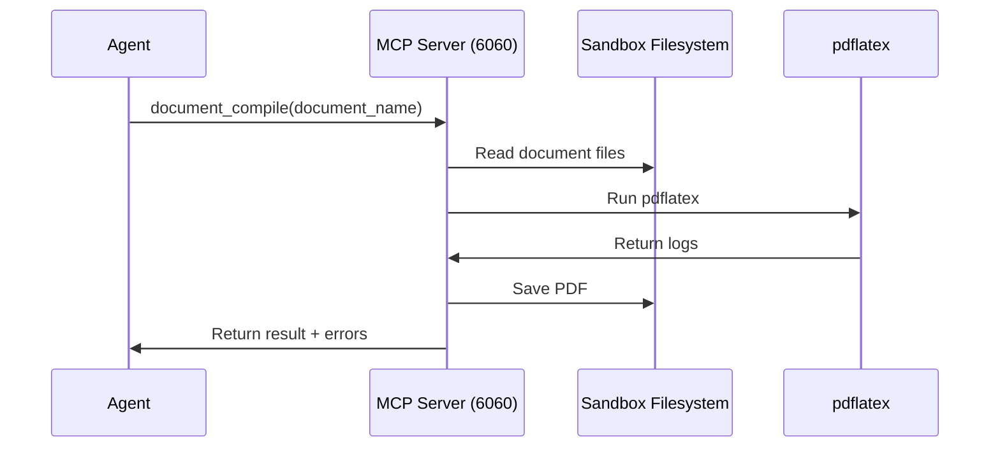

# Documents System - API Contracts

> Complete API reference for the LaTeX document system. Provides document creation, editing, and PDF compilation.

---

## Overview

The Documents System enables AI agents to create, edit, and compile LaTeX documents. Unlike the Slides system (HTML-based), Documents uses LaTeX for professional academic and business documents.

### Key Features
- **7 Templates**: Note, Report, CV, CV_2, Letter, Beamer, Poster
- **Local Compilation**: Uses pdflatex inside the sandbox (texlive)
- **LaTeX Editor**: Web-based Monaco editor on port 9001
- **Multi-file Projects**: Supports headers, bibliographies, and sections

---

## Port Allocation

| Port | Service | Mode |
|------|---------|------|
| 6060 | MCP Tool Server | All |
| 9000 | Code-Server (VS Code) | Dev |
| **9001** | **LaTeX Editor** | **Documents** |

> [!NOTE]
> All three services auto-start when the sandbox launches. The frontend chooses which port to expose based on the active mode (Dev vs Documents).

---

## File Locations

### Sandbox Storage

Documents are stored at: `/workspace/documents/{document_name}/`

```
/workspace/documents/
└── my_thesis/
    ├── main.tex          # Main file
    ├── header.tex        # Preamble/packages
    ├── reference.bib     # Bibliography
    └── metadata.json     # Document metadata
```

### Template Storage

Templates are stored at: `/app/agents_backend/.latex/{template_name}/`

---

# MCP Tool Endpoints

These tools are available via the MCP Tool Server on port 6060.

## `document_template_init`

Initialize a new LaTeX document from a template.

### Input Schema

```json
{
  "type": "object",
  "properties": {
    "document_name": {
      "type": "string",
      "description": "Name for the document (lowercase, no spaces)"
    },
    "template": {
      "type": "string",
      "enum": ["Note", "Report", "CV", "CV_2", "Letter", "Beamer", "Poster"]
    }
  },
  "required": ["document_name", "template"]
}
```

### Example

```json
{
  "tool": "document_template_init",
  "input": {
    "document_name": "conference-paper",
    "template": "Report"
  }
}
```

### Response

```json
{
  "success": true,
  "document_name": "conference_paper",
  "template": "Report",
  "document_directory": "/workspace/documents/conference_paper",
  "main_file": "main.tex",
  "tex_files": ["main.tex", "header.tex"],
  "bib_files": []
}
```

---

## `document_compile`

Compile a LaTeX document to PDF.

### Input Schema

```json
{
  "type": "object",
  "properties": {
    "document_name": {
      "type": "string",
      "description": "Name of the document to compile"
    },
    "main_file": {
      "type": "string",
      "description": "Main .tex file (optional, auto-detects if not specified)"
    }
  },
  "required": ["document_name"]
}
```

### Example

```json
{
  "tool": "document_compile",
  "input": {
    "document_name": "my-thesis"
  }
}
```

### Response (Success)

```json
{
  "success": true,
  "document_name": "my_thesis",
  "main_file": "main.tex",
  "pdf_path": "/workspace/documents/my_thesis/main.pdf",
  "run_count": 3,
  "warning_count": 2
}
```

### Response (Error)

```json
{
  "success": false,
  "document_name": "my_thesis",
  "main_file": "main.tex",
  "error_count": 1,
  "errors": [
    {
      "line": 42,
      "message": "Undefined control sequence \\foo",
      "type": "error",
      "file": "main.tex"
    }
  ]
}
```

---

## Available Templates

| Template | Main File | Description |
|----------|-----------|-------------|
| **Note** | `master.tex` | Academic lecture notes with TOC, bibliography, appendix |
| **Report** | `main.tex` | Clean academic report/assignment template |
| **CV** | `cv.tex` | Full academic CV with 6 section files |
| **CV_2** | `cv.tex` | Alternative CV style |
| **Letter** | `letter.tex` | Formal letter with custom class file |
| **Beamer** | `main.tex` | PDF presentation slides |
| **Poster** | `poster.tex` | Academic conference poster |

---

## Main File Detection

The `document_compile` tool auto-detects the main file in this order:

1. Value from `metadata.json`
2. `main.tex`
3. `master.tex`
4. File matching document name (e.g., `cv.tex` for CV)
5. First `.tex` file containing `\documentclass`

---

# LaTeX Editor Integration

## Port 9001

The LaTeX Editor is a React-based Monaco editor served on port 9001.

### Access URL

```bash
# Expose port via sandbox server
POST /sandboxes/expose-port
{
  "sandbox_id": "sandbox-123",
  "port": 9001
}

# Response
{
  "success": true,
  "url": "https://sandbox-123-9001.e2b.dev"
}
```

### Configuration

The editor is pre-built with these environment variables:

| Variable | Value | Description |
|----------|-------|-------------|
| `VITE_WORKSPACE_PATH` | `/workspace/documents` | Default document path |
| `VITE_API_BASE_URL` | `http://localhost:6060` | MCP server URL |
| `VITE_LATEX_API_URL` | `http://localhost:6060/api/compile` | Compilation endpoint |

---

# Document Metadata

Each document has a `metadata.json` file:

```json
{
  "document_name": "my_thesis",
  "template": "Report",
  "main_file": "main.tex",
  "created_at": "2026-01-09T12:00:00Z",
  "updated_at": "2026-01-09T15:30:00Z",
  "files": {
    "tex": ["main.tex", "header.tex"],
    "bib": ["reference.bib"]
  },
  "compilation": {
    "last_compiled": "2026-01-09T15:31:00Z",
    "status": "success",
    "output_file": "main.pdf"
  }
}
```

---

# Compilation Flow



---

# Error Handling

## Compilation Errors

```json
{
  "success": false,
  "errors": [
    {
      "line": 42,
      "message": "Undefined control sequence",
      "type": "error",
      "file": "main.tex"
    }
  ],
  "log": "! Undefined control sequence.\nl.42 \\foo\n..."
}
```

## Common Error Types

| Type | Description |
|------|-------------|
| `error` | LaTeX compilation error (stops compilation) |
| `warning` | LaTeX warning (compilation continues) |
| `badbox` | Overfull/underfull box warning |

---

# Dependencies

## Sandbox (e2b.Dockerfile)

```dockerfile
# texlive packages installed
apt-get install -y \
  texlive-base \
  texlive-latex-base \
  texlive-latex-extra \
  texlive-fonts-recommended \
  texlive-bibtex-extra \
  biber \
  latexmk
```

---

# Related Documentation

- [Sandbox Server API](./sandbox-server.md)
- [Tool Server API](./tool-server.md)
- [Port Allocation](./ports.md)
- [Documents Guide](../guides/documents-system.md)
