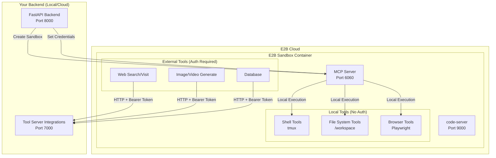
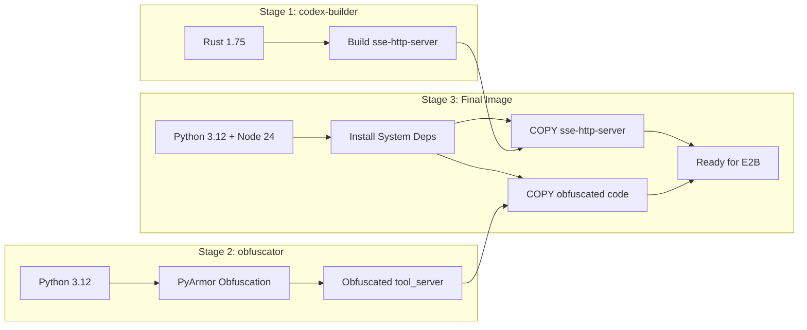
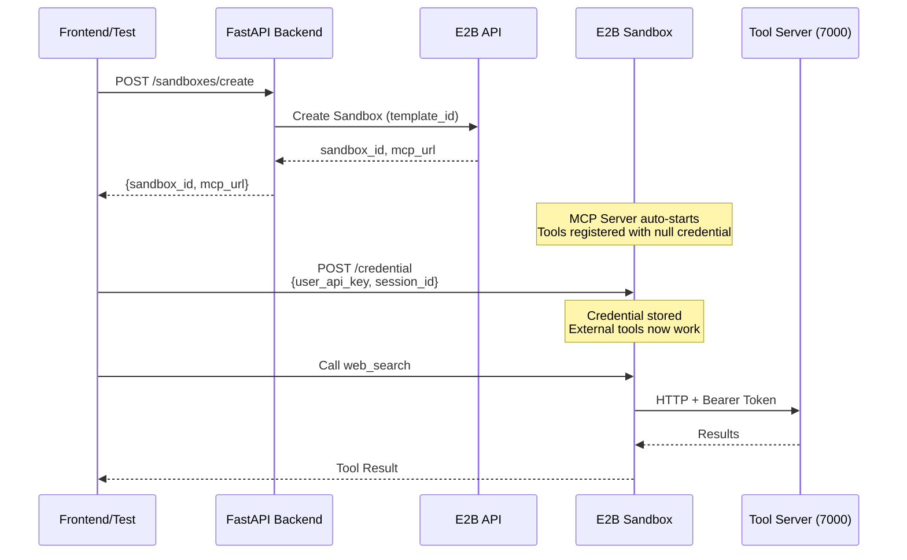

# E2B Sandbox Architecture & Template Guide

**Last Updated**: 2025-12-27  
**Template ID**: `vg6mdf4wgu5qoijamwb5`  
**Template Name**: `agents-sandbox`  
**Team ID**: `aa3fc779-c133-42ae-97a3-e8e534bfd0f3`

---

## Overview

The E2B sandbox provides an isolated cloud execution environment for AI agents. It contains tools for shell execution, file operations, browser automation, and web/media integrations—all exposed via an MCP (Model Context Protocol) server.



---

## Template Configuration

| Property | Value | Description |
|----------|-------|-------------|
| **template_id** | `vg6mdf4wgu5qoijamwb5` | Unique E2B identifier |
| **template_name** | `agents-sandbox` | Human-readable name |
| **team_id** | `aa3fc779-c133-42ae-97a3-e8e534bfd0f3` | E2B team owner |
| **dockerfile** | `e2b.Dockerfile` | Build configuration |
| **config_file** | `backend/e2b.toml` | E2B CLI config |

### Configuration Files

```
backend/
├── e2b.toml                     # E2B template configuration
├── e2b.Dockerfile               # Multi-stage Docker build
├── e2b-requirements.txt         # Python dependencies
└── docker/sandbox/
    ├── start-services.sh        # Service startup script
    ├── entrypoint.sh            # Container entrypoint
    ├── .bashrc                  # Shell configuration
    ├── template.css             # code-server styling
    └── claude_template.json     # Claude CLI configuration
```

---

## Build Process

### Running the Build

```bash
# Must run from project root (not backend/)
cd agents-backend
e2b template build
```

### Multi-Stage Build Architecture

The Dockerfile uses **3 build stages** for optimization and code protection:



### What Gets Built

| Component | Source | Destination | Purpose |
|-----------|--------|-------------|---------|
| **Codex SSE Server** | Rust binary | `/usr/local/bin/sse-http-server` | HTTP-to-SSE bridge |
| **Tool Server (obfuscated)** | `backend/src/tool_server` | `/app/agents_backend/src/tool_server` | MCP tools |
| **PyArmor Runtime** | Generated | `/app/agents_backend/src/pyarmor_runtime_000000` | Obfuscation runtime |
| **Templates** | `.templates/` | `/app/agents_backend/.templates` | Code templates |

### Installed Software

| Software | Version | Purpose |
|----------|---------|---------|
| Python | 3.12 | Runtime |
| Node.js | 24 | JavaScript runtime |
| code-server | Latest | VS Code in browser |
| Playwright | 1.55.0 | Browser automation |
| tmux | System | Terminal multiplexing |
| ripgrep | System | Fast file search |
| pandoc | System | Document conversion |
| Chromium | Playwright | Headless browser |

---

## Services Inside the Sandbox

### Startup Sequence

When the sandbox starts, `start-services.sh` launches:

```bash
#!/bin/bash
# 1. Start MCP Tool Server on port 6060
tmux new-session -d -s mcp-server-system-never-kill \
    "PYTHONPATH=/app/agents_backend/src xvfb-run python -m tool_server.mcp.server --port 6060"

# 2. Start code-server on port 9000
tmux new-session -d -s code-server-system-never-kill \
    "code-server --port 9000 --auth none /workspace"
```

### Service Endpoints

| Service | Port | External URL Pattern | Purpose |
|---------|------|---------------------|---------|
| MCP Server | 6060 | `https://6060-{sandbox-id}.e2b.app` | Tool execution via MCP |
| code-server | 9000 | `https://9000-{sandbox-id}.e2b.app` | VS Code IDE |

---

## Tool Categories

### Local Tools (Execute Inside Sandbox)

These tools run **entirely within the sandbox** and require NO external authentication:

| Category | Tools | Description |
|----------|-------|-------------|
| **Shell** | `run_shell_command`, `shell_view`, `shell_write`, `shell_init`, `shell_list`, `shell_stop` | tmux-based terminal |
| **File System** | `file_read`, `file_write`, `file_edit`, `file_patch`, `grep`, `ast_grep` | Local `/workspace` operations |
| **Browser** | `navigate`, `click`, `enter_text`, `scroll`, `screenshot`, `wait` | Playwright automation |
| **Productivity** | `todo_read`, `todo_write` | Task management |
| **Slides** | `slide_write`, `slide_edit`, `slide_patch` | PowerPoint generation |

### External Tools (Require Authentication)

These tools make **HTTP requests to Tool Server** and require `user_api_key`:

| Category | Tools | Endpoint Called |
|----------|-------|-----------------|
| **Web Search** | `web_search`, `web_batch_search` | `POST /web-search` |
| **Web Visit** | `web_visit`, `web_visit_compress` | `POST /researcher-web-visit` |
| **Image** | `generate_image`, `image_search` | `POST /image-generation`, `/image-search` |
| **Video** | `generate_video` | `POST /video-generation` |
| **Database** | `get_database_connection` | `POST /database` |

---

## Credential Flow



### Credential Types

| Credential | Source | Used For |
|------------|--------|----------|
| `user_api_key` | Backend `agent_api_keys` table | Authenticating Tool Server requests |
| `session_id` | Generated per chat | Tracking usage/billing per session |
| `E2B_API_KEY` | Environment variable | Creating/managing E2B sandboxes |

---

## Key Files Reference

### MCP Server Entry Point

```
backend/src/tool_server/mcp/server.py
```

- Auto-registers all tools at startup
- Exposes `/health`, `/credential`, `/tool-server-url` endpoints
- Provides MCP `/mcp/` endpoint for langchain-mcp-adapters

### Tool Implementations

```
backend/src/tool_server/tools/
├── shell/           # Terminal management (tmux)
├── file_system/     # File operations
├── browser/         # Playwright automation
├── web/             # Web search, visit (require auth)
├── media/           # Image/video generation (require auth)
├── dev/             # Database, init, checkpoints
├── slide_system/    # PowerPoint generation
└── productivity/    # Todo management
```

### Sandbox Server

```
backend/src/sandbox/sandbox_server/
├── sandboxes/
│   ├── e2b.py            # E2B provider implementation
│   ├── daytona.py        # Daytona provider (alternative)
│   └── sandbox_factory.py # Provider selection
├── lifecycle/
│   ├── sandbox_controller.py  # Create/delete sandboxes
│   └── queue.py               # Background operations
└── config.py                  # E2B_TEMPLATE_ID default
```

---

## Code Protection

The tool_server code is **obfuscated** before being included in the E2B template:

1. **PyArmor** encrypts Python bytecode
2. Only the **obfuscated code** is pushed to E2B
3. Original source code never leaves your machine
4. Runtime requires `pyarmor_runtime_000000` module

---

## Common Commands

```bash
# Build and push template to E2B
cd agents-backend
e2b template build

# Create sandbox programmatically
from e2b import AsyncSandbox
sandbox = await AsyncSandbox.create("vg6mdf4wgu5qoijamwb5")

# Check MCP health
curl https://6060-{sandbox-id}.e2b.app/health

# Set credentials
curl -X POST https://6060-{sandbox-id}.e2b.app/credential \
  -H "Content-Type: application/json" \
  -d '{"user_api_key": "sk_xxx", "session_id": "uuid"}'

# Get tools via MCP
GET https://6060-{sandbox-id}.e2b.app/mcp/
```

---

## Troubleshooting

| Issue | Cause | Solution |
|-------|-------|----------|
| MCP server not responding | Service didn't start | Check `/tmp/mcp-server.log` inside sandbox |
| 502 Bad Gateway on health | MCP not running | Rebuild template, check start-services.sh |
| Web tools return auth error | No credential set | POST to `/credential` endpoint |
| Docker build fails | Docker not running | Start Docker Desktop |
| "not found" during build | Wrong directory | Run `e2b template build` from project root |

---

## Related Documentation

- [Sandbox Server API](sandbox-server.md) - REST API for sandbox management
- [Tool Server API](tool-server.md) - External tool integrations
- [E2B Documentation](https://e2b.dev/docs) - Official E2B guides
