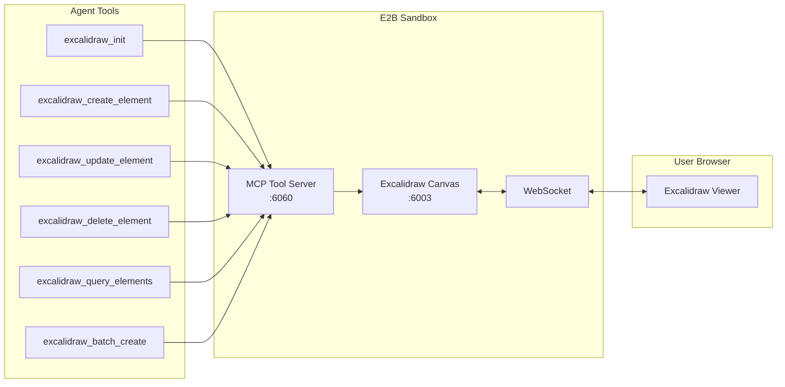

# Excalidraw System - API Contracts

> Complete API reference for the Excalidraw whiteboard system. Provides real-time diagram and sketch creation with hand-drawn aesthetics.

---

## Overview

The Excalidraw System enables AI agents to create diagrams, sketches, and wireframes using the Excalidraw library. Unlike Draw.io (structured diagrams), Excalidraw produces hand-drawn style graphics ideal for brainstorming and informal communication.

### Key Features
- **13 MCP Tools**: Full CRUD, batch operations, grouping, alignment
- **Real-time Sync**: WebSocket updates for live browser viewing
- **Hand-drawn Style**: Aesthetic sketchy appearance
- **Canvas Server**: Standalone Express server on port 6003

---

## Port Allocation

| Port | Service | Mode |
|------|---------|------|
| 6060 | MCP Tool Server | All |
| 9000 | Code-Server (VS Code) | Dev |
| 9001 | LaTeX Editor | Documents |
| **6003** | **Excalidraw Canvas Server** | **Design (Excalidraw)** |

> [!NOTE]
> The Excalidraw server auto-starts with the sandbox via `start-services.sh`. The frontend exposes port 6003 for the drawing mode.

---

## Architecture



---

## File Locations

### Source Code

| Component | Path |
|-----------|------|
| MCP Tools | `backend/src/tool_server/tools/excalidraw/` |
| Canvas Server | `backend/src/excalidraw-mcp/` |

### Sandbox Runtime

| Path | Description |
|------|-------------|
| `/app/agents_backend/excalidraw-server/` | Built Canvas Server |
| `/tmp/excalidraw.log` | Server logs |

---

# MCP Tool Endpoints

These tools are available via the MCP Tool Server on port 6060.

## Session Management

### `excalidraw_init`

Initialize a new Excalidraw whiteboard session.

**Input Schema:**
```json
{
  "type": "object",
  "properties": {
    "canvas_name": {
      "type": "string",
      "description": "Optional name for the canvas"
    }
  },
  "required": []
}
```

**Response:**
```json
{
  "session_id": "excalidraw-a1b2c3d4e5f6",
  "canvas_name": "canvas_abc12345",
  "viewer_url": "http://localhost:6003/",
  "current_element_count": 0,
  "websocket_clients": 0
}
```

---

## Element CRUD

### `excalidraw_create_element`

Create a new element on the canvas.

**Input Schema:**
```json
{
  "type": "object",
  "properties": {
    "type": {
      "type": "string",
      "enum": ["rectangle", "ellipse", "diamond", "line", "arrow", "text", "freedraw"]
    },
    "x": {"type": "number", "description": "X coordinate"},
    "y": {"type": "number", "description": "Y coordinate"},
    "width": {"type": "number", "description": "Width (default: 100)"},
    "height": {"type": "number", "description": "Height (default: 100)"},
    "backgroundColor": {"type": "string", "description": "Fill color (hex or 'transparent')"},
    "strokeColor": {"type": "string", "description": "Stroke color (hex)"},
    "strokeWidth": {"type": "number", "description": "1-5 (default: 1)"},
    "roughness": {"type": "number", "description": "0=none, 1=low, 2=high"},
    "opacity": {"type": "number", "description": "0-100"},
    "text": {"type": "string", "description": "Text content (required for text type)"},
    "fontSize": {"type": "number", "description": "Font size in pixels"},
    "fontFamily": {"type": "number", "description": "1=Hand-drawn, 2=Normal, 3=Code"}
  },
  "required": ["type", "x", "y"]
}
```

**Example:**
```json
{
  "type": "rectangle",
  "x": 100,
  "y": 100,
  "width": 200,
  "height": 100,
  "backgroundColor": "#a5d8ff",
  "strokeColor": "#1971c2"
}
```

---

### `excalidraw_update_element`

Update an existing element's properties.

**Input Schema:**
```json
{
  "type": "object",
  "properties": {
    "id": {"type": "string", "description": "Element ID to update"},
    "x": {"type": "number"},
    "y": {"type": "number"},
    "width": {"type": "number"},
    "height": {"type": "number"},
    "backgroundColor": {"type": "string"},
    "strokeColor": {"type": "string"},
    "text": {"type": "string"}
  },
  "required": ["id"]
}
```

---

### `excalidraw_delete_element`

Delete an element from the canvas.

**Input Schema:**
```json
{
  "type": "object",
  "properties": {
    "id": {"type": "string", "description": "Element ID to delete"}
  },
  "required": ["id"]
}
```

---

### `excalidraw_query_elements`

Query elements on the canvas.

**Input Schema:**
```json
{
  "type": "object",
  "properties": {
    "type": {"type": "string", "description": "Filter by element type"},
    "include_deleted": {"type": "boolean", "default": false}
  },
  "required": []
}
```

**Response:**
```json
{
  "elements": [
    {
      "id": "abc123",
      "type": "rectangle",
      "x": 100,
      "y": 100,
      "width": 200,
      "height": 100
    }
  ],
  "total_count": 1
}
```

---

## Batch Operations

### `excalidraw_batch_create`

Create multiple elements in a single call.

**Input Schema:**
```json
{
  "type": "object",
  "properties": {
    "elements": {
      "type": "array",
      "items": {
        "type": "object",
        "properties": {
          "type": {"type": "string"},
          "x": {"type": "number"},
          "y": {"type": "number"}
        }
      }
    }
  },
  "required": ["elements"]
}
```

---

## Organization Tools

### `excalidraw_group_elements`

Group multiple elements together.

**Input Schema:**
```json
{
  "type": "object",
  "properties": {
    "element_ids": {
      "type": "array",
      "items": {"type": "string"}
    }
  },
  "required": ["element_ids"]
}
```

---

### `excalidraw_ungroup_elements`

Ungroup a grouped set of elements.

**Input Schema:**
```json
{
  "type": "object",
  "properties": {
    "group_id": {"type": "string"}
  },
  "required": ["group_id"]
}
```

---

### `excalidraw_align_elements`

Align elements horizontally or vertically.

**Input Schema:**
```json
{
  "type": "object",
  "properties": {
    "element_ids": {"type": "array", "items": {"type": "string"}},
    "alignment": {
      "type": "string",
      "enum": ["left", "center", "right", "top", "middle", "bottom"]
    }
  },
  "required": ["element_ids", "alignment"]
}
```

---

### `excalidraw_distribute_elements`

Distribute elements evenly.

**Input Schema:**
```json
{
  "type": "object",
  "properties": {
    "element_ids": {"type": "array", "items": {"type": "string"}},
    "direction": {"type": "string", "enum": ["horizontal", "vertical"]}
  },
  "required": ["element_ids", "direction"]
}
```

---

## State Tools

### `excalidraw_lock_element`

Lock an element to prevent modification.

**Input Schema:**
```json
{
  "type": "object",
  "properties": {
    "id": {"type": "string"}
  },
  "required": ["id"]
}
```

---

### `excalidraw_unlock_element`

Unlock a locked element.

**Input Schema:**
```json
{
  "type": "object",
  "properties": {
    "id": {"type": "string"}
  },
  "required": ["id"]
}
```

---

## Resource Tools

### `excalidraw_get_resource`

Export the canvas or get element data.

**Input Schema:**
```json
{
  "type": "object",
  "properties": {
    "format": {"type": "string", "enum": ["json", "svg", "png"]},
    "element_ids": {
      "type": "array",
      "items": {"type": "string"},
      "description": "Optional: specific elements to export"
    }
  },
  "required": ["format"]
}
```

---

# Canvas Server API

The Excalidraw Canvas Server runs on port 6003 and provides:

## HTTP Endpoints

| Method | Endpoint | Description |
|--------|----------|-------------|
| GET | `/` | Excalidraw viewer (React app) |
| GET | `/health` | Health check with element count |
| GET | `/api/elements` | List all elements |
| POST | `/api/elements` | Create element |
| PUT | `/api/elements/:id` | Update element |
| DELETE | `/api/elements/:id` | Delete element |
| POST | `/api/elements/batch` | Batch create |
| GET | `/api/export/:format` | Export as JSON/SVG/PNG |

## WebSocket

```javascript
// Connect to canvas updates
const ws = new WebSocket('ws://localhost:6003');

// Receive real-time updates
ws.onmessage = (event) => {
  const { type, elements } = JSON.parse(event.data);
  // type: 'update', 'create', 'delete'
  // elements: affected element data
};
```

---

# Element Types

| Type | Description | Required Props |
|------|-------------|----------------|
| `rectangle` | Rectangle shape | x, y |
| `ellipse` | Ellipse/circle | x, y |
| `diamond` | Diamond shape | x, y |
| `line` | Straight line | x, y, points |
| `arrow` | Arrow with head | x, y, points |
| `text` | Text label | x, y, text |
| `freedraw` | Freehand drawing | x, y, points |

---

# Usage Example

## Create a Simple Flowchart

```python
# 1. Initialize session
excalidraw_init(canvas_name="flowchart")

# 2. Create start box
excalidraw_create_element(
    type="rectangle",
    x=100, y=100,
    width=120, height=60,
    backgroundColor="#d3f9d8",
    strokeColor="#2b8a3e"
)

# 3. Add label
excalidraw_create_element(
    type="text",
    x=130, y=120,
    text="Start",
    fontSize=18
)

# 4. Create arrow
excalidraw_create_element(
    type="arrow",
    x=160, y=160,
    width=0, height=80,
    strokeColor="#495057"
)

# 5. Create process box
excalidraw_create_element(
    type="rectangle",
    x=100, y=260,
    width=120, height=60,
    backgroundColor="#a5d8ff",
    strokeColor="#1971c2"
)
```

---

# Startup Configuration

## start-services.sh

```bash
# Start Excalidraw Canvas Server
echo "Starting Excalidraw Canvas Server on port $EXCALIDRAW_PORT..."
tmux new-session -d -s excalidraw-server-system-never-kill -c /app/agents_backend/excalidraw-server \
    "node dist/index.js 2>&1 | tee /tmp/excalidraw.log"
```

## Environment Variables

| Variable | Default | Description |
|----------|---------|-------------|
| `EXCALIDRAW_PORT` | 6003 | Canvas server port |

---

# Error Handling

## Common Errors

| Error | Cause | Solution |
|-------|-------|----------|
| "Excalidraw server not available" | Server not running | Check `/tmp/excalidraw.log` |
| "Request timeout" | Server overloaded | Reduce batch size |
| "Element not found" | Invalid ID | Query elements first |

---

# Related Documentation

- [Tool Server API](./tool-server.md)
- [Sandbox Server API](./sandbox-server.md)
- [Port Allocation](./ports.md)
- [Excalidraw Guide](../guides/excalidraw.md)
