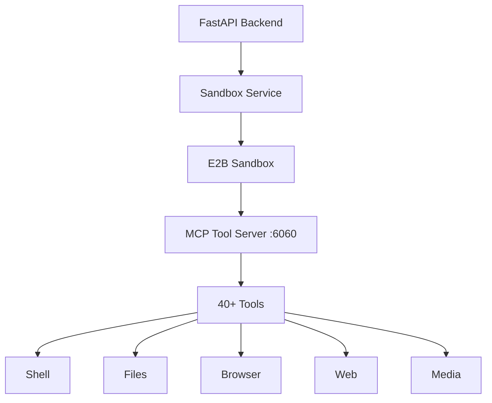

# Tool Server API Contract

## Overview

The `tool_server` is a collection of **40+ AI agent tools** that run inside E2B sandboxes via the **Model Context Protocol (MCP)**. It enables AI agents to execute code, browse the web, edit files, generate media, and more.

---

## Architecture



---

## Available Tools (40+)

### Shell Tools (`tools/shell/`)

| Tool | Description |
| ---- | ----------- |
| `shell_init` | Initialize terminal session |
| `shell_run_command` | Execute command |
| `shell_view` | View terminal output |
| `shell_stop_command` | Stop running command |
| `shell_list` | List active terminals |
| `shell_write_to_process` | Send input to process |

### File System Tools (`tools/file_system/`)

| Tool | Description |
| ---- | ----------- |
| `file_read` | Read file content |
| `file_write` | Write file content |
| `file_edit` | Edit file sections |
| `apply_patch` | Apply diff patch |
| `str_replace_editor` | Find/replace editing |
| `ast_grep` | AST-based code search |
| `grep` | Text search |

### Browser Tools (`tools/browser/`)

| Tool | Description |
| ---- | ----------- |
| `browser_click` | Click element |
| `browser_view` | View page/screenshot |
| `browser_navigate` | Navigate to URL |
| `browser_enter_text` | Type text |
| `browser_scroll_*` | Scroll up/down |
| `browser_switch_tab` | Switch tabs |
| +9 more | Additional browser tools |

### Web Tools (`tools/web/`)

| Tool | Description |
| ---- | ----------- |
| `web_search` | Search the web |
| `web_visit` | Visit and extract page |
| `web_visit_compress` | Compressed extraction |
| `image_search` | Search for images |
| `read_remote_image` | Read remote image |
| `web_batch_search` | Batch search |

### Media Tools (`tools/media/`)

| Tool | Description |
| ---- | ----------- |
| `image_generate` | Generate images (Vertex AI) |
| `video_generate` | Generate videos (Vertex AI) |

---

## Usage with LangChain

### Quick Start

```python
from langgraph.prebuilt import create_react_agent
from backend.src.llms.llm import get_llm

# Get LLM from backend
llm = get_llm()

# Create tools (see run_langchain_agent.py for full example)
tools = [run_shell_command, write_file, read_file, ...]

# Create agent
agent = create_react_agent(llm, tools)

# Run task
result = await agent.ainvoke({
    "messages": [{"role": "user", "content": "Create a Python file..."}]
})
```

---

## Test Files

```bash
cd backend/tests/live
```

| File | Tests | Status |
| ---- | ----- | ------ |
| `test_sandbox_comprehensive.py` | 10 sandbox API tests | ✅ 10/10 |
| `test_mcp_tool_server.py` | 6 MCP tests | ✅ 5/6 |
| `test_all_tools.py` | 25 tool tests | ✅ 24/25 |
| `run_langchain_agent.py` | LangChain agent | ✅ Working |
| `run_mcp_agent.py` | Sandbox agent | ✅ Working |

### Run Tests

```bash
cd backend/tests/live

# Comprehensive tool test (25 tests)
python test_all_tools.py

# LangChain agent with sandbox tools
python run_langchain_agent.py

# Sandbox agent (simple)
python run_mcp_agent.py
```

---

## Configuration

### Environment Variables

```bash
# backend/.env

# LLM Provider (for get_llm)
LLM_PROVIDER=openai
OPENAI_API_KEY=your_key
OPENAI_MODEL=gpt-4o-mini

# For web tools
TAVILY_API_KEY=your_tavily_key
SERPER_API_KEY=your_serper_key

# For image/video generation
GOOGLE_APPLICATION_CREDENTIALS=/path/to/credentials.json
```

---

## Location

```
backend/src/tool_server/
├── browser/       # Playwright browser automation
├── core/          # Workspace management
├── integrations/  # External service clients
├── mcp/           # MCP server entry point
└── tools/         # 40+ agent tools
    ├── shell/
    ├── file_system/
    ├── browser/
    ├── web/
    ├── media/
    └── slide_system/
```
