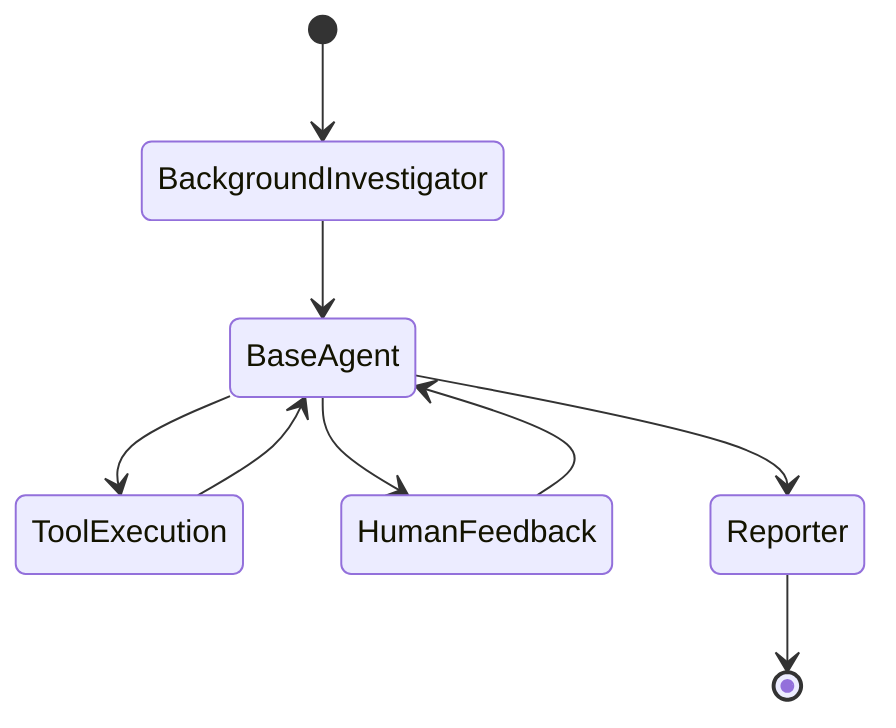

# Backend Source (`src/`) Documentation

> The Agentic AI System - LangGraph, tools, sandboxes, and more.

---

## Overview

The `backend/src/` directory contains the core AI functionality:

| Module | Purpose | Key Files |
|--------|---------|-----------|
| `graph/` | LangGraph workflow | builder.py, nodes.py, state.py |
| `tool_server/` | MCP tools (44+) | mcp/server.py, tools/manager.py |
| `sandbox/` | Execution environments | sandbox_server/, e2b.py |
| `rag/` | Document retrieval | retriever.py |
| `llms/` | LLM configuration | llm.py |
| `prompts/` | Prompt templates | *.md files |
| `agents/` | Agent implementations | - |
| `agent_template/` | Reusable template | - |
| `module/` | Feature modules | podcast, prose, slides |
| `ptc/` | Programmatic Tool Calling | - |

---

## LangGraph (`src/graph/`)

The multi-agent workflow engine.

### Key Files
| File | Purpose |
|------|---------|
| `builder.py` | Builds the LangGraph graph |
| `nodes.py` | Agent node implementations |
| `state.py` | Workflow state definition |
| `utils.py` | Graph utilities |

### Workflow


---

## Tool Server (`src/tool_server/`)

The MCP-based tool execution system.

### Structure
```
tool_server/
├── mcp/
│   ├── server.py          # FastMCP server
│   └── client.py          # MCPClient
├── tools/
│   ├── manager.py         # Tool aggregation
│   ├── base.py            # BaseTool class
│   ├── shell/             # Shell tools (6)
│   ├── file_system/       # File tools (7)
│   ├── browser/           # Browser tools (15)
│   ├── web/               # Web tools (6)
│   ├── media/             # Media tools (2)
│   └── ...
├── browser/               # Playwright browser
├── integrations/          # Web visit, search
└── mcp_integrations/      # External MCPs
```

### Tool Count: 44+
- Shell: 6
- File System: 7
- Browser: 15
- Web: 6
- Media: 2
- Dev: 4
- Productivity: 2
- Agent: 1
- Slide: 3

---

## Sandbox (`src/sandbox/`)

Isolated code execution environments.

### Structure
```
sandbox/
├── sandbox_server/
│   ├── sandboxes/
│   │   ├── base.py        # BaseSandbox
│   │   ├── e2b.py         # E2B provider
│   │   └── daytona.py     # Daytona provider
│   ├── db/                # Sandbox DB
│   └── ...
└── agent_infra_sandbox/   # DeepAgents CLI
```

### Providers
| Provider | Startup | Best For |
|----------|---------|----------|
| E2B | ~5s | Quick sandboxes |
| Daytona | ~30s | Dev environments |

---

## RAG (`src/rag/`)

Document retrieval for context-aware responses.

### Key Files
| File | Purpose |
|------|---------|
| `retriever.py` | Main retriever class |
| `embeddings/` | Vector embeddings |

---

## LLMs (`src/llms/`)

LLM configuration and access.

### Key Files
| File | Purpose |
|------|---------|
| `llm.py` | `get_llm()` function |

### Usage
```python
from backend.src.llms.llm import get_llm

llm = get_llm(model_name="gpt-4o")
response = await llm.ainvoke(messages)
```

---

## Prompts (`src/prompts/`)

Prompt templates for agents.

Contains `.md` and `.py` files with prompts for:
- Background investigation
- Code generation
- Report writing
- Clarification

---

## Module (`src/module/`)

Feature-specific modules:

| Module | Purpose |
|--------|---------|
| `podcast/` | Podcast generation |
| `prose/` | Writing assistance |
| `nano_banana_slides/` | Slide generation |

---

## PTC (`src/ptc/`)

Programmatic Tool Calling - alternative to JSON tool calls.

Generates Python code for tool execution instead of JSON.

---

## Services (`src/services/`)

Shared services:

| File | Purpose |
|------|---------|
| `sandbox_service.py` | Sandbox management with credentials |

---

## Related Documentation

- [LangGraph Lifecycle](../../lifecycle/agent-chat.md)
- [Sandbox Lifecycle](../../lifecycle/sandbox.md)
- [MCP Registry](../../lifecycle/mcp-registry.md)
- [Tool Reference](../../sandbox-tools.md)
