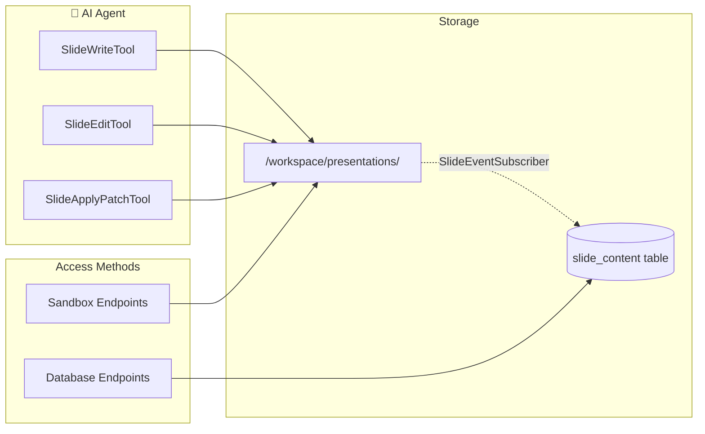

# Slides System - User Guide

> Complete guide for creating, managing, and exporting presentation slides using the AI agent.

---

## Overview

The Slides System enables AI agents to create HTML-based presentation slides that are automatically persisted to a database for frontend access. The system uses a **dual-write architecture**:


```mermaid
flowchart LR
    subgraph Agent["🤖 AI Agent"]
        SlideWrite["SlideWriteTool"]
        SlideEdit["SlideEditTool"]
        SlidePatch["SlideApplyPatchTool"]
    end
    
    subgraph Storage["Storage"]
        Sandbox["/workspace/presentations/"]
        DB[(slide_content table)]
    end
    
    subgraph Access["Access Methods"]
        SandboxAPI["Sandbox Endpoints"]
        DBAPI["Database Endpoints"]
    end
    
    SlideWrite --> Sandbox
    SlideEdit --> Sandbox
    SlidePatch --> Sandbox
    
    Sandbox -.->|SlideEventSubscriber| DB
    
    SandboxAPI --> Sandbox
    DBAPI --> DB
```

### Two Storage Types

| Storage | When to Use | Requires Active Sandbox |
|---------|-------------|-------------------------|
| **Sandbox** | Real-time editing, live preview | ✅ Yes |
| **Database** | History, sharing, downloads after session | ❌ No |

---

## Quick Start

### 1. Get Authentication Token

```powershell
$response = Invoke-RestMethod -Uri "http://localhost:8000/api/v1/auth/login/swagger?username=sandbox_test&password=TestPass123!" -Method POST
$token = $response.access_token
Write-Host "Token: $($token.Substring(0,30))..."
```

### 2. List Presentations

```powershell
$threadId = "your-thread-id"
$result = Invoke-RestMethod -Uri "http://localhost:8000/agent/sandboxes/db/presentations?thread_id=$threadId" `
  -Headers @{"Authorization"="Bearer $token"}

Write-Host "Found $($result.data.total) presentation(s)"
foreach ($pres in $result.data.presentations) {
    Write-Host "  - $($pres.name): $($pres.slide_count) slides"
}
```

### 3. View a Slide

```powershell
$slide = Invoke-RestMethod -Uri "http://localhost:8000/agent/sandboxes/db/slide?thread_id=$threadId&presentation_name=Demo&slide_number=1" `
  -Headers @{"Authorization"="Bearer $token"}

# Save to file and open in browser
$slide.data.content | Out-File -FilePath "slide_1.html" -Encoding UTF8
Start-Process "slide_1.html"
```

### 4. Download as PDF

```powershell
Invoke-WebRequest -Uri "http://localhost:8000/agent/sandboxes/db/download?thread_id=$threadId&presentation_name=Demo" `
  -Headers @{"Authorization"="Bearer $token"} `
  -OutFile "Demo.pdf"

Start-Process "Demo.pdf"
```

---

## Agent Tools

The AI agent has access to three slide tools:

### SlideWrite

Creates a new slide or overwrites an existing one.

**Tool Input:**
```json
{
  "presentation_name": "Q4_Report",
  "slide_number": 1,
  "title": "Introduction",
  "content": "<!DOCTYPE html><html>...</html>",
  "description": "Overview of Q4 results"
}
```

**Parameters:**

| Parameter | Type | Required | Description |
|-----------|------|----------|-------------|
| `presentation_name` | string | ✅ | Name of the presentation (folder) |
| `slide_number` | int | ✅ | Slide number (1-indexed) |
| `content` | string | ✅ | Complete HTML document |
| `title` | string | ❌ | Slide title (extracted if not provided) |
| `description` | string | ❌ | Notes/description |

**Output:**
- Creates `/workspace/presentations/{name}/slide_{number}.html`
- Automatically saved to database by `SlideEventSubscriber`

---

### SlideEdit

Performs find-and-replace on existing slide content.

**Tool Input:**
```json
{
  "presentation_name": "Q4_Report",
  "slide_number": 1,
  "find": "<h1>Old Title</h1>",
  "replace": "<h1>New Title</h1>"
}
```

---

### SlideApplyPatch

Applies bulk changes across multiple slides.

**Tool Input:**
```json
{
  "patches": [
    {
      "filepath": "/workspace/presentations/Q4_Report/slide_001.html",
      "find": "old text",
      "replace": "new text"
    },
    {
      "filepath": "/workspace/presentations/Q4_Report/slide_002.html",
      "find": "old text",
      "replace": "new text"
    }
  ]
}
```

---

## HTML Slide Format

Slides must be complete HTML documents at **1280×720** resolution:

```html
<!DOCTYPE html>
<html lang="en">
<head>
    <meta charset="UTF-8">
    <meta name="viewport" content="width=device-width, initial-scale=1.0">
    <title>Slide Title</title>
    <link href="https://fonts.googleapis.com/css2?family=Inter:wght@400;600;700&display=swap" rel="stylesheet">
    <style>
        * {
            margin: 0;
            padding: 0;
            box-sizing: border-box;
        }
        body {
            font-family: 'Inter', sans-serif;
            width: 1280px;
            height: 720px;
            overflow: hidden;  /* CRITICAL: No scrollbars */
        }
        .slide {
            width: 100%;
            height: 100%;
            display: flex;
            flex-direction: column;
            justify-content: center;
            align-items: center;
            background: linear-gradient(135deg, #667eea 0%, #764ba2 100%);
            color: white;
            padding: 60px;
        }
        h1 {
            font-size: 56px;
            margin-bottom: 24px;
        }
        p {
            font-size: 24px;
            max-width: 900px;
            text-align: center;
            line-height: 1.6;
        }
    </style>
</head>
<body>
    <div class="slide">
        <h1>Welcome to the Presentation</h1>
        <p>This is a sample slide demonstrating the proper HTML structure.</p>
    </div>
</body>
</html>
```

### Key Requirements

| Requirement | Why |
|-------------|-----|
| `overflow: hidden` | Prevents scrollbars - slide must fit in one view |
| 1280×720 dimensions | Standard presentation aspect ratio (16:9) |
| Complete HTML document | Required for standalone rendering |
| Inline CSS | Ensures styling works when rendered as PDF |
| Google Fonts via CDN | External fonts must be web-accessible |

---

## API Endpoints

### Choosing Between Sandbox and Database Endpoints

| Scenario | Use | Endpoint Pattern |
|----------|-----|------------------|
| Sandbox is running, need live preview | Sandbox | `/{sandbox_id}/...` |
| Sandbox stopped, need historical access | Database | `/db/...` |
| Frontend displaying slides to user | Database | `/db/...` |
| Downloading PDF after session | Database | `/db/download` |
| Real-time editing feedback | Sandbox | `/{sandbox_id}/slides/...` |

### Database Endpoints (Recommended)

| Endpoint | Method | Description |
|----------|--------|-------------|
| `/db/presentations` | GET | List all presentations for a thread |
| `/db/slide` | GET | Get specific slide content |
| `/db/slide` | POST | Manually create a slide |
| `/db/download` | GET | Download as PDF |
| `/db/download/stream` | GET | Download PDF with SSE progress |

### Sandbox Endpoints

| Endpoint | Method | Description |
|----------|--------|-------------|
| `/{sandbox_id}/presentations` | GET | List presentations in sandbox |
| `/{sandbox_id}/presentations/{name}` | GET | List slides in presentation |
| `/{sandbox_id}/slides/{name}/{num}` | GET | Get slide content |
| `/{sandbox_id}/slides/export` | POST | Export to PDF |
| `/{sandbox_id}/slides/download/{name}` | GET | Download as ZIP |

---

## Complete Examples

### Example 1: Create and Download a Presentation

```powershell
# 1. Login
$response = Invoke-RestMethod -Uri "http://localhost:8000/api/v1/auth/login/swagger?username=sandbox_test&password=TestPass123!" -Method POST
$token = $response.access_token

# 2. Create slides via API (normally the agent does this)
$threadId = "demo-thread-$(Get-Date -Format 'yyyyMMddHHmmss')"

$slide1 = @{
    presentation_name = "Demo"
    slide_number = 1
    content = @"
<!DOCTYPE html><html><head><style>
body { font-family: Arial; background: #4A90D9; color: white; display: flex; justify-content: center; align-items: center; height: 720px; width: 1280px; margin: 0; }
h1 { font-size: 72px; }
</style></head><body><h1>Welcome!</h1></body></html>
"@
    title = "Welcome"
} | ConvertTo-Json

Invoke-RestMethod -Uri "http://localhost:8000/agent/sandboxes/db/slide?thread_id=$threadId" `
  -Method POST `
  -Headers @{"Authorization"="Bearer $token"; "Content-Type"="application/json"} `
  -Body $slide1

# 3. List presentations
$presentations = Invoke-RestMethod -Uri "http://localhost:8000/agent/sandboxes/db/presentations?thread_id=$threadId" `
  -Headers @{"Authorization"="Bearer $token"}
Write-Host "Presentations: $($presentations.data.total)"

# 4. Download as PDF
Invoke-WebRequest -Uri "http://localhost:8000/agent/sandboxes/db/download?thread_id=$threadId&presentation_name=Demo" `
  -Headers @{"Authorization"="Bearer $token"} `
  -OutFile "Demo.pdf"

Write-Host "Downloaded Demo.pdf"
```

### Example 2: View All Slides as HTML Files

```powershell
$threadId = "slide-test-6c9a44b7"
$presentationName = "Python_Presentation"

# Get presentation info
$presentations = Invoke-RestMethod -Uri "http://localhost:8000/agent/sandboxes/db/presentations?thread_id=$threadId" `
  -Headers @{"Authorization"="Bearer $token"}

$pres = $presentations.data.presentations | Where-Object { $_.name -eq $presentationName }
Write-Host "Presentation: $($pres.name) ($($pres.slide_count) slides)"

# Download each slide as HTML
1..$pres.slide_count | ForEach-Object {
    $slide = Invoke-RestMethod -Uri "http://localhost:8000/agent/sandboxes/db/slide?thread_id=$threadId&presentation_name=$presentationName&slide_number=$_" `
      -Headers @{"Authorization"="Bearer $token"}
    
    $filename = "slide_$_.html"
    $slide.data.content | Out-File -FilePath $filename -Encoding UTF8
    Write-Host "Saved $filename - $($slide.data.title)"
}

# Open first slide
Start-Process "slide_1.html"
```

### Example 3: Query Database Directly

```powershell
# List all slides in database
docker exec -it agents_backend_postgres psql -U postgres -d agents_backend -c "
SELECT 
    thread_id,
    presentation_name,
    slide_number,
    slide_title,
    LENGTH(slide_content) as content_length,
    created_time
FROM slide_content 
ORDER BY created_time DESC 
LIMIT 20;
"
```

---

## Architecture

### Components

| Component | Location | Purpose |
|-----------|----------|---------|
| **SlideContent Model** | `backend/app/agent/model/slide_content.py` | SQLAlchemy ORM model |
| **SlideService** | `backend/src/services/slides/service.py` | CRUD operations |
| **SlideEventSubscriber** | `backend/src/services/slides/slide_subscriber.py` | Syncs tool results → DB |
| **SlideContentProcessor** | `backend/src/services/slides/content_processor.py` | Processes file references in HTML |
| **ToolResultExtractor** | `backend/src/services/slides/slide_subscriber.py` | Extracts data from various tool result formats |
| **PDF Service** | `backend/src/services/slides/pdf_service.py` | HTML → PDF conversion |
| **API Endpoints** | `backend/app/agent/api/v1/slides.py` | REST API |

### Data Flow

```
1. Agent calls SlideWriteTool with HTML content
                    ↓
2. Tool writes to sandbox: /workspace/presentations/{name}/slide_{num}.html
                    ↓
3. Tool returns result with file path and metadata
                    ↓
4. agent.py receives on_tool_end event
                    ↓
5. Calls slide_subscriber.on_tool_complete()
                    ↓
6. SlideEventSubscriber extracts slide data from tool result
                    ↓
7. SlideContentProcessor processes any file references (images)
                    ↓
8. SlideService.save_slide_to_db() persists to PostgreSQL
                    ↓
9. Frontend can query via /db/* endpoints
```

### File Structure

```
backend/
├── app/agent/
│   ├── api/v1/slides.py           # API endpoints (12 routes)
│   └── model/slide_content.py     # Database model
├── src/services/slides/
│   ├── __init__.py                # Exports
│   ├── models.py                  # Pydantic schemas
│   ├── service.py                 # CRUD operations
│   ├── slide_subscriber.py        # Event handler
│   ├── content_processor.py       # File reference processing
│   └── pdf_service.py             # PDF export
└── src/tool_server/tools/slide_system/
    ├── base.py                    # SlideToolBase
    ├── slide_write_tool.py        # SlideWriteTool
    ├── slide_edit_tool.py         # SlideEditTool
    └── slide_patch.py             # SlideApplyPatchTool
```

---

## Database Schema

### slide_content Table

```sql
CREATE TABLE slide_content (
    id BIGSERIAL PRIMARY KEY,
    thread_id VARCHAR(64) NOT NULL,
    presentation_name VARCHAR(255) NOT NULL,
    slide_number INTEGER NOT NULL,
    slide_title VARCHAR(500),
    slide_content TEXT,
    slide_metadata JSONB,
    created_time TIMESTAMPTZ NOT NULL DEFAULT NOW(),
    updated_time TIMESTAMPTZ,
    
    UNIQUE (thread_id, presentation_name, slide_number)
);

CREATE INDEX ix_slide_content_thread_id ON slide_content(thread_id);
CREATE INDEX ix_slide_content_presentation_name ON slide_content(presentation_name);
```

---

## PDF Export

The PDF service uses Playwright to render HTML slides:

```python
from backend.src.services.slides.pdf_service import convert_slides_to_pdf

# Convert list of SlideContentInfo to PDF
pdf_bytes = await convert_slides_to_pdf(slides)

# Save to file
with open("output.pdf", "wb") as f:
    f.write(pdf_bytes)
```

### PDF Options

| Setting | Value |
|---------|-------|
| Width | 1280px |
| Height | 720px |
| Print background | Yes |
| Margins | 0 (no margins) |
| Scale | 1.0 |

### Requirements

- `playwright>=1.57.0`
- `pypdf>=6.5.0`
- Chromium browser: `playwright install chromium`

---

## Integrating with Your Agent

To enable slide persistence in your LangGraph agent:

```python
from backend.src.services.slides import slide_subscriber

# In your agent's tool execution callback
async def on_tool_end(tool_name: str, tool_input: dict, tool_result: Any, db_session, thread_id: str):
    """Call after each tool execution."""
    
    # Check if it's a slide tool
    if tool_name in ["SlideWrite", "SlideEdit", "SlideApplyPatch"]:
        await slide_subscriber.on_tool_complete(
            db_session=db_session,
            tool_name=tool_name,
            tool_input=tool_input,
            tool_result=tool_result,
            thread_id=thread_id,
            # Optional: for processing file references
            sandbox_id=sandbox_id,
            sandbox_download_func=download_func,
        )
```

---

## Troubleshooting

### Common Issues

| Problem | Cause | Solution |
|---------|-------|----------|
| `0 presentations` returned | Route ordering bug | Ensure `/db/*` routes are before `/{sandbox_id}/*` |
| PDF export fails | Playwright not installed | Run `playwright install chromium` |
| Slides not in database | Subscriber not called | Verify `on_tool_complete` is being called |
| Sandbox endpoint returns 404 | Sandbox stopped | Use `/db/*` endpoints instead |

### Debug Commands

```powershell
# Check if slides exist in database
docker exec -it agents_backend_postgres psql -U postgres -d agents_backend -c "SELECT COUNT(*) FROM slide_content;"

# View recent slides
docker exec -it agents_backend_postgres psql -U postgres -d agents_backend -c "SELECT thread_id, presentation_name, slide_number, slide_title FROM slide_content ORDER BY created_time DESC LIMIT 10;"

# Check backend logs
docker logs --tail 100 agents_backend_server 2>&1 | Select-String -Pattern "slide"
```

---

## Export Formats

| Format | Endpoint | Notes |
|--------|----------|-------|
| **PDF** | `/db/download` | Uses Playwright to render |
| **HTML** | `/db/slide` | Get individual slide HTML |
| **ZIP** | `/{sandbox_id}/slides/download/{name}` | Bundle of HTML files (requires sandbox) |
| **PPTX** | ❌ Not implemented | Requires `python-pptx` |

---

## Best Practices

1. **Always use database endpoints for frontend** - They're faster and don't require an active sandbox

2. **Use unique thread_ids** - Include timestamp or UUID to avoid conflicts

3. **Design slides for 1280×720** - This is the standard presentation resolution

4. **Include `overflow: hidden`** - Prevents scrollbars in PDF export

5. **Use Google Fonts via CDN** - Ensures fonts render correctly in PDF

6. **Test PDF export early** - Verify slides render correctly before creating many

7. **Use inline CSS** - External stylesheets may not load during PDF conversion
