# Slides System - API & Guide

> Complete reference for the presentation slides system, including API endpoints, architecture, and usage guide.

---

## Overview

The Slides System enables AI agents to create, edit, and export HTML-based presentation slides. It uses a **dual-write architecture**:

| Storage | Purpose | Access |
|---------|---------|--------|
| **Sandbox** | Agent workspace | Tools write HTML files |
| **Database** | Frontend queries | Fast, persistent storage |

```mermaid
flowchart LR
    Agent["🤖 AI Agent"] -->|"SlideWriteTool"| Sandbox["/workspace/presentations/"]
    Agent -->|"tool_result event"| Subscriber["SlideEventSubscriber"]
    Subscriber -->|"save_slide_to_db()"| DB["slide_content table"]
    Frontend["📱 Frontend"] -->|"GET /slides/db/presentations"| API["FastAPI"]
    API -->|"query"| DB
```



---

## Components

| Component | Location | Purpose |
|-----------|----------|---------|
| **SlideContent Model** | `backend/app/agent/model/slide_content.py` | SQLAlchemy database model |
| **SlideService** | `backend/src/services/slides/service.py` | CRUD operations |
| **SlideEventSubscriber** | `backend/src/services/slides/slide_subscriber.py` | Syncs tool results → DB |
| **PDF Service** | `backend/src/services/slides/pdf_service.py` | HTML → PDF conversion |
| **API Endpoints** | `backend/app/agent/api/v1/slides.py` | REST API |

---

## API Endpoints

### Database-Backed Endpoints (Recommended)

#### GET `/slides/db/presentations`

List all presentations for a thread from the database.

**Query Parameters:**
| Parameter | Type | Required | Description |
|-----------|------|----------|-------------|
| `thread_id` | string | ✅ | Thread/session ID |

**Response:**
```json
{
  "code": "000000",
  "data": {
    "thread_id": "abc-123",
    "presentations": [
      {
        "name": "Q4 Report",
        "slide_count": 5,
        "last_updated": "2026-01-01T08:00:00Z",
        "slides": [...]
      }
    ],
    "total": 1
  }
}
```

---

#### GET `/slides/db/slide`

Get a specific slide's HTML content.

**Query Parameters:**
| Parameter | Type | Required | Description |
|-----------|------|----------|-------------|
| `thread_id` | string | ✅ | Thread/session ID |
| `presentation_name` | string | ✅ | Presentation name |
| `slide_number` | int | ✅ | Slide number (1-indexed) |

**Response:**
```json
{
  "code": "000000",
  "data": {
    "success": true,
    "slide_number": 1,
    "presentation_name": "Q4 Report",
    "content": "<html>...</html>",
    "title": "Introduction"
  }
}
```

---

#### POST `/slides/db/slide`

Manually write a slide to the database (for testing).

**Query Parameters:**
| Parameter | Type | Required | Description |
|-----------|------|----------|-------------|
| `thread_id` | string | ✅ | Thread/session ID |

**Request Body:**
```json
{
  "presentation_name": "Q4 Report",
  "slide_number": 1,
  "content": "<html>...</html>",
  "title": "Introduction"
}
```

---

#### GET `/slides/db/download`

Export slides from database to PDF.

**Query Parameters:**
| Parameter | Type | Required | Description |
|-----------|------|----------|-------------|
| `thread_id` | string | ✅ | Thread/session ID |
| `presentation_name` | string | ❌ | Specific presentation (optional) |

**Response:** PDF file download

---

### Sandbox-Backed Endpoints (Legacy)

These endpoints read directly from the sandbox filesystem:

| Endpoint | Method | Description |
|----------|--------|-------------|
| `/{sandbox_id}/presentations` | GET | List presentations in sandbox |
| `/{sandbox_id}/presentations/{name}` | GET | List slides in presentation |
| `/{sandbox_id}/slides/{name}/{num}` | GET | Get slide content |
| `/{sandbox_id}/slides/export` | POST | Export to PDF |
| `/{sandbox_id}/slides/download/{name}` | GET | Download as ZIP |

---

## Agent Tools

The slide system provides three tools for agents:

### SlideWriteTool

Creates or overwrites a slide.

```python
# Tool input
{
    "presentation_name": "Q4 Report",
    "slide_number": 1,
    "title": "Introduction",
    "content": "<html>...</html>"
}
```

### SlideEditTool

Performs find-and-replace on slide content.

```python
{
    "presentation_name": "Q4 Report",
    "slide_number": 1,
    "find": "<h1>Old Title</h1>",
    "replace": "<h1>New Title</h1>"
}
```

### SlideApplyPatchTool

Applies bulk changes across multiple slides using a patch format.

---

## Integration Guide

### Integrating with Your LangGraph Agent

To sync slide tool results to the database, call `SlideEventSubscriber` after tool execution:

```python
from backend.src.services.slides import slide_subscriber

async def on_tool_result(tool_name, tool_input, tool_result, thread_id, db_session):
    """Call this after each tool execution in your agent."""
    await slide_subscriber.on_tool_complete(
        db_session=db_session,
        tool_name=tool_name,
        tool_input=tool_input,
        tool_result=tool_result,
        thread_id=thread_id,
    )
```

### Slide Format

Slides are HTML documents at 1280×720 resolution:

```html
<!DOCTYPE html>
<html>
<head>
    <style>
        body {
            width: 1280px;
            height: 720px;
            margin: 0;
            font-family: 'Inter', sans-serif;
        }
    </style>
</head>
<body>
    <h1>Slide Title</h1>
    <p>Slide content...</p>
</body>
</html>
```

---

## Database Schema

### slide_content Table

| Column | Type | Description |
|--------|------|-------------|
| `id` | BIGINT | Primary key |
| `thread_id` | VARCHAR(64) | Thread/session ID |
| `presentation_name` | VARCHAR(255) | Presentation name |
| `slide_number` | INT | Slide number (1-indexed) |
| `slide_title` | VARCHAR(500) | Slide title |
| `slide_content` | TEXT | HTML content |
| `slide_metadata` | JSONB | Tool metadata |
| `created_time` | TIMESTAMP | Created at |
| `updated_time` | TIMESTAMP | Updated at |

**Unique Constraint:** `(thread_id, presentation_name, slide_number)`

---

## PDF Export

The PDF service uses Playwright to render HTML slides:

```python
from backend.src.services.slides.pdf_service import convert_slides_to_pdf

# Get slides from database
slides = await SlideService.get_all_slides_for_presentation(
    db_session=db,
    thread_id="abc-123",
    presentation_name="Q4 Report"
)

# Convert to PDF
pdf_bytes = await convert_slides_to_pdf(slides)
```

**Requirements:**
- `playwright>=1.57.0`
- `pypdf>=6.5.0`
- Chromium browser: `playwright install chromium`

---

## Quick Start

### 1. Ensure migrations are applied

```bash
cd backend
alembic upgrade head
```

### 2. Create a test slide via API

```bash
curl -X POST "http://localhost:8000/agent/slides/db/slide?thread_id=test-123" \
  -H "Authorization: Bearer <token>" \
  -H "Content-Type: application/json" \
  -d '{
    "presentation_name": "Demo",
    "slide_number": 1,
    "content": "<html><body><h1>Hello World</h1></body></html>",
    "title": "Welcome"
  }'
```

### 3. List presentations

```bash
curl "http://localhost:8000/agent/slides/db/presentations?thread_id=test-123" \
  -H "Authorization: Bearer <token>"
```

### 4. Download as PDF

```bash
curl "http://localhost:8000/agent/slides/db/download?thread_id=test-123&presentation_name=Demo" \
  -H "Authorization: Bearer <token>" \
  -o slides.pdf
```

---

## File Structure

```
backend/
├── app/agent/
│   ├── api/v1/slides.py           # API endpoints
│   └── model/slide_content.py     # DB model
├── src/services/slides/
│   ├── __init__.py
│   ├── models.py                  # Pydantic schemas
│   ├── service.py                 # CRUD operations
│   ├── slide_subscriber.py        # Event handler
│   └── pdf_service.py             # PDF export
└── src/tool_server/tools/slide_system/
    ├── base.py                    # SlideToolBase
    ├── slide_write_tool.py        # SlideWriteTool
    ├── slide_edit_tool.py         # SlideEditTool
    └── slide_patch.py             # SlideApplyPatchTool
```
