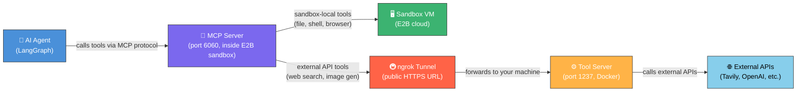
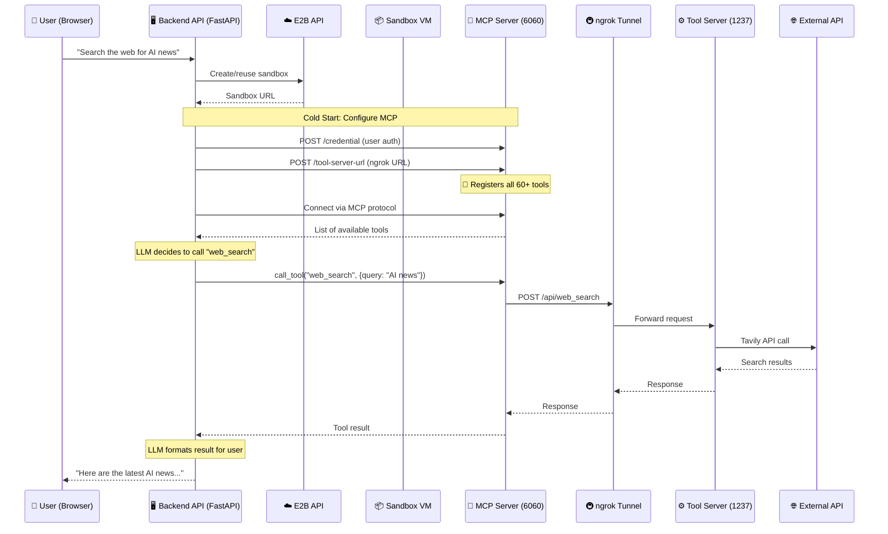
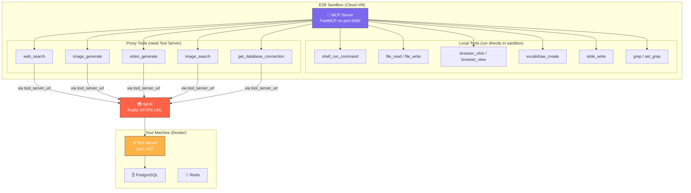
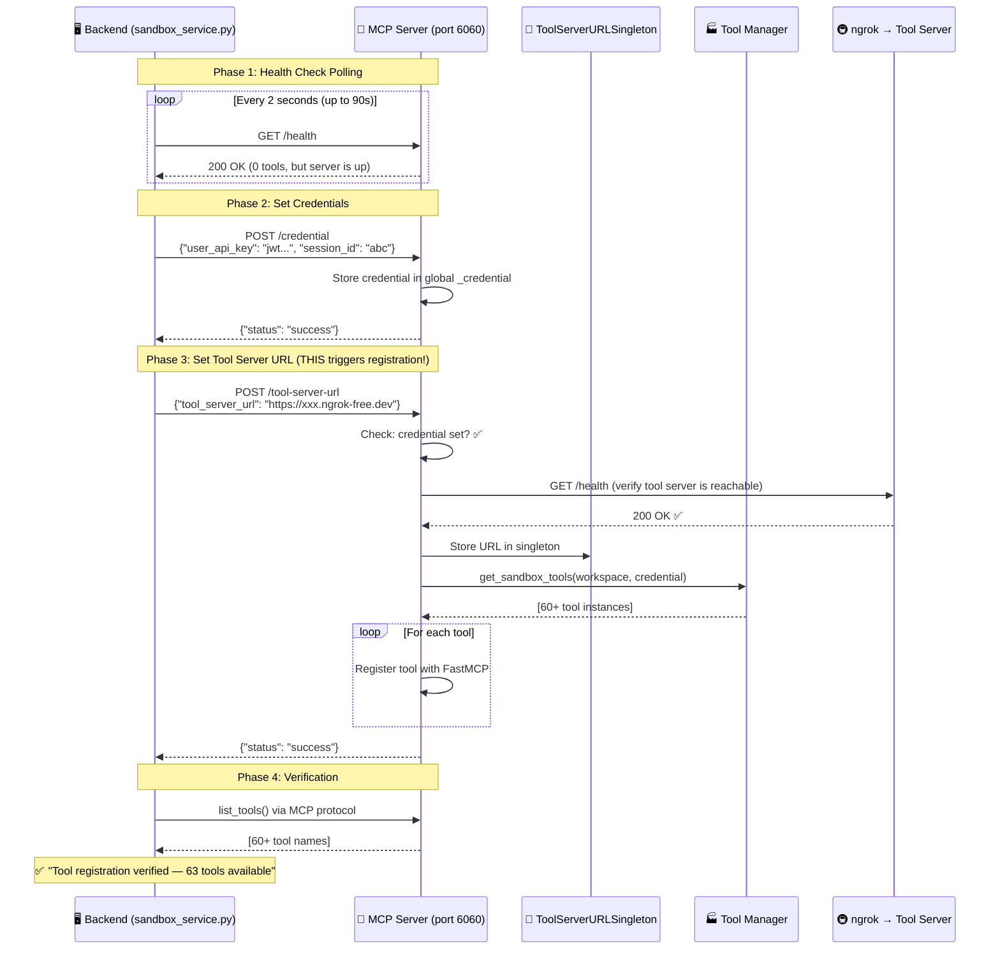
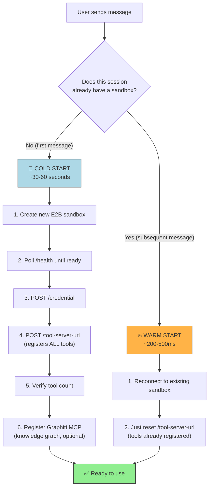
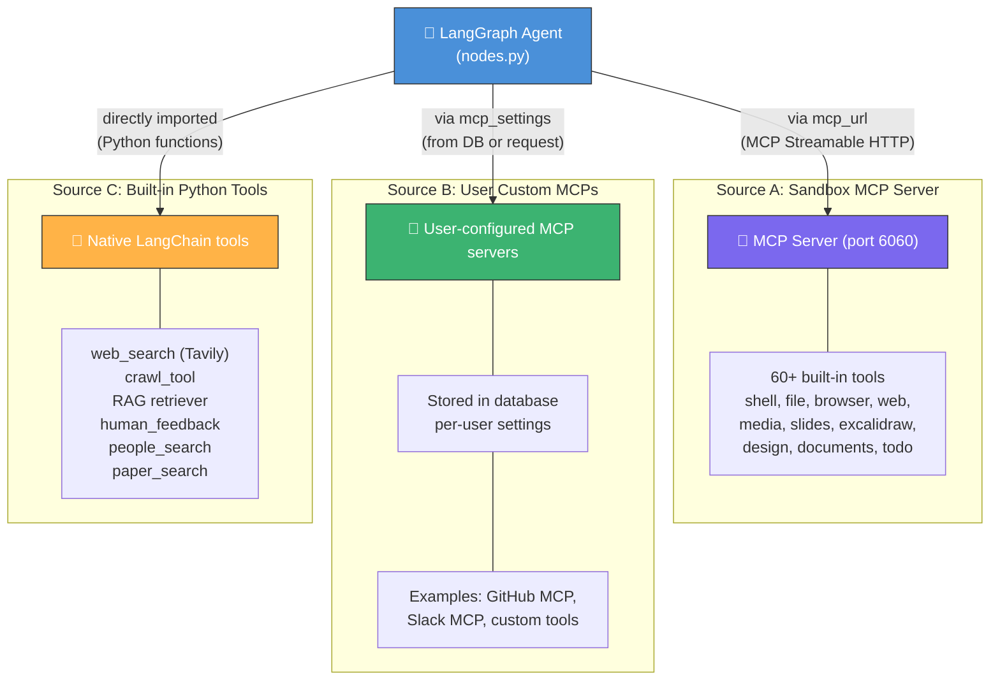
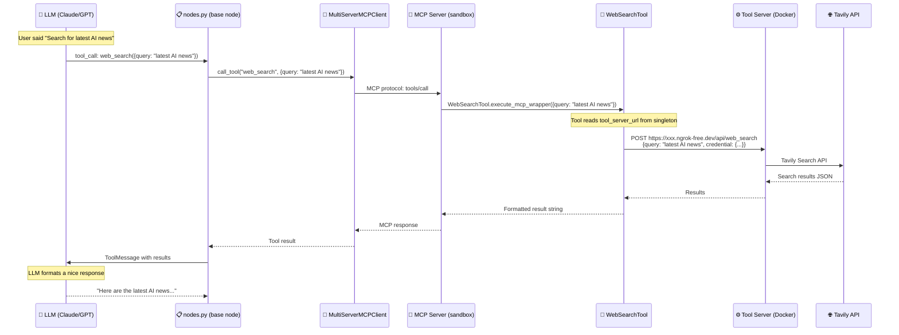
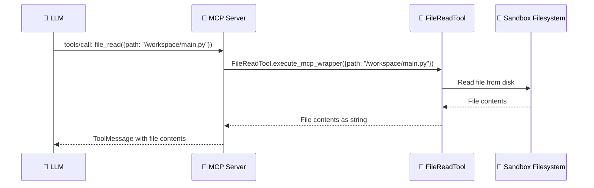
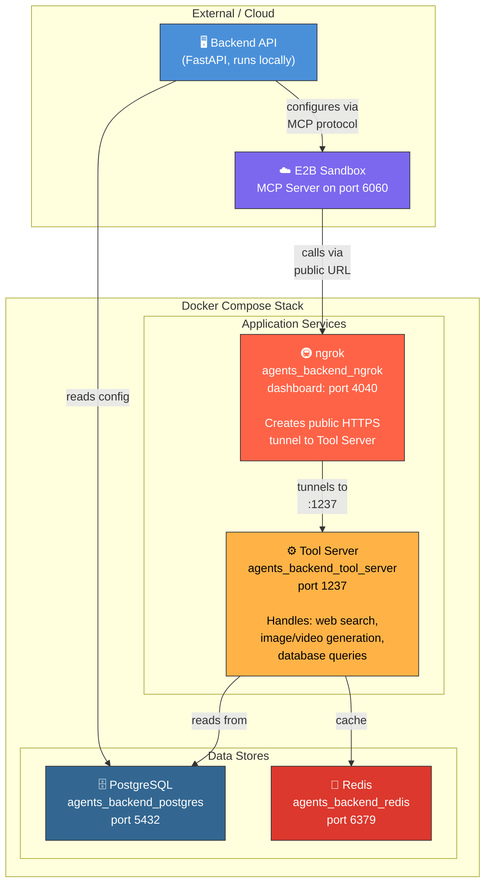

# Tool Architecture Guide

> **A complete, beginner-friendly guide to understanding how the Agent Backend's tool system works — from the AI agent all the way down to the individual tool that searches the web or generates an image.**

---

## Table of Contents

1. [The Big Picture — Why Does This Exist?](#1-the-big-picture--why-does-this-exist)
2. [The Three Key Components](#2-the-three-key-components)
3. [How They All Connect Together](#3-how-they-all-connect-together)
4. [Why ngrok? The Network Bridging Problem](#4-why-ngrok-the-network-bridging-problem)
5. [The Complete Tool Registration Flow](#5-the-complete-tool-registration-flow)
6. [Cold Start vs Warm Start](#6-cold-start-vs-warm-start)
7. [The Three Sources of Tools](#7-the-three-sources-of-tools)
8. [How the Agent Actually Calls a Tool](#8-how-the-agent-actually-calls-a-tool)
9. [Docker Architecture](#9-docker-architecture)
10. [Configuration Reference](#10-configuration-reference)
11. [Troubleshooting](#11-troubleshooting)
12. [Appendix: Full Tool Inventory](#appendix-full-tool-inventory)

---

## 1. The Big Picture — Why Does This Exist?

The agent backend lets an AI language model (LLM) do real things — not just generate text, but actually run shell commands, write files, search the web, generate images, create presentations, draw diagrams, and more.

To do that, the LLM needs **tools**. A tool is just a function — "search the web for X" or "write this content to a file." The challenge is that these tools run in a **sandboxed environment** (a cloud VM managed by [E2B](https://e2b.dev)), which is isolated from your local machine and from the backend server for security.

This creates a fundamental problem:

> **How does an isolated cloud sandbox access your backend's APIs (web search, image generation, etc.) that run on your local machine or a private Docker container?**

The answer involves three components working together: the **MCP Server**, the **Tool Server**, and **ngrok**. This guide explains each one and how they connect.

---

## 2. The Three Key Components

Think of the system as a restaurant:

| Component | Analogy | What It Does |
|---|---|---|
| **MCP Server** (port 6060) | The waiter | Lives inside the sandbox. Takes "orders" (tool calls) from the AI agent and either handles them directly or forwards them to the kitchen. |
| **Tool Server** (port 1237) | The kitchen | Runs on your machine (Docker). Does the actual heavy work — calling web search APIs, image generation APIs, database queries, etc. |
| **ngrok** | The delivery tunnel | Creates a public internet URL so the sandbox (which is in E2B's cloud) can reach the Tool Server (which is on your machine). |



---

## 3. How They All Connect Together

Here's the entire system from user message to tool execution:



### The Key Insight

The MCP Server is a **two-faced** component:

- **Some tools run locally inside the sandbox** (shell commands, file read/write, browser automation). These don't need the Tool Server at all — they execute directly on the sandbox VM.
- **Other tools need external APIs** (web search, image generation, video generation). These proxy their requests through the ngrok tunnel to the Tool Server on your machine, which has the API keys and makes the actual external calls.



---

## 4. Why ngrok? The Network Bridging Problem

### The Problem

Your Docker Tool Server runs on `localhost:1237` on your machine. But the E2B sandbox is a virtual machine running somewhere in E2B's cloud infrastructure (AWS). It has **no way** to reach `localhost:1237` on your machine — they're on completely different networks.

```
Your Machine                          E2B Cloud
┌─────────────────┐                  ┌─────────────────┐
│                 │                  │                 │
│  Tool Server    │    ❌ BLOCKED    │  MCP Server     │
│  localhost:1237 │ ←────────────── │  port 6060      │
│                 │   (no route)     │                 │
└─────────────────┘                  └─────────────────┘
```

### The Solution: ngrok

[ngrok](https://ngrok.com) creates a **secure tunnel** — it gives your local Tool Server a public HTTPS URL that anyone on the internet can reach (including the E2B sandbox).

```
Your Machine                 ngrok Cloud                E2B Cloud
┌──────────────┐     ┌─────────────────────┐     ┌──────────────┐
│              │     │                     │     │              │
│ Tool Server  │◄────│  ngrok tunnel       │◄────│ MCP Server   │
│ :1237        │     │  https://xxx.ngrok  │     │ :6060        │
│              │     │  -free.dev          │     │              │
└──────────────┘     └─────────────────────┘     └──────────────┘
       ✅ Connected via public HTTPS URL!
```

### Why Not Just Deploy the Tool Server to the Cloud?

You could! In **production**, you'd deploy the Tool Server to a cloud server with a real domain name (e.g., `https://tools.yourdomain.com`), and you wouldn't need ngrok at all. ngrok is specifically for **local development** — it saves you from deploying every time you want to test.

### Important: Free ngrok URLs Change on Restart

On ngrok's free plan, the public URL (like `https://candis-ferial-undeviatingly.ngrok-free.dev`) is randomly generated and changes every time the ngrok container restarts. You need to:

1. Get the new URL
2. Update `PUBLIC_TOOL_SERVER_URL` in `backend/.env`
3. Restart the backend

**How to get the current ngrok URL:**

```bash
# Option 1: Terminal command (PowerShell)
(Invoke-RestMethod http://localhost:4040/api/tunnels).tunnels[0].public_url

# Option 2: Terminal command (curl)
curl -s http://localhost:4040/api/tunnels | python -m json.tool
# → Look for "public_url" in the output

# Option 3: Browser
# Open http://localhost:4040 → ngrok dashboard shows the current URL
```

---

## 5. The Complete Tool Registration Flow

This is the most critical part to understand. The MCP Server inside the sandbox starts with **zero tools**. Tools are registered on-demand through a specific sequence of API calls. Here's exactly what happens:



### Why Are Tools Not Registered at Startup?

**Performance optimization.** Importing all 60+ tool classes, instantiating them, and connecting to external services takes 30–40 seconds. If that happened at startup, the `/health` endpoint wouldn't respond until all tools were loaded, and the backend would time out waiting for the sandbox.

Instead:
1. MCP Server starts and `/health` is available immediately (~5 seconds)
2. Backend detects the server is healthy
3. Backend triggers tool registration via `/credential` + `/tool-server-url`
4. Tools are registered while the backend waits

This is a **lazy loading** pattern — don't do work until someone needs it.

### What Happens If `PUBLIC_TOOL_SERVER_URL` Is Empty?

If the URL is not set in `backend/.env`, the backend **skips** the `/tool-server-url` call entirely. That means `get_sandbox_tools()` is never called, and the MCP Server has 0 tools. The AI agent literally cannot do anything — no file read, no shell commands, no web search, nothing.

This is the **#1 most common cause** of "the agent isn't doing anything." Check your `.env` file.

---

## 6. Cold Start vs Warm Start

The sandbox system uses a **cold/warm start** pattern to balance speed and correctness:



| | Cold Start | Warm Start |
|---|---|---|
| **When** | First message in a session | Second+ messages in the same session |
| **Duration** | 30–60 seconds | 200–500 ms |
| **What happens** | New sandbox created, full MCP configuration, all tools registered | Reuse existing sandbox, just reset tool server URL |
| **Code location** | `pre_configure_mcp_server()` | `reset_tool_server()` |
| **File** | `sandbox_service.py` | `sandbox_service.py` |

---

## 7. The Three Sources of Tools

The agent doesn't just use sandbox tools. It can load tools from **three separate sources**:



### How They're Combined (nodes.py)

```python
# 1. Start with empty dict
mcp_servers = {}

# 2. Add user's custom MCP servers (Source B)
if configurable.mcp_settings:
    for server_name, server_config in configurable.mcp_settings["servers"].items():
        mcp_servers[server_name] = {
            "transport": "streamable_http",
            "url": server_config["url"]
        }

# 3. Add the sandbox MCP server (Source A)
if configurable.mcp_url:
    mcp_servers["sandbox"] = {
        "transport": "streamable_http",
        "url": f"{configurable.mcp_url}/mcp"
    }

# 4. Connect to all MCP servers and load tools
client = MultiServerMCPClient(mcp_servers)
mcp_tools = await client.get_tools()

# 5. Add native Python tools (Source C)
all_tools = mcp_tools + [web_search, crawl_tool, human_feedback_tool, ...]
```

---

## 8. How the Agent Actually Calls a Tool

Let's trace a single tool call from start to finish — say the user asks "Search the web for the latest AI news":



### For a Local Tool (e.g., `file_read`)

The flow is simpler because no external calls are needed:



No ngrok, no Tool Server, no external network calls — everything stays inside the sandbox.

---

## 9. Docker Architecture

The Docker Compose stack runs four services:



### Service Dependencies

```
agents_backend_postgres  ← (no dependencies, starts first)
agents_backend_redis     ← (no dependencies, starts first)
agents_backend_tool_server ← depends on postgres (healthy) + redis (healthy)
agents_backend_ngrok     ← depends on tool_server (healthy)
```

### Docker Compose Health Checks

| Service | Health Check | Interval |
|---|---|---|
| PostgreSQL | `pg_isready` | 10s |
| Redis | `redis-cli ping` | 10s |
| Tool Server | `curl http://localhost:1237/health` | 15s |
| ngrok | (none — relies on tool_server being healthy first) | — |

---

## 10. Configuration Reference

All configuration is in `backend/.env`. Here are the tool-related settings:

### Tool Server Settings

| Variable | Default | Description |
|---|---|---|
| `TOOL_SERVER_PORT` | `1237` | Port the Tool Server listens on inside Docker |
| `PUBLIC_TOOL_SERVER_URL` | *(empty)* | **Critical.** The public URL (ngrok or production) that sandboxes use to reach the Tool Server. If empty, **all tools are unavailable.** |

### ngrok Settings

| Variable | Default | Description |
|---|---|---|
| `NGROK_AUTHTOKEN` | *(required)* | Your ngrok authentication token from [dashboard.ngrok.com](https://dashboard.ngrok.com/get-started/your-authtoken) |
| `NGROK_METRICS_PORT` | `4040` | Port for the ngrok web dashboard |

### MCP Server Settings

| Variable | Default | Description |
|---|---|---|
| `SANDBOX_MCP_SERVER_PORT` | `6060` | Port the MCP Server listens on inside the sandbox |
| `SANDBOX_GRAPHITI_MCP_PORT` | `8500` | Port for the optional Graphiti knowledge graph MCP server |

### E2B Settings

| Variable | Default | Description |
|---|---|---|
| `E2B_API_KEY` | *(required)* | API key for E2B sandbox service |

---

## 11. Troubleshooting

### Problem: Agent does nothing / 0 tools available

```
COLD START: 0 tools available on sandbox MCP server
```

**Cause:** `PUBLIC_TOOL_SERVER_URL` is empty or the ngrok tunnel is down.

**Fix:**
1. Start Docker stack: `docker compose up -d`
2. Get ngrok URL: `curl -s http://localhost:4040/api/tunnels | python -m json.tool`
3. Set in `backend/.env`: `PUBLIC_TOOL_SERVER_URL=https://your-url.ngrok-free.dev`
4. Restart the backend

### Problem: ngrok authentication failed (ERR_NGROK_4018)

**Cause:** `NGROK_AUTHTOKEN` is missing or invalid.

**Fix:**
1. Go to [dashboard.ngrok.com/get-started/your-authtoken](https://dashboard.ngrok.com/get-started/your-authtoken)
2. Copy your authtoken
3. Set in `backend/.env`: `NGROK_AUTHTOKEN=your_token_here`
4. Restart ngrok: `docker compose up -d agents_backend_ngrok`

### Problem: Tool Server not reachable from sandbox

```
Can't connect to tool server: [ConnectionError]
```

**Cause:** ngrok tunnel is down or URL has changed.

**Fix:**
1. Check ngrok is running: `docker ps | findstr ngrok`
2. Check current URL: `(Invoke-RestMethod http://localhost:4040/api/tunnels).tunnels[0].public_url`
3. Verify it matches `PUBLIC_TOOL_SERVER_URL` in `backend/.env`
4. Test reachability: `curl https://your-url.ngrok-free.dev/health`

### Problem: Cold start times out

```
COLD START: MCP not ready after 90s
```

**Cause:** E2B sandbox is slow to boot or MCP server failed to start.

**Fix:**
1. Check your E2B API key is valid
2. Check E2B service status at [e2b.dev/status](https://e2b.dev/status)
3. Try creating a fresh session

### Problem: Some tools work but web_search / image_generate don't

**Cause:** Local tools (file_read, shell_run_command) work because they run inside the sandbox. External tools need the Tool Server, which may be unreachable.

**Fix:** Same as "Tool Server not reachable" above — check ngrok tunnel.

---

## Appendix: Full Tool Inventory

All 60+ tools registered on the sandbox MCP server:

### Shell Tools (6)
| Tool | Description |
|---|---|
| `shell_init` | Initialize a new terminal session |
| `shell_run_command` | Run a shell command |
| `shell_view` | View terminal output |
| `shell_stop_command` | Stop a running command |
| `shell_list` | List active terminal sessions |
| `shell_write_to_process` | Write input to a running process |

### File System Tools (8)
| Tool | Description |
|---|---|
| `file_read` | Read a file's contents |
| `file_write` | Write content to a file |
| `file_edit` | Edit sections of a file |
| `apply_patch` | Apply a unified diff patch |
| `str_replace_editor` | Find-and-replace in files |
| `ast_grep` | AST-based code search |
| `grep` | Text pattern search |
| `lsp` | Language Server Protocol operations |

### Browser Tools (15)
| Tool | Description |
|---|---|
| `browser_click` | Click an element on a web page |
| `browser_wait` | Wait for page to load |
| `browser_view` | View current page content |
| `browser_scroll_down/up` | Scroll the page |
| `browser_switch_tab` | Switch browser tabs |
| `browser_open_new_tab` | Open a new tab |
| `browser_get_select_options` | Get dropdown options |
| `browser_select_dropdown_option` | Select a dropdown value |
| `browser_navigation` | Navigate to a URL |
| `browser_restart` | Restart the browser |
| `browser_enter_text` | Type text into an input |
| `browser_press_key` | Press a keyboard key |
| `browser_drag` | Drag-and-drop |
| `browser_enter_multiple_texts` | Fill multiple inputs |

### Web & Search Tools (6)
| Tool | Description |
|---|---|
| `web_search` | Search the web (via Tavily) |
| `web_visit` | Visit and read a web page |
| `web_visit_compress` | Visit and compress a page |
| `image_search` | Search for images |
| `read_remote_image` | Fetch a remote image |
| `web_batch_search` | Multiple searches at once |

### Media Tools (2)
| Tool | Description |
|---|---|
| `image_generate` | Generate images (via AI) |
| `video_generate` | Generate videos (via AI) |

### Dev Tools (4)
| Tool | Description |
|---|---|
| `fullstack_init` | Initialize a fullstack project |
| `save_checkpoint` | Save a workspace checkpoint |
| `register_port` | Register a port for preview |
| `message_user` | Send a message to the user |

### Slide Tools (4)
| Tool | Description |
|---|---|
| `slide_write` | Write slide content |
| `slide_edit` | Edit existing slides |
| `slide_apply_patch` | Patch slide files |
| `slide_template_init` | Initialize a slide template |

### Document Tools (2)
| Tool | Description |
|---|---|
| `document_template_init` | Initialize a LaTeX document |
| `document_compile` | Compile LaTeX to PDF |

### Design Tools — Draw.io (5)
| Tool | Description |
|---|---|
| `design_init` | Initialize a Draw.io project |
| `design_create` | Create a new diagram |
| `design_edit` | Edit an existing diagram |
| `design_get` | Get diagram content |
| `design_export` | Export diagram to image |

### Excalidraw Tools (13)
| Tool | Description |
|---|---|
| `excalidraw_init` | Initialize an Excalidraw canvas |
| `excalidraw_create` | Create a new drawing element |
| `excalidraw_update` | Update an element |
| `excalidraw_delete` | Delete an element |
| `excalidraw_query` | Query canvas elements |
| `excalidraw_batch_create` | Create multiple elements |
| `excalidraw_group` | Group elements |
| `excalidraw_ungroup` | Ungroup elements |
| `excalidraw_align` | Align elements |
| `excalidraw_distribute` | Distribute elements evenly |
| `excalidraw_lock` | Lock elements |
| `excalidraw_unlock` | Unlock elements |
| `excalidraw_resource` | Manage Excalidraw resources |

### Productivity Tools (2)
| Tool | Description |
|---|---|
| `todo_read` | Read the todo list |
| `todo_write` | Write to the todo list |

### Database Tools (1)
| Tool | Description |
|---|---|
| `get_database_connection` | Get a database connection URL |

---

## Key Code Locations

| What | File | Key Function/Class |
|---|---|---|
| MCP Server (inside sandbox) | `backend/src/tool_server/mcp/server.py` | `create_mcp()`, `/tool-server-url` endpoint |
| MCP Client (backend calls sandbox) | `backend/src/tool_server/mcp/client.py` | `MCPClient` class |
| Tool Manager (instantiates tools) | `backend/src/tool_server/tools/manager.py` | `get_sandbox_tools()` |
| Sandbox Service (cold/warm start) | `backend/src/services/sandbox_service.py` | `pre_configure_mcp_server()`, `reset_tool_server()` |
| Agent Graph Nodes (loads tools) | `backend/src/graph/nodes.py` | `base_node()`, `MultiServerMCPClient` |
| Agent API Endpoint | `backend/app/agent/api/v1/agent.py` | `_agent_stream_generator()` |
| Configuration | `backend/src/config/configuration.py` | `Configuration` dataclass |
| Settings | `backend/core/conf.py` | `settings.PUBLIC_TOOL_SERVER_URL`, etc. |
| Docker Compose | `docker-compose.yml` | `agents_backend_tool_server`, `agents_backend_ngrok` |
| Environment Variables | `backend/.env` | `PUBLIC_TOOL_SERVER_URL`, `NGROK_AUTHTOKEN`, etc. |

---

*Last updated: February 8, 2026*
