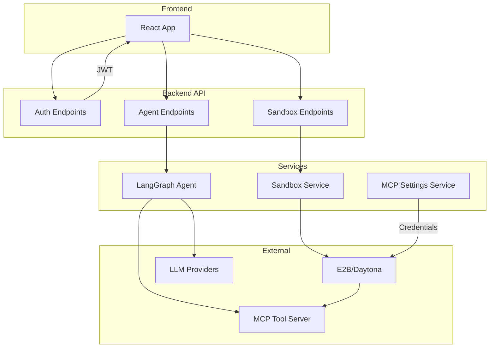

# Lifecycle Documentation

> Visual flowcharts and detailed explanations of how each system component works end-to-end.

---

## Overview

This directory contains lifecycle documentation showing complete user journeys through the Agents Backend system. Each document includes:
- **Mermaid flowcharts** - Visual representation of the flow
- **Database tables** - What data is affected
- **API endpoints** - What to call and when
- **Code references** - Links to source files
- **Examples** - Practical request/response examples

---

## Lifecycle Documents

| Lifecycle | Description |
|-----------|-------------|
| [Authentication](./authentication.md) | Login, JWT, OAuth, session management |
| [User Management](./user-management.md) | Account creation, credits, API keys |
| [Agent Chat](./agent-chat.md) | Chat request → LangGraph → streaming response |
| [Sandbox](./sandbox.md) | Create → tools → credentials → delete |
| [MCP Registry](./mcp-registry.md) | Built-in 44 tools, registration, execution |
| [MCP User Settings](./mcp-user-settings.md) | Codex, Claude Code, custom MCP configs |
| [Frontend Integration](./frontend-integration.md) | How frontend connects to all APIs |

---

## Quick Reference: What Calls What

---

## Related Documentation

| Document | Description |
|----------|-------------|
| [API Endpoints](../api-contracts/api-endpoints.md) | Complete endpoint reference |
| [Database Schema](../api-contracts/database.md) | All tables and columns |
| [MCP Configuration](../mcp-configuration.md) | Tool server architecture |
| [Sandbox Tools](../sandbox-tools.md) | All 44+ tools |
