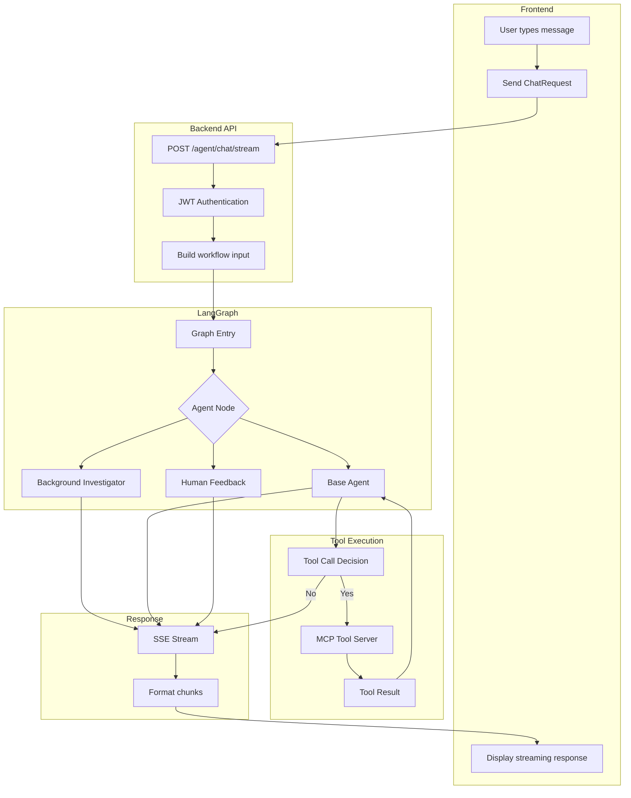
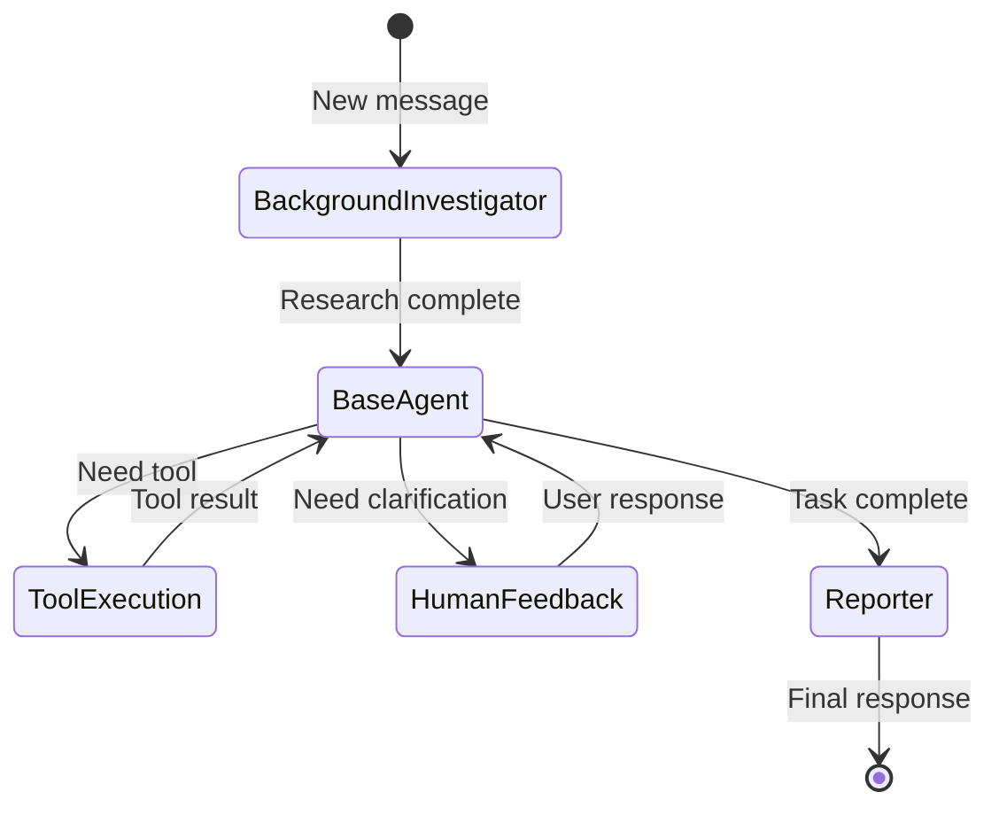
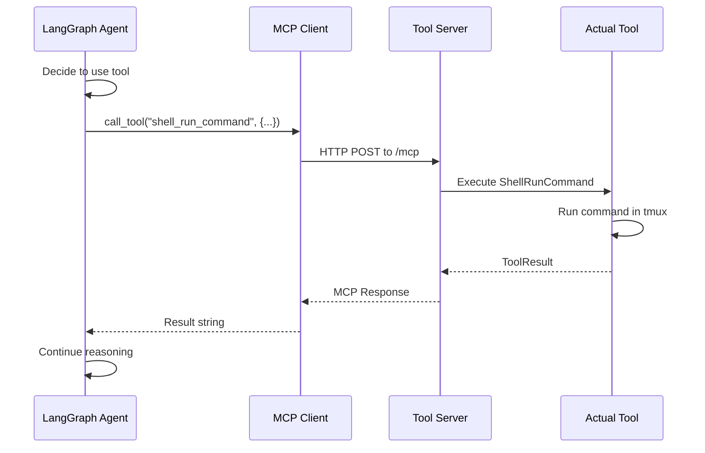

# Agent Chat Lifecycle

> From chat request to streaming response through LangGraph.

---

## Overview

The agent chat system provides:
- **Streaming responses** via Server-Sent Events (SSE)
- **Multi-agent workflow** using LangGraph
- **Tool execution** via MCP tool server
- **Memory persistence** for conversation history

---

## Complete Flow



---

## Request Structure

```http
POST /api/v1/agent/chat/stream
Authorization: Bearer <token>
Content-Type: application/json

{
  "messages": [
    {"role": "user", "content": "Create a React component"}
  ],
  "thread_id": "session-123",
  "agent_name": "coder",
  "resources": [
    {"uri": "https://docs.example.com", "name": "Docs"}
  ],
  "mcp_settings": {
    "servers": {
      "my-mcp": {"command": "...", "args": [...]}
    }
  },
  "enable_web_search": true,
  "enable_deep_thinking": false,
  "enable_clarification": true,
  "max_clarification_rounds": 2,
  "locale": "en-US",
  "interrupt_before_tools": ["shell_run_command"]
}
```

---

## SSE Response Events

The response is a stream of Server-Sent Events:

### Text Content
```
event: message
data: {"type": "text", "agent": "coder", "content": "I'll create a React..."}
```

### Tool Call
```
event: message
data: {"type": "tool_call", "tool": "file_write", "args": {"path": "...", "content": "..."}}
```

### Tool Result
```
event: message
data: {"type": "tool_result", "tool": "file_write", "result": "File written successfully"}
```

### Interrupt (Human Feedback)
```
event: interrupt
data: {"thread_id": "session-123", "needs_input": true, "prompt": "Should I proceed?"}
```

### Stream Complete
```
event: done
data: {"thread_id": "session-123", "agent": "reporter"}
```

---

## LangGraph Workflow



**Nodes:**
| Node | Purpose |
|------|---------|
| `BackgroundInvestigator` | Web research if enabled |
| `BaseAgent` | Main reasoning and tool use |
| `HumanFeedback` | Clarification requests |
| `Reporter` | Final response generation |

---

## Tool Execution Flow



---

## Memory & Persistence

### Thread ID
Each conversation has a `thread_id` for:
- **Checkpointing**: Save/resume conversation state
- **Memory**: Retrieve past messages
- **Credits**: Track token usage per session

### Session Metrics
| Column | Purpose |
|--------|---------|
| `session_id` | Links to thread_id |
| `model_name` | LLM used |
| `credits` | Credits consumed |
| `total_prompt_tokens` | Input tokens |
| `total_completion_tokens` | Output tokens |

---

## Configuration Options

| Option | Type | Description |
|--------|------|-------------|
| `enable_web_search` | bool | Use Tavily for web research |
| `enable_deep_thinking` | bool | Extended reasoning mode |
| `enable_clarification` | bool | Allow agent to ask questions |
| `max_clarification_rounds` | int | Limit on clarification loops |
| `interrupt_before_tools` | list | Tools requiring confirmation |

---

## Error Handling

| Error | Cause | Response |
|-------|-------|----------|
| 401 | Invalid/missing token | `{"detail": "Unauthorized"}` |
| 400 | Invalid request body | `{"detail": "Validation error"}` |
| 500 | Agent error | SSE event: `{"type": "error", "message": "..."}` |

---

## Code References

| File | Purpose |
|------|---------|
| [chat.py](file:///c:/Users/pault/Documents/3.%20AI%20and%20Machine%20Learning/2.%20Deep%20Learning/1c.%20App/Projects/agents-backend/backend/app/agent/api/v1/chat.py) | Chat endpoint |
| [builder.py](file:///c:/Users/pault/Documents/3.%20AI%20and%20Machine%20Learning/2.%20Deep%20Learning/1c.%20App/Projects/agents-backend/backend/src/graph/builder.py) | LangGraph workflow |
| [nodes.py](file:///c:/Users/pault/Documents/3.%20AI%20and%20Machine%20Learning/2.%20Deep%20Learning/1c.%20App/Projects/agents-backend/backend/src/graph/nodes.py) | Agent nodes |
| [client.py](file:///c:/Users/pault/Documents/3.%20AI%20and%20Machine%20Learning/2.%20Deep%20Learning/1c.%20App/Projects/agents-backend/backend/src/tool_server/mcp/client.py) | MCP client |

---

## Frontend Integration

```typescript
// Using EventSource
const eventSource = new EventSource(
  `/api/v1/agent/chat/stream?...`,
  { withCredentials: true }
)

eventSource.onmessage = (event) => {
  const data = JSON.parse(event.data)
  
  switch (data.type) {
    case 'text':
      appendToChat(data.content)
      break
    case 'tool_call':
      showToolCall(data.tool, data.args)
      break
    case 'tool_result':
      showToolResult(data.result)
      break
  }
}

eventSource.addEventListener('done', () => {
  eventSource.close()
})
```
