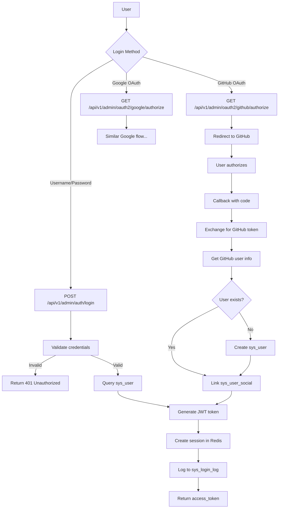
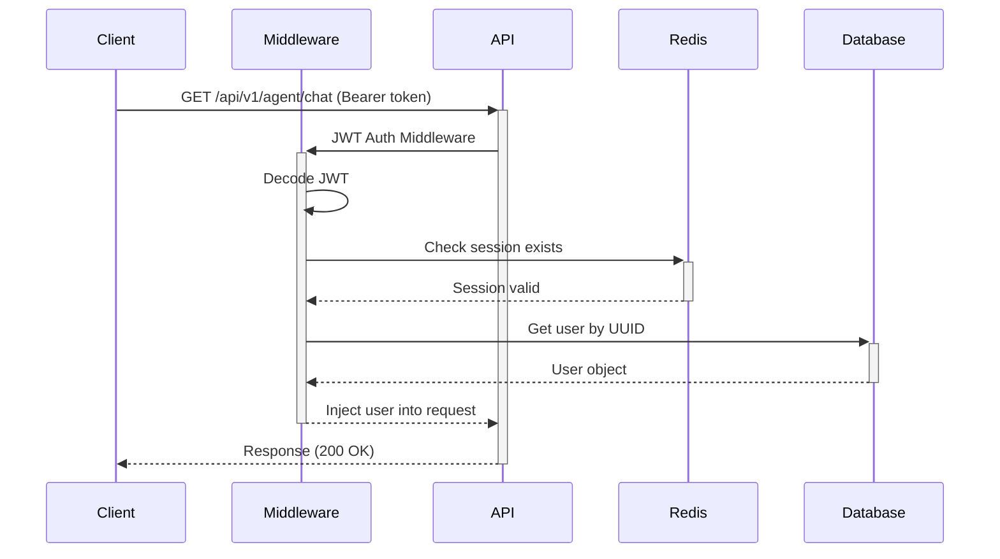

# Authentication Lifecycle

> Complete flow from login to logout, including JWT tokens and OAuth.

---

## Overview

The authentication system supports:
- **Username/Password** login
- **OAuth2** (GitHub, Google)
- **JWT tokens** for API access
- **Session management** via Redis

---

## Login Flow



---

## JWT Token Structure

```json
{
  "sub": "user_uuid",
  "exp": 1735500000,
  "iat": 1735413600,
  "jti": "unique_token_id",
  "is_superuser": false,
  "is_staff": true
}
```

**Token Configuration:**
| Setting | Value | Description |
|---------|-------|-------------|
| `TOKEN_ALGORITHM` | HS256 | Signing algorithm |
| `TOKEN_EXPIRE_SECONDS` | 86400 | Token lifetime (24h) |
| `TOKEN_SECRET_KEY` | .env | Signing key |

---

## API Request Flow



---

## Database Tables

### `sys_user` - User Accounts
| Column | Type | Description |
|--------|------|-------------|
| `id` | BIGINT | Primary key |
| `uuid` | VARCHAR(64) | Unique identifier (used in JWT) |
| `username` | VARCHAR(64) | Login username |
| `password` | VARCHAR(256) | Hashed password (Argon2) |
| `salt` | BLOB | Password salt |
| `status` | INT | 0=disabled, 1=active |
| `is_superuser` | BOOLEAN | Admin flag |
| `credits` | FLOAT | AI tool credits |

### `sys_login_log` - Login History
| Column | Type | Description |
|--------|------|-------------|
| `user_uuid` | VARCHAR(64) | User who logged in |
| `ip` | VARCHAR(128) | IP address |
| `status` | INT | 0=failed, 1=success |
| `login_time` | TIMESTAMP | When login occurred |

### `sys_user_social` - OAuth Connections
| Column | Type | Description |
|--------|------|-------------|
| `user_id` | BIGINT | FK to sys_user |
| `source` | VARCHAR(32) | github, google, etc. |
| `uid` | VARCHAR(128) | External user ID |
| `access_token` | TEXT | OAuth access token |

---

## API Endpoints

### Login
```http
POST /api/v1/admin/auth/login
Content-Type: application/json

{
  "username": "admin",
  "password": "password123",
  "captcha_id": "abc123",
  "captcha_code": "1234"
}
```

**Response:**
```json
{
  "access_token": "eyJhbGciOiJIUzI1NiIs...",
  "token_type": "Bearer",
  "user": {
    "id": 1,
    "uuid": "550e8400-e29b-41d4-a716-446655440000",
    "username": "admin",
    "nickname": "Administrator",
    "is_superuser": true
  }
}
```

### Logout
```http
POST /api/v1/admin/auth/logout
Authorization: Bearer <token>
```

**Effect:** Removes session from Redis, invalidates token.

### OAuth Start
```http
GET /api/v1/admin/oauth2/github/authorize
```
**Effect:** Redirects to GitHub OAuth authorization page.

---

## Middleware Stack

Requests pass through these middleware in order:

```
Request → StateMiddleware → JWTAuthMiddleware → AccessMiddleware → Handler
```

| Middleware | Purpose |
|------------|---------|
| `StateMiddleware` | Initialize request context |
| `JWTAuthMiddleware` | Validate JWT, inject user |
| `AccessMiddleware` | Log request/response |
| `OperaLogMiddleware` | Audit trail |

---

## Code References

| File | Purpose |
|------|---------|
| [auth.py](file:///c:/Users/pault/Documents/3.%20AI%20and%20Machine%20Learning/2.%20Deep%20Learning/1c.%20App/Projects/agents-backend/backend/app/admin/api/v1/auth/auth.py) | Login/logout endpoints |
| [jwt.py](file:///c:/Users/pault/Documents/3.%20AI%20and%20Machine%20Learning/2.%20Deep%20Learning/1c.%20App/Projects/agents-backend/backend/common/security/jwt.py) | JWT token utilities |
| [jwt_auth_middleware.py](file:///c:/Users/pault/Documents/3.%20AI%20and%20Machine%20Learning/2.%20Deep%20Learning/1c.%20App/Projects/agents-backend/backend/middleware/jwt_auth_middleware.py) | Auth middleware |
| [router.py](file:///c:/Users/pault/Documents/3.%20AI%20and%20Machine%20Learning/2.%20Deep%20Learning/1c.%20App/Projects/agents-backend/backend/plugin/oauth2/api/router.py) | OAuth2 endpoints |

---

## Security Notes

1. **Password Hashing**: Uses Argon2id with salt
2. **Token Storage**: JWTs are stateless but sessions tracked in Redis
3. **Rate Limiting**: Login attempts are rate-limited
4. **CAPTCHA**: Required for login in production
