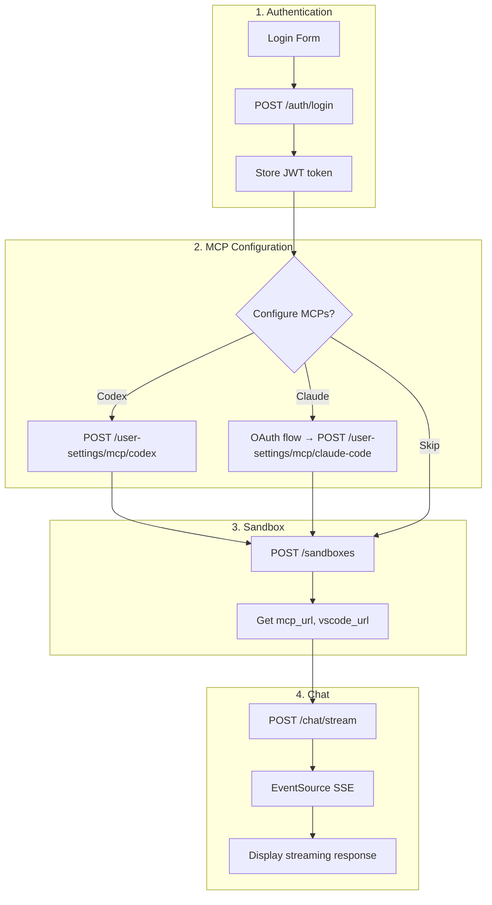

# Frontend Integration Lifecycle

> How to connect a React/TypeScript frontend to the Agents Backend.

---

## Overview

This guide covers the complete frontend integration:
1. **Authentication** - Get JWT token
2. **Sandbox** - Create execution environment
3. **MCP Settings** - Configure Codex/Claude Code
4. **Chat** - Stream agent responses

---

## Complete Integration Flow



---

## Step 1: Authentication

### Login
```typescript
const login = async (username: string, password: string) => {
  const response = await fetch('/api/v1/admin/auth/login', {
    method: 'POST',
    headers: { 'Content-Type': 'application/json' },
    body: JSON.stringify({ username, password })
  })
  
  const { access_token, user } = await response.json()
  
  // Store token
  localStorage.setItem('access_token', access_token)
  
  return user
}
```

### Create API Client
```typescript
import axios from 'axios'

const api = axios.create({
  baseURL: 'http://localhost:8000/api/v1'
})

api.interceptors.request.use((config) => {
  const token = localStorage.getItem('access_token')
  if (token) {
    config.headers.Authorization = `Bearer ${token}`
  }
  return config
})
```

---

## Step 2: MCP Configuration

### Configure Codex
```typescript
const configureCodex = async (apiKey: string) => {
  await api.post('/agent/user-settings/mcp/codex', {
    apikey: apiKey,
    model: 'gpt-4o',
    model_reasoning_effort: 'medium'
  })
}
```

### Configure Claude Code (OAuth)
```typescript
const startClaudeAuth = async () => {
  // Generate PKCE
  const verifier = generateCodeVerifier()
  const challenge = await generateCodeChallenge(verifier)
  
  // Store verifier for later
  sessionStorage.setItem('claude_verifier', verifier)
  
  // Open OAuth window
  const url = `https://claude.ai/oauth/authorize?${new URLSearchParams({
    code: 'true',
    client_id: '9d1c250a-e61b-44d9-88ed-5944d1962f5e',
    response_type: 'code',
    redirect_uri: 'https://console.anthropic.com/oauth/code/callback',
    scope: 'org:create_api_key user:profile user:inference',
    code_challenge: challenge,
    code_challenge_method: 'S256',
    state: verifier
  })}`
  
  window.open(url, '_blank')
}

const completeClaudeAuth = async (code: string) => {
  const verifier = sessionStorage.getItem('claude_verifier')
  
  await api.post('/agent/user-settings/mcp/claude-code', {
    authorization_code: `${code}#${verifier}`
  })
}
```

---

## Step 3: Sandbox Creation

```typescript
const createSandbox = async () => {
  const response = await api.post('/agent/sandboxes', {
    template_id: 'agents-backend-sandbox'
  })
  
  return {
    sandboxId: response.data.sandbox_id,
    mcpUrl: response.data.mcp_url,
    vscodeUrl: response.data.vscode_url
  }
}
```

---

## Step 4: Chat Streaming

### Using EventSource
```typescript
const streamChat = (
  message: string,
  threadId: string,
  onChunk: (data: any) => void,
  onDone: () => void
) => {
  const requestBody = {
    messages: [{ role: 'user', content: message }],
    thread_id: threadId,
    enable_web_search: true
  }
  
  // Use POST with fetch, then EventSource-like handling
  fetch('/api/v1/agent/chat/stream', {
    method: 'POST',
    headers: {
      'Content-Type': 'application/json',
      'Authorization': `Bearer ${localStorage.getItem('access_token')}`
    },
    body: JSON.stringify(requestBody)
  }).then(async response => {
    const reader = response.body?.getReader()
    const decoder = new TextDecoder()
    
    while (reader) {
      const { done, value } = await reader.read()
      if (done) {
        onDone()
        break
      }
      
      const chunk = decoder.decode(value)
      const lines = chunk.split('\n')
      
      for (const line of lines) {
        if (line.startsWith('data: ')) {
          try {
            const data = JSON.parse(line.slice(6))
            onChunk(data)
          } catch (e) {
            // Skip non-JSON lines
          }
        }
      }
    }
  })
}
```

### React Hook
```typescript
const useChat = () => {
  const [messages, setMessages] = useState<Message[]>([])
  const [isStreaming, setIsStreaming] = useState(false)
  
  const sendMessage = async (content: string) => {
    setMessages(prev => [...prev, { role: 'user', content }])
    setIsStreaming(true)
    
    let assistantMessage = ''
    
    streamChat(
      content,
      'thread-' + Date.now(),
      (data) => {
        if (data.type === 'text') {
          assistantMessage += data.content
          setMessages(prev => [
            ...prev.slice(0, -1),
            { role: 'assistant', content: assistantMessage }
          ])
        }
      },
      () => setIsStreaming(false)
    )
  }
  
  return { messages, sendMessage, isStreaming }
}
```

---

## Event Types to Handle

```typescript
interface ChatEvent {
  type: 'text' | 'tool_call' | 'tool_result' | 'error'
  agent?: string
  content?: string
  tool?: string
  args?: Record<string, any>
  result?: string
  message?: string
}

const handleEvent = (event: ChatEvent) => {
  switch (event.type) {
    case 'text':
      appendToChat(event.content)
      break
      
    case 'tool_call':
      showToolIndicator(event.tool, event.args)
      break
      
    case 'tool_result':
      showToolResult(event.result)
      break
      
    case 'error':
      showError(event.message)
      break
  }
}
```

---

## Complete React Component

```tsx
import { useState, useEffect } from 'react'

function ChatApp() {
  const [token, setToken] = useState<string | null>(null)
  const [sandbox, setSandbox] = useState<any>(null)
  
  // Check auth on mount
  useEffect(() => {
    const stored = localStorage.getItem('access_token')
    if (stored) setToken(stored)
  }, [])
  
  // Create sandbox when authenticated
  useEffect(() => {
    if (token && !sandbox) {
      createSandbox().then(setSandbox)
    }
  }, [token])
  
  if (!token) return <LoginForm onLogin={setToken} />
  if (!sandbox) return <div>Creating sandbox...</div>
  
  return (
    <div>
      <a href={sandbox.vscodeUrl} target="_blank">Open VS Code</a>
      <ChatInterface sandboxId={sandbox.sandboxId} />
    </div>
  )
}
```

---

## Error Handling

```typescript
api.interceptors.response.use(
  response => response,
  error => {
    if (error.response?.status === 401) {
      localStorage.removeItem('access_token')
      window.location.href = '/login'
    }
    return Promise.reject(error)
  }
)
```

---

## Related Documentation

| Document | Description |
|----------|-------------|
| [Frontend Connect](../frontend-connect/README.md) | API reference & components |
| [MCP Settings API](../frontend-connect/mcp-settings-api.md) | MCP endpoints |
| [Authentication](./authentication.md) | Auth lifecycle |
