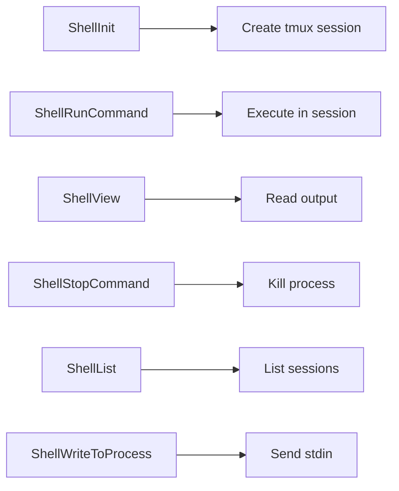
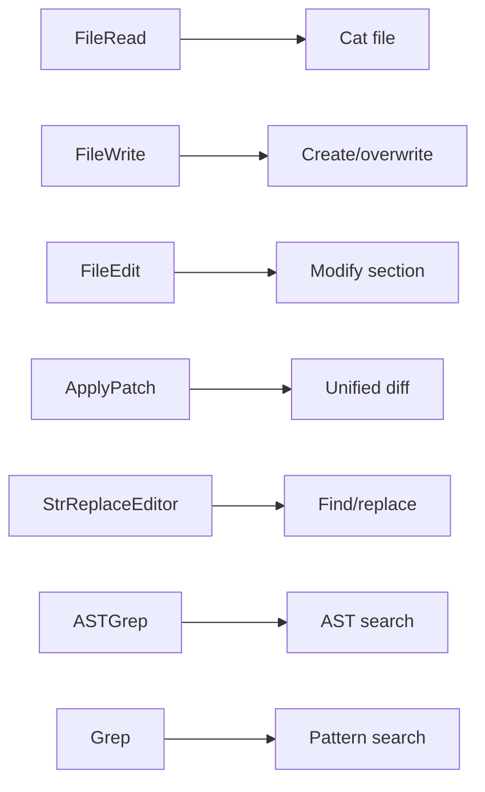
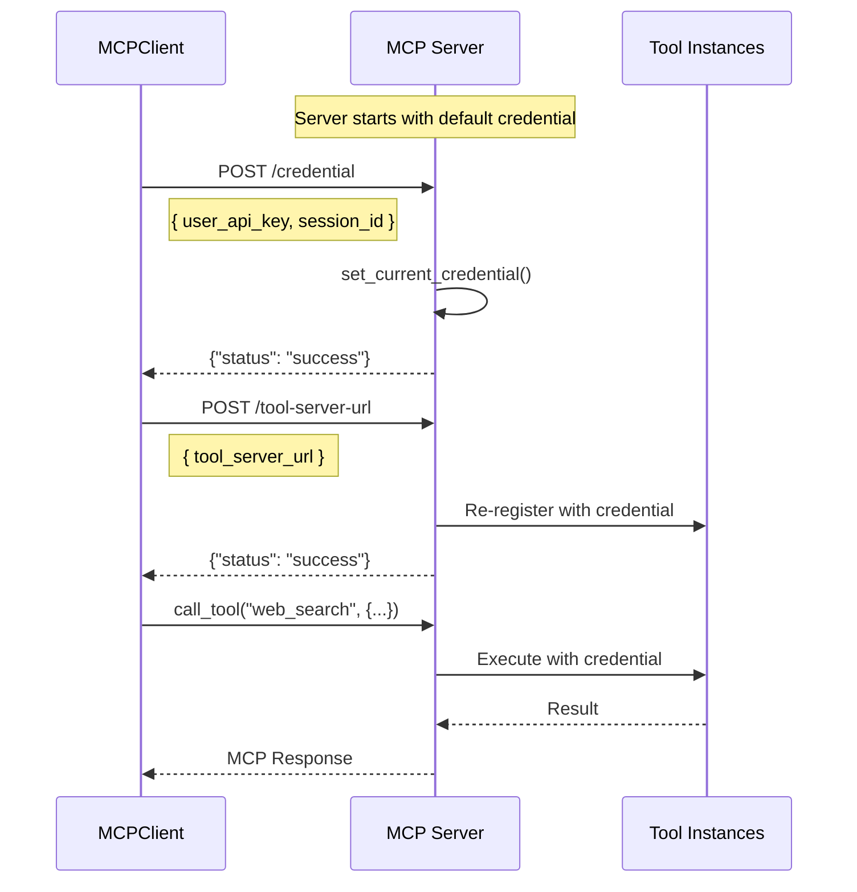
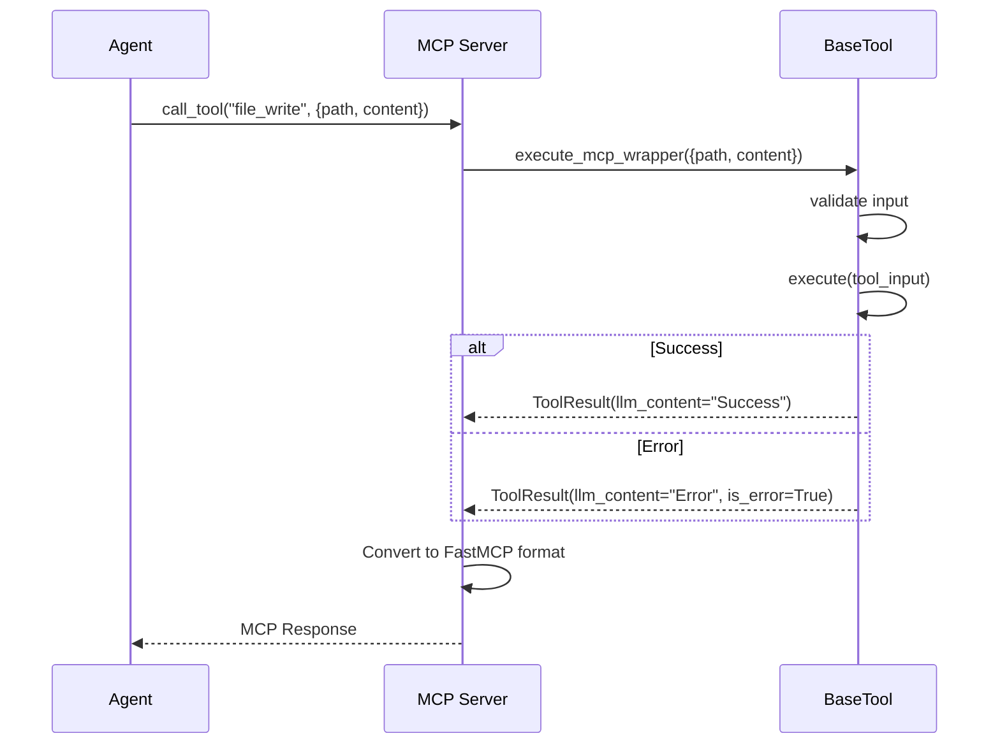

# MCP Registry Lifecycle

> How the 44 built-in tools are registered and executed via MCP.

---

## Overview

The MCP (Model Context Protocol) Registry manages:
- **44+ built-in tools** (shell, file, browser, web, media, etc.)
- **Auto-registration** at server startup
- **Dynamic credential updates**
- **LangChain integration** for agent use

---

## Server Startup Flow

```mermaid
flowchart TD
    A[Sandbox starts] --> B[start-services.sh]
    B --> C[python -m mcp.server]
    C --> D[create_mcp function]
    
    D --> E[Create FastMCP server]
    E --> F[Register custom routes]
    F --> G[/health, /credential, /custom-mcp]
    
    E --> H[Load MCP integrations]
    H --> I[Mount external MCPs]
    
    E --> J[Auto-register all tools]
    J --> K[get_sandbox_tools]
    K --> L[Shell tools 6]
    K --> M[File tools 7]
    K --> N[Browser tools 15]
    K --> O[Web tools 6]
    K --> P[Media tools 2]
    K --> Q[Dev tools 4]
    K --> R[Other tools 4]
    
    L --> S[Register with FastMCP]
    M --> S
    N --> S
    O --> S
    P --> S
    Q --> S
    R --> S
    
    S --> T[MCP Server listening :6060]
```

---

## Tool Registration Code

```python
# From backend/src/tool_server/mcp/server.py

async def register_all_tools(credential: Dict):
    tools = get_sandbox_tools(
        workspace_path=workspace_dir,
        credential=credential,
    )
    
    for tool in tools:
        main_server.tool(
            tool.execute_mcp_wrapper,
            name=tool.name,
            description=tool.description,
            annotations=ToolAnnotations(
                title=tool.display_name,
                readOnlyHint=tool.read_only,
            ),
        )
        
        # Set input schema
        _mcp_tool = await main_server._tool_manager.get_tool(tool.name)
        _mcp_tool.parameters = tool.input_schema
```

---

## Tool Categories

### Shell Tools (6)


### File Tools (7)


### Browser Tools (15)
- Navigate, view, click, type, scroll, wait
- Tab management, dropdowns, drag

### Web Tools (6)
- Search, visit, compress, image search

### Media Tools (2)
- Image generation, video generation

### Dev Tools (4)
- FullStackInit, RegisterPort, SaveCheckpoint, GetDatabaseConnection

---

## MCP Server Endpoints

| Endpoint | Method | Purpose |
|----------|--------|---------|
| `/health` | GET | Health check |
| `/mcp` | * | MCP protocol (SSE) |
| `/credential` | POST | Set API credentials |
| `/tool-server-url` | POST | Set external tool server |
| `/register-codex` | POST | Start Codex subprocess |
| `/custom-mcp` | POST | Mount custom MCP server |

---

## Credential Flow



---

## Tool Execution



---

## Custom MCP Integration

### Runtime Addition
```http
POST https://6060-sandbox.e2b.app/custom-mcp
Content-Type: application/json

{
  "mcpServers": {
    "my-weather": {
      "command": "npx",
      "args": ["-y", "@my/weather-mcp"]
    }
  }
}
```

### Pre-configured (mcp_integrations/)
Files in `backend/src/tool_server/mcp_integrations/` are auto-loaded:
- Mounted as proxy servers
- Selected tools exposed to main server

---

## Code References

| File | Purpose |
|------|---------|
| [server.py](file:///c:/Users/pault/Documents/3.%20AI%20and%20Machine%20Learning/2.%20Deep%20Learning/1c.%20App/Projects/agents-backend/backend/src/tool_server/mcp/server.py) | MCP server creation |
| [manager.py](file:///c:/Users/pault/Documents/3.%20AI%20and%20Machine%20Learning/2.%20Deep%20Learning/1c.%20App/Projects/agents-backend/backend/src/tool_server/tools/manager.py) | Tool aggregation |
| [base.py](file:///c:/Users/pault/Documents/3.%20AI%20and%20Machine%20Learning/2.%20Deep%20Learning/1c.%20App/Projects/agents-backend/backend/src/tool_server/tools/base.py) | BaseTool class |
| [mcp_integrations/](file:///c:/Users/pault/Documents/3.%20AI%20and%20Machine%20Learning/2.%20Deep%20Learning/1c.%20App/Projects/agents-backend/backend/src/tool_server/mcp_integrations/) | External MCPs |
