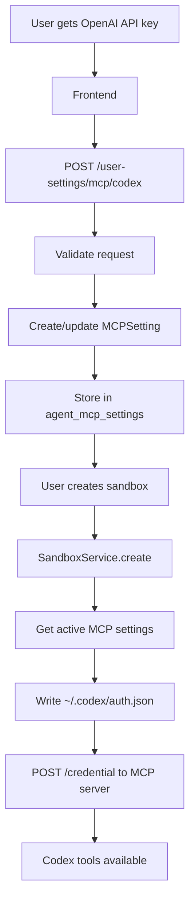
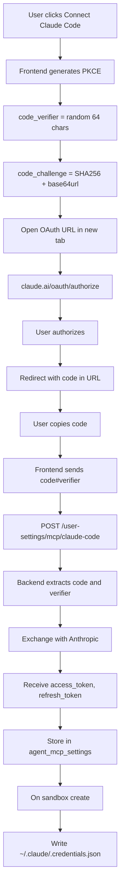

# MCP User Settings Lifecycle

> Configuring Codex, Claude Code, and custom MCPs via the API.

---

## Overview

Users can configure personal MCP tools that are:
- **Stored in database** (`agent_mcp_settings` table)
- **Written to sandbox** on creation
- **Used by agents** for enhanced capabilities

---

## Two MCP Endpoint Groups

> **Important distinction!**

| Endpoint Group | Purpose | Storage |
|----------------|---------|---------|
| `/agent/mcp/*` | Manage MCP servers for current chat | In-memory |
| `/agent/user-settings/mcp/*` | Store user's MCP configs | Database |

**Use `/user-settings/mcp/*` for persistent configuration.**

---

## Codex Configuration Lifecycle



### API Request
```http
POST /api/v1/agent/user-settings/mcp/codex
Authorization: Bearer <token>
Content-Type: application/json

{
  "apikey": "sk-...",
  "model": "gpt-4o",
  "model_reasoning_effort": "medium",
  "search": false
}
```

### Stored in Database
```json
{
  "tool_type": "codex",
  "mcp_config": {
    "mcpServers": {
      "codex-as-mcp": {
        "command": "uvx",
        "args": ["--from", "git+https://...", "codex-as-mcp", "--yolo"]
      }
    }
  },
  "auth_json": {
    "OPENAI_API_KEY": "sk-..."
  },
  "metadata_json": {
    "model": "gpt-4o",
    "model_reasoning_effort": "medium"
  }
}
```

### Written to Sandbox
`~/.codex/auth.json`:
```json
{
  "OPENAI_API_KEY": "sk-..."
}
```

---

## Claude Code Configuration Lifecycle

Claude Code uses **OAuth with PKCE** for secure authentication.



### Frontend OAuth URL Build
```typescript
const generateCodeVerifier = () => {
  const array = new Uint8Array(32)
  crypto.getRandomValues(array)
  return base64UrlEncode(array)
}

const generateCodeChallenge = async (verifier: string) => {
  const hash = await crypto.subtle.digest(
    'SHA-256',
    new TextEncoder().encode(verifier)
  )
  return base64UrlEncode(new Uint8Array(hash))
}

const verifier = generateCodeVerifier()
const challenge = await generateCodeChallenge(verifier)

const oauthUrl = `https://claude.ai/oauth/authorize?${new URLSearchParams({
  code: 'true',
  client_id: '9d1c250a-e61b-44d9-88ed-5944d1962f5e',  // Public ID
  response_type: 'code',
  redirect_uri: 'https://console.anthropic.com/oauth/code/callback',
  scope: 'org:create_api_key user:profile user:inference',
  code_challenge: challenge,
  code_challenge_method: 'S256',
  state: verifier
})}`

window.open(oauthUrl, '_blank')
```

### API Request
```http
POST /api/v1/agent/user-settings/mcp/claude-code
Authorization: Bearer <token>
Content-Type: application/json

{
  "authorization_code": "abc123#verifier456"
}
```

### Backend Token Exchange
```python
# In mcp_setting_service.py
async def configure_claude_code(self, authorization_code: str):
    code, verifier = authorization_code.split("#")
    
    async with httpx.AsyncClient() as client:
        response = await client.post(
            "https://claude.ai/api/oauth/token",
            json={
                "grant_type": "authorization_code",
                "client_id": CLAUDE_CODE_CLIENT_ID,
                "code": code,
                "code_verifier": verifier,
                "redirect_uri": "https://console.anthropic.com/oauth/code/callback"
            }
        )
    
    tokens = response.json()
    # {access_token, refresh_token, expires_in, ...}
```

### Written to Sandbox
`~/.claude/.credentials.json`:
```json
{
  "claudeAiOauth": {
    "accessToken": "sk-ant-...",
    "refreshToken": "...",
    "expiresAt": "2025-01-15T00:00:00Z"
  }
}
```

---

## Custom MCP Configuration

```http
POST /api/v1/agent/user-settings/mcp/custom
Authorization: Bearer <token>
Content-Type: application/json

{
  "name": "my-weather-mcp",
  "command": "npx",
  "args": ["-y", "@my/weather-mcp"],
  "transport": "stdio",
  "env": {
    "WEATHER_API_KEY": "..."
  }
}
```

---

## Database Schema

### `agent_mcp_settings`
| Column | Type | Description |
|--------|------|-------------|
| `id` | BIGINT | Primary key |
| `user_id` | BIGINT | FK to sys_user |
| `tool_type` | VARCHAR(64) | codex, claude_code, custom:name |
| `mcp_config` | JSONB | MCP server configuration |
| `auth_json` | JSONB | Credentials (encrypted in production) |
| `metadata_json` | JSONB | Extra settings (model, etc.) |
| `is_active` | BOOLEAN | Whether enabled |
| `store_path` | VARCHAR(256) | Sandbox file path |
| `created_time` | TIMESTAMP | When created |
| `updated_time` | TIMESTAMP | Last update |

**Unique Constraint:** `(user_id, tool_type)`

---

## API Endpoints

| Method | Endpoint | Description |
|--------|----------|-------------|
| GET | `/user-settings/mcp` | List all settings |
| GET | `/user-settings/mcp/codex` | Get Codex config |
| POST | `/user-settings/mcp/codex` | Set Codex config |
| GET | `/user-settings/mcp/claude-code` | Get Claude config |
| POST | `/user-settings/mcp/claude-code` | Set Claude config |
| POST | `/user-settings/mcp/custom` | Add custom MCP |
| DELETE | `/user-settings/mcp/{type}` | Remove setting |
| PATCH | `/user-settings/mcp/{type}/toggle` | Enable/disable |

---

## Code References

| File | Purpose |
|------|---------|
| [mcp_settings.py](file:///c:/Users/pault/Documents/3.%20AI%20and%20Machine%20Learning/2.%20Deep%20Learning/1c.%20App/Projects/agents-backend/backend/app/agent/api/v1/mcp_settings.py) | API endpoints |
| [mcp_setting_service.py](file:///c:/Users/pault/Documents/3.%20AI%20and%20Machine%20Learning/2.%20Deep%20Learning/1c.%20App/Projects/agents-backend/backend/app/agent/service/mcp_setting_service.py) | Business logic |
| [mcp_setting.py](file:///c:/Users/pault/Documents/3.%20AI%20and%20Machine%20Learning/2.%20Deep%20Learning/1c.%20App/Projects/agents-backend/backend/app/agent/model/mcp_setting.py) | Database model |
| [sandbox_service.py](file:///c:/Users/pault/Documents/3.%20AI%20and%20Machine%20Learning/2.%20Deep%20Learning/1c.%20App/Projects/agents-backend/backend/src/services/sandbox_service.py) | Credential writing |
