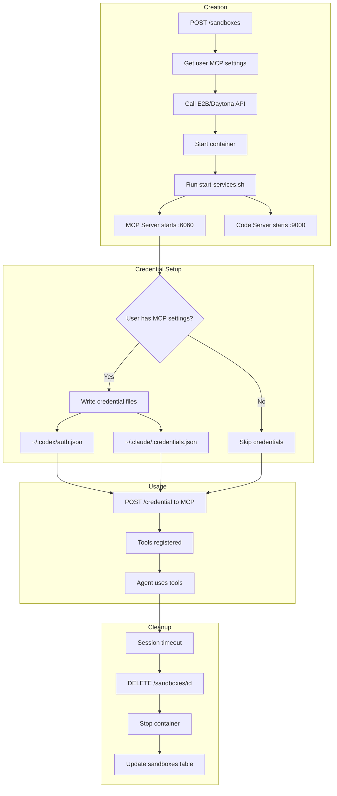
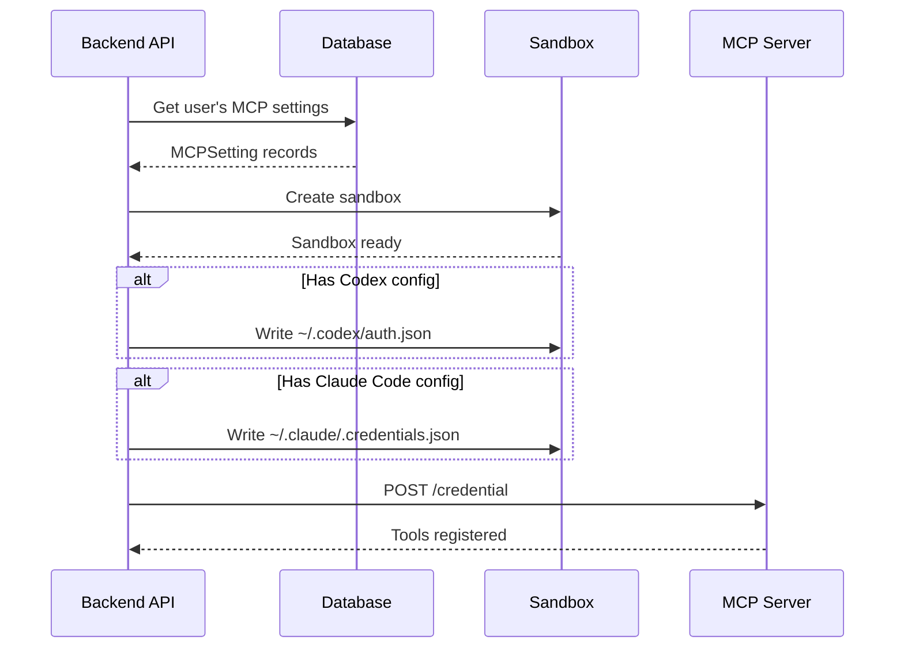

# Sandbox Lifecycle

> From creation to tool execution to cleanup.

---

## Overview

Sandboxes are isolated execution environments that:
- Run code securely via **E2B** or **Daytona**
- Host the **MCP Tool Server** on port 6060
- Provide **VS Code** access on port 9000
- Auto-configure **credentials** (Codex, Claude Code)

---

## Complete Lifecycle



---

## API Flow

### 1. Create Sandbox

```http
POST /api/v1/agent/sandboxes
Authorization: Bearer <token>
Content-Type: application/json

{
  "template_id": "agents-backend-sandbox"
}
```

**Response:**
```json
{
  "sandbox_id": "sbx_abc123",
  "mcp_url": "https://6060-sbx_abc123.e2b.app",
  "vscode_url": "https://9000-sbx_abc123.e2b.app",
  "status": "running"
}
```

### 2. Connect to Sandbox

```http
POST /api/v1/agent/sandboxes/connect
Authorization: Bearer <token>
Content-Type: application/json

{
  "sandbox_id": "sbx_abc123"
}
```

### 3. Run Command

```http
POST /api/v1/agent/sandboxes/run-command
Authorization: Bearer <token>
Content-Type: application/json

{
  "sandbox_id": "sbx_abc123",
  "command": "npm install && npm run dev"
}
```

### 4. Delete Sandbox

```http
DELETE /api/v1/agent/sandboxes/sbx_abc123
Authorization: Bearer <token>
```

---

## Credential Provisioning

When a sandbox is created, the backend automatically writes user credentials:



**Credential Files:**

| Tool | File Path | Content |
|------|-----------|---------|
| Codex | `~/.codex/auth.json` | `{"OPENAI_API_KEY": "sk-..."}` |
| Claude Code | `~/.claude/.credentials.json` | `{"accessToken": "...", ...}` |

---

## Database Table

### `sandboxes`
| Column | Type | Description |
|--------|------|-------------|
| `id` | VARCHAR | UUID primary key |
| `provider` | VARCHAR | e2b, daytona |
| `provider_sandbox_id` | VARCHAR | Provider's ID |
| `user_id` | VARCHAR | Owner user ID |
| `status` | VARCHAR | initializing, running, stopped |
| `created_at` | TIMESTAMP | Creation time |
| `started_at` | TIMESTAMP | When started |
| `stopped_at` | TIMESTAMP | When stopped |
| `last_activity_at` | TIMESTAMP | Last activity |

---

## Sandbox Services

| Service | Port | Purpose |
|---------|------|---------|
| MCP Tool Server | 6060 | Tool execution via MCP protocol |
| Code Server | 9000 | VS Code in browser |
| Playwright | - | Browser automation |
| tmux | - | Terminal sessions |

---

## Startup Script

`start-services.sh` runs at sandbox boot:

```bash
#!/bin/bash

# Fix permissions
chmod 755 /home/pn
chmod 777 /workspace

# Start MCP server
cd /home/pn/agents_backend
python -m backend.src.tool_server.mcp.server \
  --workspace_dir /workspace \
  --port 6060 &

# Start code-server
code-server --bind-addr 0.0.0.0:9000 &

# Wait for services
wait
```

---

## E2B vs Daytona

| Feature | E2B | Daytona |
|---------|-----|---------|
| Startup time | ~5s | ~30s |
| Persistence | Template-based | Git-integrated |
| Pricing | Per-minute | Self-hosted |
| Best for | Quick sandboxes | Dev environments |

---

## Code References

| File | Purpose |
|------|---------|
| [sandbox.py](file:///c:/Users/pault/Documents/3.%20AI%20and%20Machine%20Learning/2.%20Deep%20Learning/1c.%20App/Projects/agents-backend/backend/app/agent/api/v1/sandbox.py) | Sandbox endpoints |
| [sandbox_service.py](file:///c:/Users/pault/Documents/3.%20AI%20and%20Machine%20Learning/2.%20Deep%20Learning/1c.%20App/Projects/agents-backend/backend/src/services/sandbox_service.py) | Sandbox business logic |
| [e2b.py](file:///c:/Users/pault/Documents/3.%20AI%20and%20Machine%20Learning/2.%20Deep%20Learning/1c.%20App/Projects/agents-backend/backend/src/sandbox/sandbox_server/sandboxes/e2b.py) | E2B provider |
| [daytona.py](file:///c:/Users/pault/Documents/3.%20AI%20and%20Machine%20Learning/2.%20Deep%20Learning/1c.%20App/Projects/agents-backend/backend/src/sandbox/sandbox_server/sandboxes/daytona.py) | Daytona provider |
| [model.py](file:///c:/Users/pault/Documents/3.%20AI%20and%20Machine%20Learning/2.%20Deep%20Learning/1c.%20App/Projects/agents-backend/backend/src/sandbox/sandbox_server/db/model.py) | Sandbox DB model |

---

## Timeout & Cleanup

Sandboxes auto-terminate after inactivity:

```http
POST /api/v1/agent/sandboxes/{id}/timeout
Content-Type: application/json

{
  "timeout_seconds": 3600
}
```

**Cleanup process:**
1. Timeout triggers
2. Container stopped
3. `stopped_at` updated
4. Resources released
