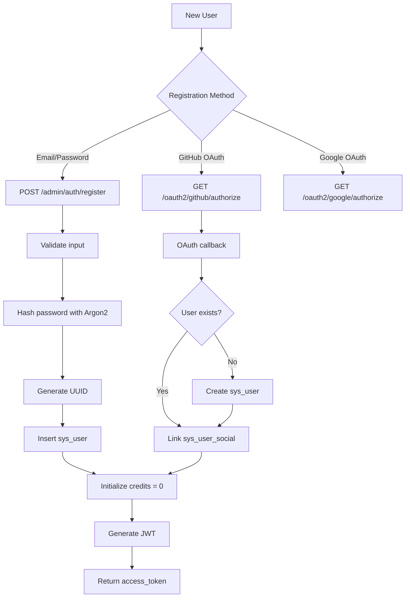
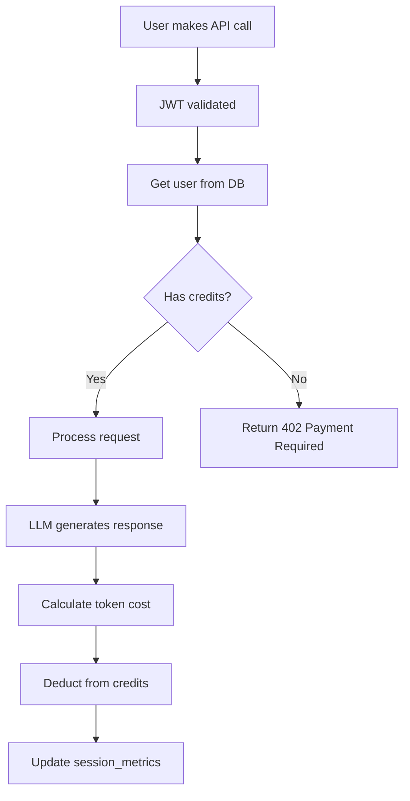
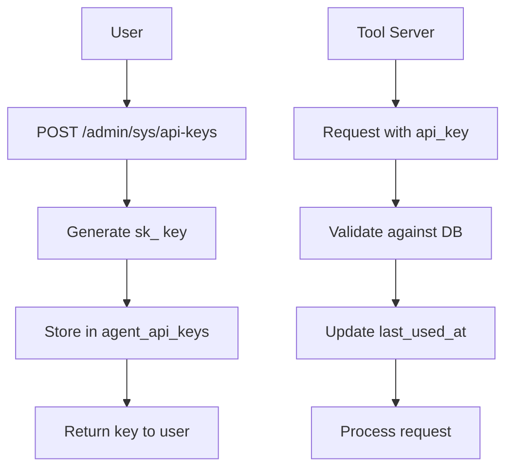

# User Management Lifecycle

> Account creation, credits, and API keys.

---

## Overview

User management covers:
- **Account creation** (signup, OAuth)
- **Profile management** (update, password)
- **Credit system** (balance, usage)
- **API keys** (create, revoke)

---

## Account Creation Flow



---

## Credit System

### Credit Types
| Column | Purpose |
|--------|---------|
| `credits` | Primary balance (paid credits) |
| `bonus_credits` | Free/promotional credits |

**Usage order:** Bonus credits consumed first, then regular credits.

### Credit Flow


### Credit Endpoints
| Method | Endpoint | Description |
|--------|----------|-------------|
| GET | `/agent/credits/balance` | Get current balance |
| GET | `/agent/credits/usage` | Get usage history |
| POST | `/agent/credits/add` | Add credits (admin) |

### Balance Response
```json
{
  "credits": 100.50,
  "bonus_credits": 25.00,
  "total": 125.50
}
```

---

## API Keys

### Purpose
API keys allow tool server authentication without JWT:
- Used by MCP tool server
- Enabled for specific integrations

### Key Format
```
sk_a1b2c3d4e5f6g7h8i9j0k1l2m3n4o5p6
```
Prefix `sk_` followed by 32 URL-safe characters.

### API Key Flow


### Database Table: `agent_api_keys`
| Column | Type | Description |
|--------|------|-------------|
| `id` | BIGINT | Primary key |
| `user_id` | BIGINT | Owner |
| `api_key` | VARCHAR(256) | The key (hashed in production) |
| `name` | VARCHAR(128) | Label |
| `is_active` | BOOLEAN | Active status |
| `expires_at` | TIMESTAMP | Expiration (null = never) |
| `last_used_at` | TIMESTAMP | Last usage |

---

## Profile Management

### Update Profile
```http
PUT /api/v1/admin/sys/users/{id}
Authorization: Bearer <token>
Content-Type: application/json

{
  "nickname": "New Name",
  "email": "new@example.com",
  "phone": "1234567890",
  "avatar": "https://..."
}
```

### Change Password
```http
PUT /api/v1/admin/sys/users/{id}/password
Authorization: Bearer <token>
Content-Type: application/json

{
  "old_password": "old123",
  "new_password": "new456"
}
```

**Password stored in:** `sys_user_password_history` (prevents reuse)

---

## Session Metrics

Each agent chat session tracks usage:

### `agent_session_metrics`
| Column | Type | Description |
|--------|------|-------------|
| `session_id` | VARCHAR(64) | Chat session ID |
| `user_id` | BIGINT | User |
| `model_name` | VARCHAR(64) | LLM used |
| `credits` | FLOAT | Credits consumed |
| `total_prompt_tokens` | INT | Input tokens |
| `total_completion_tokens` | INT | Output tokens |

---

## Code References

| File | Purpose |
|------|---------|
| [user.py](file:///c:/Users/pault/Documents/3.%20AI%20and%20Machine%20Learning/2.%20Deep%20Learning/1c.%20App/Projects/agents-backend/backend/app/admin/model/user.py) | User model |
| [credits.py](file:///c:/Users/pault/Documents/3.%20AI%20and%20Machine%20Learning/2.%20Deep%20Learning/1c.%20App/Projects/agents-backend/backend/app/agent/api/v1/credits.py) | Credit endpoints |
| [agent_models.py](file:///c:/Users/pault/Documents/3.%20AI%20and%20Machine%20Learning/2.%20Deep%20Learning/1c.%20App/Projects/agents-backend/backend/app/agent/model/agent_models.py) | APIKey, SessionMetrics |
