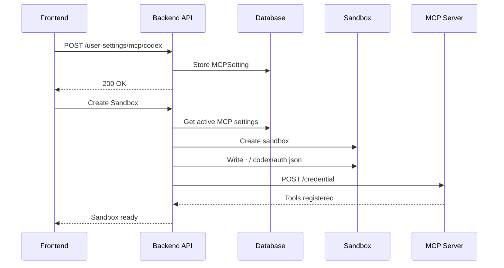

# MCP Configuration Guide

> How the Model Context Protocol (MCP) connects agents to 44+ tools in the sandbox.

---

## Architecture Overview

```
┌────────────────────────────────────────────────────────────────────┐
│                           E2B Sandbox                              │
│  ┌──────────────────────────────────────────────────────────────┐  │
│  │              MCP Server (FastMCP on port 6060)               │  │
│  │  ┌────────────┐ ┌────────────┐ ┌────────────┐ ┌────────────┐ │  │
│  │  │   Shell    │ │    File    │ │  Browser   │ │    Web     │ │  │
│  │  │   Tools    │ │   Tools    │ │   Tools    │ │   Tools    │ │  │
│  │  └────────────┘ └────────────┘ └────────────┘ └────────────┘ │  │
│  │  ┌────────────┐ ┌────────────┐ ┌────────────┐ ┌────────────┐ │  │
│  │  │   Media    │ │    Slide   │ │    Dev     │ │  Custom    │ │  │
│  │  │   Tools    │ │   Tools    │ │   Tools    │ │   MCPs     │ │  │
│  │  └────────────┘ └────────────┘ └────────────┘ └────────────┘ │  │
│  └──────────────────────────────────────────────────────────────┘  │
│                              ▲                                     │
└──────────────────────────────│─────────────────────────────────────┘
                               │ SSE/HTTP
                               ▼
                    ┌─────────────────────┐
                    │     MCPClient       │
                    │  (FastMCP Client)   │
                    └─────────────────────┘
                               │
                    ┌─────────────────────┐
                    │   LangGraph Agent   │
                    │   (create_react_    │
                    │     agent)          │
                    └─────────────────────┘
```

---

## Built-in Tools (44 Total)

### Shell Tools (6)
| Tool | Description |
|------|-------------|
| `ShellInit` | Initialize a tmux session |
| `ShellRunCommand` | Execute shell commands |
| `ShellView` | View terminal output |
| `ShellStopCommand` | Stop running commands |
| `ShellList` | List active sessions |
| `ShellWriteToProcessTool` | Send input to running process |

### File System Tools (7)
| Tool | Description |
|------|-------------|
| `FileReadTool` | Read file contents |
| `FileWriteTool` | Write/create files |
| `FileEditTool` | Edit file sections |
| `ApplyPatchTool` | Apply unified diffs |
| `StrReplaceEditorTool` | String replacement edits |
| `ASTGrepTool` | AST-based code search |
| `GrepTool` | Pattern-based search |

### Browser Tools (15)
| Tool | Description |
|------|-------------|
| `BrowserViewTool` | View current page |
| `BrowserClickTool` | Click elements |
| `BrowserEnterTextTool` | Type text |
| `BrowserNavigationTool` | Navigate URLs |
| `BrowserScrollDown/UpTool` | Scroll page |
| `BrowserWaitTool` | Wait for elements |
| `BrowserSwitchTabTool` | Switch tabs |
| `BrowserOpenNewTabTool` | Open new tab |
| `BrowserGetSelectOptionsTool` | Get dropdown options |
| `BrowserSelectDropdownOptionTool` | Select option |
| `BrowserPressKeyTool` | Press keyboard keys |
| `BrowserDragTool` | Drag elements |
| `BrowserEnterMultipleTextsTool` | Fill multiple fields |
| `BrowserRestartTool` | Restart browser |

### Web Tools (6)
| Tool | Description |
|------|-------------|
| `WebSearchTool` | Search the web (Tavily) |
| `WebVisitTool` | Fetch webpage content |
| `WebVisitCompressTool` | Compressed page fetch |
| `ImageSearchTool` | Search for images |
| `ReadRemoteImageTool` | Read remote image |
| `WebBatchSearchTool` | Batch web searches |

### Media Tools (2)
| Tool | Description |
|------|-------------|
| `ImageGenerateTool` | Generate images (AI) |
| `VideoGenerateTool` | Generate videos (AI) |

### Slide Tools (3)
| Tool | Description |
|------|-------------|
| `SlideWriteTool` | Write slide content |
| `SlideEditTool` | Edit existing slides |
| `SlideApplyPatchTool` | Apply slide patches |

### Dev Tools (4)
| Tool | Description |
|------|-------------|
| `FullStackInitTool` | Initialize projects |
| `RegisterPort` | Register sandbox ports |
| `SaveCheckpointTool` | Save work checkpoint |
| `GetDatabaseConnection` | Get DB connection |

### Productivity Tools (2)
| Tool | Description |
|------|-------------|
| `TodoReadTool` | Read todo list |
| `TodoWriteTool` | Write to todo list |

---

## MCP Server Endpoints

The MCP server runs inside the sandbox on **port 6060**.

| Endpoint | Method | Description |
|----------|--------|-------------|
| `/health` | GET | Health check |
| `/mcp` | * | MCP protocol endpoint |
| `/credential` | POST | Set API credentials |
| `/tool-server-url` | POST | Set external tool server |
| `/register-codex` | POST | Start Codex SSE server |
| `/custom-mcp` | POST | Add custom MCP config |

---

## Connecting from an Agent

### 1. Using MCPClient (Recommended)

```python
from backend.src.tool_server.mcp.client import MCPClient

async with MCPClient("https://6060-sandbox-id.e2b.app") as client:
    # Set credentials for authenticated tools
    await client.set_credential({
        "user_api_key": "your-api-key",
        "session_id": "session-123"
    })
    
    # Get tools as LangChain-compatible
    tools = await client.get_langchain_tools()
    
    # Use with LangGraph
    from langgraph.prebuilt import create_react_agent
    agent = create_react_agent(llm, tools)
```

### 2. Direct Tool Access (In Sandbox)

```python
from backend.src.tool_server.tools.manager import get_langchain_tools

tools = get_langchain_tools(
    workspace_path="/workspace",
    credential={"TAVILY_API_KEY": "..."}
)
```

---

## User MCP Settings

Users can configure personal MCP tools via the API:

### Codex Configuration
```http
POST /api/v1/agent/user-settings/mcp/codex
{
  "apikey": "sk-...",
  "model": "gpt-4o",
  "model_reasoning_effort": "medium",
  "search": false
}
```

When sandbox is created, credentials are written to `~/.codex/auth.json`.

### Claude Code Configuration
```http
POST /api/v1/agent/user-settings/mcp/claude-code
{
  "authorization_code": "code#verifier"
}
```

Backend exchanges code for OAuth tokens. Written to `~/.claude/.credentials.json`.

### Custom MCP Server
```http
POST /api/v1/agent/user-settings/mcp/custom
{
  "name": "my-server",
  "command": "npx",
  "args": ["-y", "@my/mcp-server"],
  "transport": "stdio"
}
```

---

## Credential Flow



---

## Adding Custom MCPs at Runtime

```python
# Via MCPClient
await client.register_custom_mcp({
    "mcpServers": {
        "my-server": {
            "command": "uvx",
            "args": ["--from", "git+https://...", "my-mcp"]
        }
    }
})
```

Or via HTTP:
```http
POST https://6060-sandbox.e2b.app/custom-mcp
Content-Type: application/json

{"mcpServers": {"my-server": {"command": "...", "args": [...]}}}
```

---

## MCP Integrations (Pre-registered)

The server loads additional MCP integrations from:
`backend/src/tool_server/mcp_integrations/`

These are third-party MCP servers mounted automatically.

---

## Related Files

| File | Purpose |
|------|---------|
| [mcp/server.py](file:///c:/Users/pault/Documents/3.%20AI%20and%20Machine%20Learning/2.%20Deep%20Learning/1c.%20App/Projects/agents-backend/backend/src/tool_server/mcp/server.py) | MCP server implementation |
| [mcp/client.py](file:///c:/Users/pault/Documents/3.%20AI%20and%20Machine%20Learning/2.%20Deep%20Learning/1c.%20App/Projects/agents-backend/backend/src/tool_server/mcp/client.py) | MCPClient for remote access |
| [tools/manager.py](file:///c:/Users/pault/Documents/3.%20AI%20and%20Machine%20Learning/2.%20Deep%20Learning/1c.%20App/Projects/agents-backend/backend/src/tool_server/tools/manager.py) | Tool registration |
